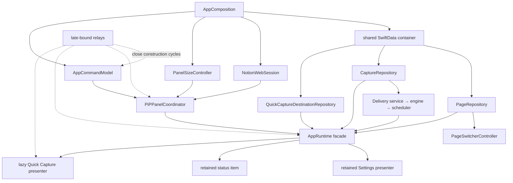

# Lecture 4 — Composition and Runtime

**Duration:** 75 minutes

Notion PiP assembles one long-lived object graph, then exposes a smaller
`AppRuntime` surface to most UI code. The composition root is allowed to know
concrete repositories, WebKit and AppKit controllers, services, relays, and
window factories. The runtime coordinates those objects without becoming a
database, browser, window, or HTTP client itself.

This lecture describes the committed repository snapshot. Unrelated unstaged
runtime and persistence changes present while the course was authored are
outside that snapshot. Keep the [course glossary](GLOSSARY.md) nearby and use
the [startup dependency flow](ARCHITECTURE_MAP.md#flow-1--startup-and-dependency-composition)
when you want the whole graph on one page.

## Learning objectives

By the end of this lecture, you can:

1. Define a composition root and reconstruct `AppComposition.init()` in its
   actual construction order.
2. Explain the intended dependency direction from concrete adapters through
   protocols to application coordination.
3. Identify the construction cycles broken by command, selection, submission,
   prefill, and release relays.
4. Describe `AppRuntime` as a main-actor facade rather than a universal owner.
5. Explain why runtime behavior is split across the main file, activation and
   persistence extensions, and state types without becoming separate runtime
   objects.
6. Trace observable state from a child controller, through the runtime, to a
   SwiftUI view.
7. Contrast retained Settings presentation with lazy, releasable Quick Capture
   presentation.
8. Compare healthy persistence startup with the deliberate degraded graph.
9. Use ownership, lifetime, isolation, consumers, and failure behavior to
   decide where a new dependency belongs.
10. Separate unit-test evidence from behavior that requires the real macOS UI,
    Keychain, WebKit, network, or persistent store.

The primary source is
[`NotionPiPApp.swift`](../../Sources/NotionPiP/App/NotionPiPApp.swift), which
contains `AppComposition`. Pair it with
[`AppRuntime.swift`](../../Sources/NotionPiP/App/AppRuntime.swift),
[`AppRuntime+Activation.swift`](../../Sources/NotionPiP/App/AppRuntime+Activation.swift),
and
[`AppRuntime+Persistence.swift`](../../Sources/NotionPiP/App/AppRuntime+Persistence.swift).

## Before you begin

A **dependency** is an object or function another component needs to do its
work. **Composition** is the act of constructing those objects and connecting
their references and callbacks. A **facade** offers one convenient surface over
several collaborators without taking over all of their responsibilities.

Read this lecture at the layer that matches your experience:

- **Foundation layer:** follow boxes, arrows, owners, and lifetimes. A relay is
  simply a small box whose destination can be connected later.
- **Swift layer:** notice protocol existentials (`any Protocol`), weak
  references, escaping closures, `ObservableObject`, `@Published`, Combine
  subscriptions, tasks, and actors.
- **Architecture layer:** test dependency direction, cycle breaking, failure
  containment, isolation crossings, and whether each retained object has a
  clear owner.

Before inspecting or changing a checkout, run `git status --short` and preserve
unrelated work. This lecture's exercise is read-only. It requires no Notion
password, session cookie, integration token, `.env` file, running app, or
system-setting change.

**Manual-verification boundary:** source and unit tests establish construction
policy and forwarding behavior, but they do not prove real Keychain access,
Notion authentication, network results, window focus, status-item behavior,
WebKit presentation, SwiftData file-system failure, or lifecycle under the real
AppKit event loop. Those integrations belong in the
[`MANUAL_TEST_MATRIX.md`](../MANUAL_TEST_MATRIX.md).

## Foundation

### The composition root is the wiring diagram

Most types should know only the collaborator they need. A page-switching
controller needs a `PageWorkingSetPersisting` store; it should not know how to
open a SwiftData container. A window presenter needs an `AppWindow`; it should
not know how to validate a Notion token. The one exception is the
**composition root**, [`AppComposition`](../../Sources/NotionPiP/App/NotionPiPApp.swift).
It chooses the production implementations and connects them.

For a beginner, imagine assembling a sound system. The composition root chooses
the microphone, mixer, amplifier, and speakers, then plugs them together. Once
the system is running, pressing a button should not rebuild or search for the
whole system; it should send an intent through an already-connected path.

For an experienced reader, this is the architectural permission boundary:
concrete-to-concrete knowledge is concentrated in one private main-actor type.
Other components receive protocols, focused models, or callbacks. That makes
their behavior testable without turning the production graph into a global
service locator.

### Construction order is not event order

`AppComposition.init()` runs synchronously on the main actor. It creates and
wires objects; it does not itself perform every startup action. Later,
[`AppStartup.start`](../../Sources/NotionPiP/App/NotionPiPApp.swift) calls
`runtime.start()`, which registers shortcuts and starts asynchronous bootstrap,
delivery recovery, capture-history refresh, and page restoration.

Keep three orders separate:

1. **Construction order:** an object must exist before it can be passed to
   another initializer.
2. **Binding order:** a relay or weak callback can be created first and receive
   its final destination later.
3. **Runtime event order:** after startup, user actions, callbacks, tasks, and
   actor results arrive over time.

Confusing these orders produces false bugs. For example, creating the lazy
Quick Capture wrapper during composition does not create its `NSWindow`; the
inner presenter is made only on first `show()`.

### Protocols describe narrow dependency edges

The code uses protocols at boundaries where substituting behavior or hiding
framework mechanics is useful:

| Protocol | Production edge | What the consumer avoids knowing |
|---|---|---|
| `PiPPanelCoordinating` | `AppRuntime`/`PinCoordinator` → `PiPPanelCoordinator` | `NSPanel`, stash handle, geometry, and WebKit presentation mechanics |
| `PageWorkingSetPersisting` | runtime and switcher → `PageRepository` | SwiftData models and `ModelContext` transactions |
| `QuickCaptureDestinationPersisting` | destination controller → destination repository | SwiftData settings storage |
| `GlobalShortcutRegistering` | runtime → Carbon registrar | Carbon event-handler setup |
| `PageURLInputPresenting` | runtime/pin coordinator → input window presenter | `NSWindow` creation and field focus mechanics |
| `SettingsWindowPresenting` | runtime and command relay → settings presenter | concrete window retention |
| `AppWindowPresenting` | commands/relays → lazy or concrete presenter | the underlying `NSWindow` |
| `ApplicationTerminationParticipating` | startup → live Quick Capture presenter | editor-specific final snapshot logic |
| `NotionWorkspaceClient` | connection/destination controllers → API client | HTTP request construction |
| `PanelSizing` | size controller → panel coordinator | panel frame conversion and screen geometry |

See the declarations in
[`PiPPanelCoordinator.swift`](../../Sources/NotionPiP/Platform/PiPPanelCoordinator.swift),
[`PageWorkingSetStore.swift`](../../Sources/NotionPiP/Persistence/PageWorkingSetStore.swift),
[`AppWindowPresenter.swift`](../../Sources/NotionPiP/Platform/AppWindowPresenter.swift),
and
[`NotionAPIClient.swift`](../../Sources/NotionPiP/Services/NotionAPIClient.swift).
A protocol is not automatically a separate layer. Its value here is the narrow
edge it creates and the fake or actor implementation that can sit behind it.

## Repository tour

Read the composition/runtime slice by responsibility:

| Source | Responsibility | Focused evidence |
|---|---|---|
| [`NotionPiPApp.swift`](../../Sources/NotionPiP/App/NotionPiPApp.swift) | Concrete construction, persistence fallback, callback wiring, and graph retention | Startup and termination tests introduced in Lecture 3 |
| [`AppCommandActionRelay.swift`](../../Sources/NotionPiP/App/AppCommandActionRelay.swift) | Late-bound command destinations and AppKit quit request | [`AppCommandActionRelayTests.swift`](../../Tests/NotionPiPTests/AppCommandActionRelayTests.swift) |
| [`AppCommandModel.swift`](../../Sources/NotionPiP/App/AppCommandModel.swift) | Shared command metadata and main-actor actions | [`AppCommandTests.swift`](../../Tests/NotionPiPTests/AppCommandTests.swift) |
| [`AppRuntime.swift`](../../Sources/NotionPiP/App/AppRuntime.swift) | Main-actor facade, published state, child controllers, startup, and controller observation | [`AppRuntimeFacadeTests.swift`](../../Tests/NotionPiPTests/AppRuntimeFacadeTests.swift) |
| [`AppRuntime+Activation.swift`](../../Sources/NotionPiP/App/AppRuntime+Activation.swift) | Shortcut/settings commands and the unified page-activation path | [`RuntimeActivationAndMenuBarTests.swift`](../../Tests/NotionPiPTests/RuntimeActivationAndMenuBarTests.swift) |
| [`AppRuntime+Persistence.swift`](../../Sources/NotionPiP/App/AppRuntime+Persistence.swift) | Restore, ordered visit persistence, health publication, and termination wait | [`RuntimePinnedPagePersistenceTests.swift`](../../Tests/NotionPiPTests/RuntimePinnedPagePersistenceTests.swift) |
| [`AppRuntimeStateTypes.swift`](../../Sources/NotionPiP/App/AppRuntimeStateTypes.swift) | Service-health, activation-source, and connection-state values | Runtime and connection-controller tests |
| [`NotionConnectionController.swift`](../../Sources/NotionPiP/App/NotionConnectionController.swift) | Token connection and workspace-page search state | [`NotionConnectionControllerTests.swift`](../../Tests/NotionPiPTests/NotionConnectionControllerTests.swift) |
| [`QuickCaptureDestinationController.swift`](../../Sources/NotionPiP/App/QuickCaptureDestinationController.swift) | Saved destination and paginated/debounced search state | [`QuickCaptureDestinationControllerTests.swift`](../../Tests/NotionPiPTests/QuickCaptureDestinationControllerTests.swift) |
| [`PageSwitcherController.swift`](../../Sources/NotionPiP/App/PageSwitcherController.swift) | Working-set loading, matching, selection, and favorite changes | [`PageSwitcherMatcherTests.swift`](../../Tests/NotionPiPTests/PageSwitcherMatcherTests.swift) |
| [`PanelSizeController.swift`](../../Sources/NotionPiP/App/PanelSizeController.swift) | Observable size preferences and a weak sizing target | [`PanelSizeControllerTests.swift`](../../Tests/NotionPiPTests/PanelSizeControllerTests.swift) |
| [`AppWindowFactory.swift`](../../Sources/NotionPiP/Platform/AppWindowFactory.swift) | Concrete Settings and Quick Capture windows, degraded capture UI, close and termination handlers | Capture lifecycle and presenter tests |
| [`AppWindowPresenter.swift`](../../Sources/NotionPiP/Platform/AppWindowPresenter.swift) | Concrete presentation plus lazy creation, delayed release, resource disposal, and termination participation | [`AppWindowPresenterTests.swift`](../../Tests/NotionPiPTests/AppWindowPresenterTests.swift) |
| [`SettingsWindowPresenter.swift`](../../Sources/NotionPiP/Platform/SettingsWindowPresenter.swift) | Small Settings-specific presentation adapter | `AppWindowPresenterTests` |

Two views demonstrate the facade boundary. `SettingsView` observes one runtime
and reads both runtime-owned and controller-owned state through it, while
`StatusItemController` subscribes specifically to
`runtime.$effectiveMenuBarIconVisibility`. See
[`SettingsView.swift`](../../Sources/NotionPiP/Views/SettingsView.swift) and
[`StatusItemController.swift`](../../Sources/NotionPiP/Platform/StatusItemController.swift).

## Runtime trace

### Exact `AppComposition` construction order

The committed initializer can be reconstructed in these phases:

1. Create `AppCommandActionRelay`, `NotionWebSession`, and
   `PersonalTokenCredentialVault`.
2. Attempt one shared `NotionPiPPersistence` container. On success, create the
   capture and destination repositories, token-backed capture API, delivery
   service, engine, scheduler, and page repository. On failure, set all four
   optional persistence/delivery outputs to `nil` and create an initial
   `.persistentStoreUnavailable` health issue.
3. Create `PanelSizeController`; create `AppCommandModel` with actions that call
   the still-unbound action relay.
4. Create `PageSwitcherController`, `PageSwitcherSelectionRelay`, and
   `PiPPanelCoordinator`. This is also where the panel constructs its retained
   AppKit/WebKit surface and binds the size controller.
5. Create `AppRuntime` with the panel coordinator, optional repositories and
   scheduler, credential vault, and initial service health.
6. Bind the relay's reload action to the now-existing runtime.
7. If capture, destination, and scheduler dependencies all exist, create
   `QuickCaptureLifecycleCoordinator`; otherwise leave capture lifecycle `nil`.
8. Bind WebKit page-resolution/restoration callbacks, working-set snapshot
   eviction, and page-switcher selection to weak runtime/session references or
   actor calls.
9. Create the prefill and release relays, then create
   `LazyAppWindowPresenter`. Its factory closure captures everything needed to
   make Quick Capture later; it does not invoke `AppWindowFactory` yet.
10. Create the retained Settings presenter and status-item controller.
11. Complete late bindings: presenters into the action relay, prefill behavior,
    the runtime's Quick Capture action, Settings into the runtime, and the panel
    size controller's “manage” command.
12. Store strong references on `AppComposition` to the runtime, lazy capture
    presenter, release relay, Settings presenter, status item, and size
    controller. `main()` then keeps the composition alive across
    `NSApplication.run()`.

That order is source behavior, not a suggested refactor. Follow it in
[`AppComposition.init`](../../Sources/NotionPiP/App/NotionPiPApp.swift).

### Dependency graph



**Prose fallback.** The composition root tries to open one container and builds
repositories and delivery services over it. Independently, it creates the
WebKit session, panel-size controller, shared command model, page-switcher
controller, and panel coordinator. These concrete collaborators enter one
main-actor `AppRuntime`. Retained Settings and status-item objects use that
runtime immediately; Quick Capture holds only a factory until first
presentation. Small relays connect callbacks whose final receiver did not
exist at the moment their sender had to be initialized.

### One state change, end to end

Trace the user connecting a personal token in Settings:

```text
SettingsView button
  → Task { await runtime.connectPersonalToken(token) }
  → AppRuntime cancels its older bootstrap task
  → NotionConnectionController.connect
  → state = .connecting
  → await NotionWorkspaceClient.validateConnection()
  → save validated token in PersonalTokenCredentialVault
  → state = .connected(workspaceName: ...)
  → controller.objectWillChange
  → AppRuntime.observeControllers sink
  → runtime.objectWillChange.send()
  → SettingsView @ObservedObject invalidates body
  → switch runtime.connectionState renders Workspace or failure UI
```

The runtime does not duplicate `connectionState`; it exposes a computed property
that reads the child controller. Because SwiftUI observes the runtime rather
than the private child, `observeControllers()` forwards the child's
`objectWillChange`. The same pattern forwards destination-controller changes.
[`AppRuntimeFacadeTests`](../../Tests/NotionPiPTests/AppRuntimeFacadeTests.swift)
checks that child search publication reaches the facade, and
[`NotionConnectionControllerTests`](../../Tests/NotionPiPTests/NotionConnectionControllerTests.swift)
checks token validation, persistence, reconnection, errors, and stale-result
rejection.

The asynchronous boundary matters: a connection generation rejects results
from an older attempt. The manual boundary matters too: fakes can establish
ordering and publication, but only a real Keychain item and Notion account can
establish actual credential and network integration.

## Deep dive

### Relays break construction cycles without service lookup

A construction cycle occurs when A needs B in its initializer while B also
needs A. The graph uses tiny main-actor relays whose callable surface exists
before their final handler is assigned:

| Relay | Why the sender must exist first | Later binding | Extra behavior |
|---|---|---|---|
| `AppCommandActionRelay` | `AppCommandModel` is needed while constructing panel UI, before runtime and presenters exist | Runtime reload action plus weak Quick Capture and Settings presenters | Centralizes `NSApp.terminate(nil)` and optional prefill dispatch |
| `PageSwitcherSelectionRelay` | Panel chrome needs a selection callback before runtime exists | Weak runtime activation closure | Keeps panel/view code from locating the runtime globally |
| `PageURLInputSubmissionRelay` | `AppRuntime.init` creates the default input presenter before `self` is fully initialized | Weak `self.validatePageURL()` closure at the end of initialization | Private to the runtime implementation |
| `QuickCapturePrefillRelay` | A capture shortcut may carry text while the editor session is created lazily | Weak session binding from `AppWindowFactory` | Buffers one pending prefill and retries if the session is not ready |
| `QuickCaptureReleaseRelay` | The inner presenter close callback needs to schedule release on its lazy wrapper | Weak lazy presenter assigned after wrapper construction | Avoids a strong wrapper → factory closure → wrapper cycle |

The weak references are lifetime decisions, not decoration. `AppComposition`
strongly owns the long-lived graph. Back edges generally do not keep their
owners alive. A relay also does less than a service locator: it cannot answer
“give me any service”; it forwards one named intent.

### `AppRuntime` is a facade and coordinator

[`AppRuntime`](../../Sources/NotionPiP/App/AppRuntime.swift) is
`@MainActor`, `ObservableObject`, and `ApplicationURLHandling`. It presents a
cohesive API to Settings, status-item, delegate, and command surfaces:

- published activation, capture-history, service-health, shortcut, trusted
  capture, and menu-bar state;
- computed connection and destination state owned by child controllers;
- validated activation and panel coordination through `PinCoordinator`;
- startup of shortcut registration, token/destination bootstrap, delivery
  recovery, capture refresh, and saved-page restoration; and
- ordered asynchronous calls to actor-backed repositories and services.

It deliberately does **not** own AppKit window mechanics, WebKit navigation,
SwiftData model mutation, Keychain implementation, or Notion HTTP transport.
Its stored protocol dependencies and controller methods make that boundary
visible.

The file split is organizational:

- [`AppRuntime.swift`](../../Sources/NotionPiP/App/AppRuntime.swift) declares
  stored state, initialization, startup, facade forwarding, health, and child
  observation.
- [`AppRuntime+Activation.swift`](../../Sources/NotionPiP/App/AppRuntime+Activation.swift)
  groups shortcut, status-menu, validation, and page-activation behavior.
- [`AppRuntime+Persistence.swift`](../../Sources/NotionPiP/App/AppRuntime+Persistence.swift)
  groups restore, ordered visit writes, health changes, and termination wait.
- [`AppRuntimeStateTypes.swift`](../../Sources/NotionPiP/App/AppRuntimeStateTypes.swift)
  keeps `Sendable` health and activation values plus connection UI state near
  the application layer.

All extensions are still the same `AppRuntime` instance and the same main-actor
isolation domain. File boundaries do not create services, actors, queues, or
independent lifetimes.

### Observable state has two propagation shapes

Direct runtime-owned state uses `@Published`. For example,
`reportServiceIssue` mutates `serviceHealth`; Settings observes the runtime and
reveals `ServiceHealthView`. The status item takes a narrower Combine path:

```text
registration failure
  → serviceHealth reports .globalShortcutUnavailable
  → effectiveMenuBarIconVisibility becomes true when saved visibility is false
  → runtime.$effectiveMenuBarIconVisibility
  → StatusItemController visibility subscription
  → NSStatusItem.isVisible
```

Child-owned state uses forwarding. `NotionConnectionController` and
`QuickCaptureDestinationController` are private observable objects. Runtime
stores their `AnyCancellable` subscriptions and sends its own
`objectWillChange`, allowing views to keep one facade reference while reading
computed properties.

This is deliberately not a claim that every state value belongs in the
runtime. `PanelSizeController` remains a separately observed object in
`SettingsView`, because it has its own preferences, target binding, and
presentation consumers. `PageSwitcherController` likewise belongs to the PiP
surface. A facade is useful when it clarifies consumption, not when it absorbs
every observable object.

### Lazy Quick Capture versus retained Settings

Settings is built eagerly during composition. `AppWindowFactory.makeSettings`
creates a concrete `AppWindowPresenter`, `SettingsWindowPresenter` wraps it,
and `AppComposition` retains the wrapper for the event-loop lifetime. This is a
small, stable window whose content directly observes the already-created
runtime and size controller.

Quick Capture is heavier: its window contains a `CaptureEditorSession` and
local editor WebKit resources. Composition therefore creates a
`LazyAppWindowPresenter` with a factory closure. The first `show()`:

1. begins the first-presentation signpost;
2. calls `AppWindowFactory.makeQuickCapture`;
3. creates a real editor session when capture persistence is available, or an
   explanatory unavailable view when it is not;
4. binds the prefill relay to a newly created session; and
5. presents and retains that concrete presenter.

Subsequent `show()` calls reuse it. After a successful close, the release relay
schedules a 60-second delayed release. Reopening cancels that release; expiry
disposes the editor session and clears the inner presenter, so a later open
constructs a fresh one. A termination participant exists only while the inner
presenter exists, and its handler is called only while the window is visible.
These are explicit regressions in
[`AppWindowPresenterTests.swift`](../../Tests/NotionPiPTests/AppWindowPresenterTests.swift).

Laziness here changes resource lifetime, not feature ownership. The composition
root still owns the wrapper and factory closure, `AppWindowFactory` still owns
window construction policy, and `CaptureEditorSession` still owns the editor
bridge lifecycle.

### Healthy and degraded persistence startup

The persistence branch is one `do`/`catch`, producing two valid graphs:

| Capability | Healthy container | Container creation fails |
|---|---|---|
| Page working set | `PageRepository` actor | No durable page repository; page switcher falls back to its in-memory store |
| Capture drafts/history | `CaptureRepository` actor | Repository is `nil`; Quick Capture shows an unavailable explanation |
| Capture destination | Destination repository actor | Destination controller exists with no repository and reports settings unavailable for save/clear |
| Delivery | API → service → engine → scheduler | Scheduler and capture lifecycle are absent |
| Runtime health | `.healthy` initially | `.persistentStoreUnavailable` is published immediately |
| Core presentation | Panel, WebKit session, commands, shortcuts, Settings, and status item are composed | The same in-memory/UI graph is still composed |
| Restore behavior | Runtime requests the durable working set | Missing repository leads to Settings if no newer page activation exists |
| Recovery guidance | Normal operation | Settings says local storage is unavailable and offers quit/reopen |

See the branch in
[`NotionPiPApp.swift`](../../Sources/NotionPiP/App/NotionPiPApp.swift), the
fallback window in
[`AppWindowFactory.swift`](../../Sources/NotionPiP/Platform/AppWindowFactory.swift),
and recovery copy in
[`ServiceHealthView.swift`](../../Sources/NotionPiP/Views/ServiceHealthView.swift).
[`RuntimeActivationAndMenuBarTests`](../../Tests/NotionPiPTests/RuntimeActivationAndMenuBarTests.swift)
establish that an initial persistent-store issue is observable.

This is **degraded service**, not pretend durability. A typed page may still be
validated and shown for the current process, but it cannot be promised across
relaunch. Quick Capture does not accept a draft it cannot persist. The app
surfaces the missing capability while preserving independent UI routes.

### Ownership, lifetime, isolation, consumers, and failure behavior

| Owner/component | Lifetime | Isolation | Principal consumers | Failure behavior |
|---|---|---|---|---|
| `AppComposition` | Constructed before startup; explicitly retained across `NSApplication.run()` | `@MainActor` | Process entry and startup closure | If a concrete initializer has an unrecoverable invariant failure, launch cannot complete; persistent-container failure is caught and converted to a degraded graph |
| Persistence and delivery graph | Event-loop lifetime when created | Repository/model actors plus service actors or `Sendable` ports | Runtime, switcher, capture lifecycle | Actor calls throw; runtime/controllers publish scoped messages or health issues; the graph is absent if container creation fails |
| `AppRuntime` | Event-loop lifetime through composition | `@MainActor` | Delegate, Settings, status item, commands, startup | Reports health, rejects stale async results, preserves presentation when a durable save fails, and exposes retry paths |
| `NotionWebSession` and `PiPPanelCoordinator` | Event-loop lifetime through graph references | `@MainActor` | Pin coordinator, panel chrome, WebKit callbacks | Validation and presentation paths stay available independently of persistence; real WebKit/window failures need integration evidence |
| Command and callback relays | Event-loop lifetime when retained or captured; back references are weak where appropriate | `@MainActor` | Command model, panel chrome, runtime, lazy presenter | Default no-op or optional destination prevents use-before-bind crashes; prefill relay temporarily buffers text |
| Connection and destination controllers | Owned for the runtime lifetime | `@MainActor`; await `Sendable` clients/repositories | Runtime facade and Settings views | Publish user-facing failures, cancel tasks, and use generations to reject stale results |
| `PanelSizeController` | Event-loop lifetime through composition, panel, status item, and Settings | `@MainActor`; weak `PanelSizing` target | Panel chrome, status menu, Settings | Keeps validation messages; failed storage or invalid size does not replace valid preferences |
| Settings presenter/window | Eagerly created and retained for composition lifetime | `@MainActor` | Command relay and runtime fallback/recovery paths | Repeated show forwards to the same presenter; window remains reachable even in degraded persistence |
| Lazy Quick Capture wrapper and inner presenter | Wrapper lives for composition lifetime; inner presenter starts on first show and may be released 60 seconds after successful close | `@MainActor`; editor calls await repository actor | Commands, capture shortcut fallback, termination provider | Shows unavailable UI without repository; close failures preserve the window; termination save can veto quit; delayed release disposes resources |
| `StatusItemController` | Event-loop lifetime through composition | `@MainActor` plus Combine subscription | User status-item actions | A global-shortcut failure can force icon visibility without overwriting the saved preference |

Use this table when adding a dependency. Ask who constructs it, who keeps it
alive, which isolation domain may mutate it, which consumers need its narrowest
surface, and what truthful behavior remains when it fails.

## Common misconceptions and failure modes

| Misconception | Correction | Diagnostic starting point |
|---|---|---|
| “`AppRuntime` owns the whole app.” | It coordinates a facade; AppKit, WebKit, repositories, services, and child controllers retain their own responsibilities. | Runtime stored properties and the [ownership map](ARCHITECTURE_MAP.md#subsystem-and-ownership-map) |
| “A protocol means a separate process or service.” | These protocols are in-process dependency seams; isolation depends on the conforming type. | Protocol declaration and production conformance |
| “Extensions make several runtimes.” | All runtime extension methods act on one instance and one main-actor state set. | `AppRuntime.swift` plus both extension files |
| “A weak relay can disappear at any time.” | The relay itself must have a strong owner or capture; only its back reference is weak. | `AppComposition` stored properties and relay captures |
| “Relays are global dependency lookup.” | Each relay forwards one narrow late-bound intent and has no registry or arbitrary resolution. | `AppCommandActionRelay` and private relay types |
| “Quick Capture is created at launch because its presenter exists.” | Only the lazy wrapper and factory closure exist until first `show()`. | `LazyAppWindowPresenter.presenterOrCreate()` and presenter tests |
| “Hiding and releasing a window are the same.” | Hiding orders it out but keeps resources; successful-close release later disposes resources and clears the inner presenter. | `scheduleReleaseAfterSuccessfulClose()` |
| “If persistence fails, the app either crashes or works normally.” | Composition creates an explicit degraded graph: independent UI works, durability/delivery do not, and health is visible. | `AppComposition` catch branch and `ServiceHealthView` |
| “Computed facade state updates SwiftUI automatically.” | Runtime must forward private child `objectWillChange`, or views observing only runtime would miss child changes. | `observeControllers()` and facade tests |
| “Unit tests prove the real menu-bar item and window focus.” | Fakes prove policy and calls; macOS integration remains manual. | Presenter/status tests plus manual matrix |

A common implementation failure is adding a callback directly from an
early-created component to a later-created object and then force-unwrapping it.
First ask whether the dependency direction should change. If the cycle is
legitimate, use a focused late-bound relay with an explicit lifetime and safe
pre-bind behavior.

## Presenter notes

### Suggested 75-minute pacing

- **0–8 minutes:** introduce composition roots, facades, and the three reading
  layers.
- **8–20 minutes:** number the exact `AppComposition` construction phases.
- **20–30 minutes:** draw the dependency graph and protocol boundaries.
- **30–41 minutes:** demonstrate each cycle-breaking relay and its lifetime.
- **41–51 minutes:** tour the runtime facade, extension split, controllers, and
  observable-state propagation.
- **51–60 minutes:** compare retained Settings with lazy/releasable Quick
  Capture.
- **60–67 minutes:** branch the graph into healthy and degraded persistence.
- **67–75 minutes:** ownership table, knowledge check, and exercise setup.

### Board plan and demonstration cues

Draw the graph in three passes. First draw concrete boxes from persistence and
WebKit toward the runtime. Second circle the protocol edges. Third add dotted
back arrows for relays. Use a different color for strong lifetime ownership
than for callbacks; otherwise learners often mistake “can call” for “keeps
alive.”

For the source demonstration:

1. Open `AppComposition.init()` and number local values in construction order.
2. Pause at the persistence `do`/`catch` and draw two complete output graphs.
3. Follow `AppCommandModel` into its action relay, then follow page-switcher
   selection back into runtime activation.
4. Open `AppRuntime.init`, find the private submission relay, and identify why
   `self` cannot be captured earlier.
5. Trace `NotionConnectionController.state` through `observeControllers()` to
   `SettingsView`.
6. Put a breakpoint conceptually—not necessarily in a running app—at
   `LazyAppWindowPresenter.presenterOrCreate()` and ask what exists before and
   after first presentation.
7. End at `AppComposition` stored properties and `withExtendedLifetime` to
   close the ownership loop.

Do not use a live app to claim persistent-store failure unless the failure was
created safely and intentionally. Do not delete stores, credentials, or user
data for a presentation. If demonstrating the UI, save work and quit any
running Notion PiP before rebuilding; then treat actual window focus, status
item, Keychain, WebKit, and network behavior as manual observations.

If time is short, preserve four ideas: concrete construction is centralized;
relays break only necessary cycles; the runtime is a facade with forwarded
observation; and persistence failure produces a truthful degraded graph.

## Knowledge check

1. Why is `AppComposition` allowed to know both repositories and AppKit window
   presenters when most feature types are not?
2. What is the difference between construction order and runtime event order?
3. Why can `AppCommandModel` be created before the Quick Capture and Settings
   presenters?
4. Name two other construction cycles and the relays that break them.
5. Does `AppRuntime+Persistence.swift` contain a different runtime service from
   `AppRuntime.swift`?
6. Why does runtime forward `objectWillChange` from connection and destination
   controllers?
7. Why is `PanelSizeController` observed separately instead of being folded
   completely into runtime?
8. What exists before Quick Capture's first `show()`, and what is created by
   that call?
9. Which capabilities remain when the persistent container cannot open, and
   which are deliberately unavailable?
10. Which reference keeps `AppComposition` alive after `main()` enters the
    AppKit event loop?
11. Name two claims in this lecture that still need manual verification.

### Answers

1. It is the private composition root: the designated place where production
   implementations are chosen and wired. Concentrating concrete knowledge
   there keeps other dependency edges narrow.
2. Construction order satisfies initializer dependencies synchronously.
   Runtime event order begins after startup and depends on callbacks, tasks,
   actors, user input, and external systems.
3. Its closures call `AppCommandActionRelay`, which already exists and has safe
   pre-bind behavior. Presenter references are installed on that relay later.
4. Examples: panel selection precedes runtime, so
   `PageSwitcherSelectionRelay` is bound later; input presentation precedes a
   fully initialized runtime, so `PageURLInputSubmissionRelay` is bound at the
   end of `AppRuntime.init`; capture close precedes access to the completed
   lazy wrapper, so `QuickCaptureReleaseRelay` supplies the back edge.
5. No. It is an extension of the same main-actor instance, separated only for
   source organization.
6. Views observe the facade, while those computed properties read private
   child state. Forwarding invalidates the runtime observer when a child is
   about to change.
7. It has its own coherent observable preferences, weak panel-sizing target,
   and multiple consumers. Keeping that owner visible avoids making runtime a
   universal state bucket.
8. The wrapper, factory closure, relays, and dependencies exist. First `show()`
   constructs the concrete presenter, window, and either editor session or
   degraded unavailable content, then presents it.
9. The runtime, panel/WebKit session, commands, shortcuts, Settings, status
   item, URL validation, and in-process presentation remain. Durable page and
   destination storage, capture drafts/history, capture lifecycle, and
   delivery are absent or unavailable.
10. `withExtendedLifetime(composition)` encloses `application.run()`; the
    composition's stored properties then retain the long-lived graph.
11. Examples include real SwiftData container failure/recovery, Keychain
    behavior, Notion network authentication, status-item visibility, window
    focus, WebKit presentation, and operation under the real AppKit event loop.

## Hands-on exercise

### Exercise: audit one command path and one failure branch

Without editing source, trace these two scenarios:

1. The user chooses **Quick Capture** before any capture window has existed,
   then closes a nonempty successfully saved capture and reopens it after the
   scheduled release fires.
2. On another launch, `NotionPiPPersistence.makeContainer()` throws, the user
   opens Settings, enters a valid page URL, and then chooses Quick Capture.

For each step, record:

- the concrete owner and any protocol surface used;
- whether the object already exists, is lazily created, or is absent;
- strong, weak, or closure-based lifetime edges;
- the current isolation domain;
- observable state or callback crossing the edge; and
- the test or manual boundary that supports the claim.

Use focused source searches:

```sh
rg -n "AppComposition|AppCommandActionRelay|PageSwitcherSelectionRelay" \
  Sources/NotionPiP/App
rg -n "LazyAppWindowPresenter|scheduleReleaseAfterSuccessfulClose|makeQuickCapture" \
  Sources/NotionPiP Tests/NotionPiPTests
rg -n "persistentStoreUnavailable|initialServiceHealth|serviceHealth" \
  Sources/NotionPiP Tests/NotionPiPTests
```

Do not force a real store failure, remove a database, or enter a secret. The
exercise is a source-and-test ownership audit.

### Expected answers and observations

The healthy command path should read:

```text
AppCommandModel.quickCapture action
  → AppCommandActionRelay.showQuickCapture
  → weak AppWindowPresenting destination
  → composition-owned LazyAppWindowPresenter.show
  → presenterOrCreate invokes AppWindowFactory.makeQuickCapture once
  → CaptureEditorSession + KeyCapableAppWindow + AppWindowPresenter
  → presentAsKey

successful close
  → AppWindowFactory close handler saves/finalizes
  → orderOut + QuickCaptureReleaseRelay
  → lazy wrapper schedules 60-second release
  → expiry disposes session resources and clears inner presenter
  → later show constructs a fresh presenter/session
```

The wrapper exists from launch, but the concrete capture window does not. The
relay's presenter reference is weak because composition owns the wrapper. The
release relay is strongly retained by composition and points weakly back to the
wrapper. `AppWindowPresenterTests` establish deferral, reuse, cancellation,
release, disposal, reconstruction, and termination-participant lifetime. Real
focus and WebKit resource behavior remain manual.

The degraded branch should read:

```text
NotionPiPPersistence.makeContainer throws
  → nil page/capture/destination repositories and scheduler
  → serviceHealth begins with .persistentStoreUnavailable
  → runtime, panel, WebKit, commands, Settings, status item still compose
  → restore finds no repository and Settings remains the recovery route

valid typed URL
  → normal validation and PinCoordinator presentation
  → activePage publishes for this process
  → enqueuePersistence returns because repository is nil

Quick Capture command
  → lazy factory runs
  → AppWindowFactory receives repository: nil and lifecycle: nil
  → explanatory “Quick Capture is unavailable” window is presented
```

The correct conclusion is not “everything works offline.” The live page can be
shown in the current process, while durable restoration, local capture, saved
destination, and delivery are unavailable. Settings exposes the health issue
and quit/reopen guidance. Unit tests establish the published initial health;
safe real-world recovery still requires manual verification.

## Recap

- `AppComposition` is the private main-actor composition root that constructs
  concrete adapters and retains the production graph across the event loop.
- Construction proceeds from foundational adapters and optional persistence,
  through services/controllers/panel, to runtime and presenters, then finishes
  late callback binding.
- Narrow protocols hide AppKit, WebKit, Carbon, Keychain, SwiftData, and HTTP
  mechanics from consumers and make focused tests possible.
- Small relays break legitimate construction cycles with explicit intent and
  lifetime behavior; they are not service locators.
- `AppRuntime` is one main-actor facade split across source files. It owns
  coordination and UI-facing state, not every subsystem implementation.
- Direct `@Published` state and forwarded child `objectWillChange` let Settings
  observe one facade, while coherent controllers such as panel sizing remain
  separately observable.
- Settings is eagerly built and retained. Quick Capture uses a lazy wrapper,
  creates editor resources at first presentation, and may dispose them after a
  successful close delay.
- Persistence construction has two honest outcomes: a healthy durable graph or
  a degraded graph that preserves independent UI while disabling unavailable
  storage and delivery capabilities.
- Ownership analysis should always name lifetime, isolation, consumers, and
  failure behavior—not just draw a call arrow.
- Unit tests prove wiring policy and state propagation. Real AppKit, status
  item, focus, WebKit, Keychain, Notion network, and store recovery behavior
  remain manual-verification boundaries.

Next, Lecture 5 in the [course navigation](README.md#course-navigation) follows
the runtime's presentation commands into panel geometry, sizing, stashing, the
edge handle, and all-Spaces AppKit behavior.
