# Lecture 6: Embedded Notion and WebKit session management

> **Estimated duration:** 75 minutes (15 minutes foundation, 20 minutes
> repository tour, 15 minutes runtime trace, 10 minutes deep dive, 5 minutes
> knowledge check, and 10 minutes exercise)

Perch does not render a native copy of a Notion page. It hosts the real
Notion web application inside a native panel and builds a narrow lifecycle and
trust boundary around it. This lecture explains how that boundary keeps one
page surface live, switches pages without keeping a browser per page, and
recovers as much safe state as WebKit makes available.

## Learning objectives

By the end of this lecture, you will be able to:

1. Explain why `NotionWebSession` owns **at most one live `WKWebView`**, while
   `NotionWebView` merely hosts that object in SwiftUI.
2. Trace page activation, trusted navigation, page resolution, hiding,
   restoration, and eviction through the committed implementation.
3. Distinguish opaque in-process interaction state, durable URL/scroll state,
   and short-lived editor-selection state.
4. Apply the navigation, script-message, new-window, and external-drop trust
   rules without confusing the live Notion page with the local Quick Capture
   editor.
5. Identify what automated tests establish and what still needs a real Notion
   account, WebKit process, window server, focus system, or Launch Services.

## Before you begin

Read [Lecture 5](05-panel-stashing-and-controls.md) for the panel side of
`panelDidShow()` and `panelDidHide()`. Keep the
[glossary](GLOSSARY.md) nearby for `WKWebView`, `NSViewRepresentable`, durable
restoration, and manual-verification boundary. The canonical cross-layer view
is [Flow 2 in the architecture map](ARCHITECTURE_MAP.md#flow-2--page-activation-and-webkit-navigation).

This lecture is maintained against the current implementations in
[`NotionWebSession.swift`](../../Sources/Perch/Platform/NotionWebSession.swift)
and
[`NotionWebSessionTests.swift`](../../Tests/PerchTests/NotionWebSessionTests.swift).

Prerequisite concepts are deliberately light: a browser view loads URLs, a
delegate receives navigation events, and an object can outlive the SwiftUI view
that temporarily displays it. No prior WebKit experience is required.

## Foundation

### The plain-language model

Think of `NotionWebSession` as a librarian responsible for one reading desk.
The desk can show only one live volume at a time. When the reader changes
pages, the librarian records useful state, clears the desk, and prepares the
next page. When the panel is stashed, the desk is detached but kept warm for a
short time. Under memory pressure or after the warm period, the desk can be
removed and reconstructed later from safer records.

“One live `WKWebView`” therefore means **one at a time**, not one immortal
object. A warm hide/show keeps the same instance. A page switch or warm eviction
can retire it and create a replacement. WebKit renderer recovery keeps the same
view object when WebKit permits and refreshes its document-bound bridges. The
session never keeps one browser instance per pinned page.

### WebKit, AppKit, and SwiftUI roles

- `WKWebView` is the browser surface. Its default website data store retains
  the user's Notion web session; the app does not ask for a password or copy
  cookies into native state.
- `WKNavigationDelegate` decides which navigation may stay inside the panel and
  reports loading, completion, failure, and renderer termination.
- `WKUIDelegate` receives requests that would normally create a new browser
  window and routes them without creating a second live Notion view.
- `NSViewRepresentable` is only a SwiftUI adapter. In
  [`NotionWebView.swift`](../../Sources/Perch/Platform/NotionWebView.swift),
  `makeNSView` returns the already-owned `WKWebView`; SwiftUI does not create or
  configure the session.

### Three kinds of continuity

| State | Representation | Lifetime | What it can recover |
|---|---|---|---|
| WebKit interaction state | Opaque `WKWebView.interactionState`, keyed by page ID | Current process, until applied or explicitly evicted | Richer back/forward and page interaction state when WebKit accepts it |
| Durable restoration | Validated `lastURL`, scroll x/y, scroll progress, and timestamp | Persistable across launches | Trusted page URL plus a best-effort scroll position |
| Editor selection | Versioned DOM paths, offsets, and an element token | Same retained view, page, and DOM element | Focus and selection across a warm panel hide/show |

These are fallbacks, not interchangeable copies. In particular, a durable
record cannot reproduce arbitrary DOM state or unsaved edits after WebKit's
renderer exits.

## Repository tour

### Ownership and state

[`NotionWebSession.swift`](../../Sources/Perch/Platform/NotionWebSession.swift)
defines the `NotionPageLoading` boundary, the observable session, the activity
and scroll bridges, and both WebKit delegates. The session publishes one of:

```text
unloaded | loading | active | suspended | offline | failed(message)
```

[`NotionWebLifecycleController.swift`](../../Sources/Perch/Platform/NotionWebLifecycleController.swift)
owns visibility, suspension, the 60-second warm-retention timer, and eviction
eligibility without retaining WebKit objects. `NotionWebSession` executes its
commands by detaching, configuring, or retiring the actual view.

```mermaid
stateDiagram-v2
    [*] --> unloaded
    unloaded --> loading: activate visible page
    loading --> active: navigation finishes
    loading --> offline: recognized network failure
    loading --> failed: other navigation failure
    active --> loading: reload or next navigation
    active --> suspended: panel hides
    loading --> suspended: panel hides
    offline --> suspended: panel hides
    failed --> suspended: panel hides
    suspended --> active: show retained active view
    suspended --> loading: show after eviction or changed page
    suspended --> offline: show retained offline result
    suspended --> failed: show retained failure result
    suspended --> unloaded: warm or memory-pressure eviction
    active --> loading: renderer termination; canonical reload
    suspended --> suspended: hidden renderer termination; canonical reload
```



While suspended, navigation callbacks update a saved “state before suspension”
rather than making a hidden view appear active. Showing the panel exposes the
latest saved outcome. Tests cover this subtle rule in
[`NotionWebSessionTests.swift`](../../Tests/PerchTests/NotionWebSessionTests.swift)
and the pure lifecycle policy in
[`NotionWebLifecycleControllerTests.swift`](../../Tests/PerchTests/NotionWebLifecycleControllerTests.swift).

### View creation and hosting

`makeWebView()` creates an
[`ExternalDropActivatingWebView`](../../Sources/Perch/Platform/ExternalDropActivatingWebView.swift)
with `WKWebsiteDataStore.default()` and an inactive scheduling policy of
`.suspend`. `configure(_:)` installs the activity and scroll scripts, sets the
navigation and UI delegates, and observes the URL so single-page-app route
changes can resolve a new Notion page.

`ensureWebView()` is the only demand-creation gate. `retire(_:)` cancels warm
retention, invalidates the URL observation, removes message handlers and user
scripts, clears both delegates, stops loading, detaches the view, and advances
a generation counter. Identity and generation checks make late callbacks from
a retired renderer harmless.

### Trust table

| Boundary | Accepted | Rejected or redirected | Why |
|---|---|---|---|
| Pin or cross-app handoff | A canonical HTTPS page on `app.notion.com`, `notion.com`, or `www.notion.com` with a 32-hex page ID; legacy `.so` links remain accepted | Unknown action/source, credentials, invalid page, oversized outer URL | [`HANDOFF_PROTOCOL.md`](../HANDOFF_PROTOCOL.md) and `NotionPageReference` turn external input into a validated page value before activation |
| Live top-frame navigation | Exact HTTPS Notion hosts, plus `identity.notion.com` for authentication | External HTTP(S) opens through the system; credential-bearing, relative, malformed, and unsupported schemes cancel | [`WebNavigationDestination.swift`](../../Sources/Perch/Platform/WebNavigationDestination.swift) uses exact hosts, not suffix matching |
| New-window request | Trusted Notion request loads in the existing view | External HTTP(S) opens through the system; unsupported input does nothing; no second `WKWebView` is returned | `WKUIDelegate` preserves the one-live-view invariant |
| Activity message | Main-frame HTTPS message from the three page hosts and exactly `typingStarted` or `editingEnded` | Subframes, HTTP, other hosts, and other payload shapes | The message only changes chrome/eviction state, but it is still origin- and shape-checked |
| Scroll message | Main-frame HTTPS message from the three page hosts with exactly finite `x`, `y`, and `progress` in 0...1 | Extra/missing fields, nonfinite values, bad progress, subframes, or other origins | Only bounded values can become restoration data |
| Selection capture/restore | Current view, current page ID, trusted page URL, bounded versioned paths/offsets, and the same element token | Replaced DOM element, wrong page/view, stale generation, malformed or oversized paths | [`NotionEditorSelection.swift`](../../Sources/Perch/Platform/NotionEditorSelection.swift) prevents a stale selection from being replayed into different content |
| External text drop | Plain or attributed text from outside the WebView | Nontext and internal WebView drags do not activate the panel | The subclass prepares focus once per drag and forwards the original event to WebKit; it does not ingest or rewrite the dropped content |
| Local Quick Capture bridge | Versioned request from its one allowed local editor document | Wrong frame/origin/document or malformed protocol | [`WeakScriptMessageHandler.swift`](../../Sources/Perch/Platform/WeakScriptMessageHandler.swift) belongs to the separate local Quick Capture view; it is **not** the live Notion activity/scroll bridge |

The classification tests are in
[`WebNavigationDestinationTests.swift`](../../Tests/PerchTests/WebNavigationDestinationTests.swift),
drop preparation tests are in
[`ExternalDropActivatingWebViewTests.swift`](../../Tests/PerchTests/ExternalDropActivatingWebViewTests.swift),
and DOM-token selection tests are in
[`NotionEditorSelectionTests.swift`](../../Tests/PerchTests/NotionEditorSelectionTests.swift).

## Runtime trace

The six flows below are the useful paths to remember. They intentionally skip
small helper methods while retaining ownership and failure behavior.

### Flow 1: activate the first page

1. `activate(page:restoration:)` records the active validated page.
2. If the panel is visible, `restoreOrLoad(page:)` calls `ensureWebView()`.
3. Configuration installs the persistent data store, scripts, delegates, URL
   observation, and drop-aware subclass.
4. With no richer snapshot, `load` requests the durable last URL or canonical
   URL and publishes `loading`.
5. `didFinish` publishes `active`, adopts a newly resolved canonical page if
   appropriate, and starts the pending scroll fallback.

### Flow 2: navigate and resolve another Notion page

1. `WKNavigationDelegate` asks `WebNavigationDestination` about the URL.
2. A trusted Notion destination stays in the live view; an external web URL is
   opened outside the app and the internal navigation is cancelled.
3. URL observation and `didFinish` may call `adoptResolvedPage`.
4. Adoption succeeds only for the current view and generation, the view's
   actual current URL, and a valid page distinct from the active page.
5. `onPageResolved` sends the new page back to application state. Duplicate or
   stale callbacks do not report it again.

### Flow 3: report editor activity

1. A main-frame script injected at document start watches `beforeinput`,
   pointer movement, focus loss, Tab, and Escape.
2. A weak message handler accepts only exact HTTPS Notion origins and known
   string values.
3. `typingStarted` sets `isTypingInPage` and protects the lifecycle from
   eviction; `editingEnded` clears both.
4. Navigation and page resolution also end typing state so hidden chrome and
   eviction policy cannot remain stale.

### Flow 4: hide, capture, and restore

1. `panelDidHide()` marks visibility hidden and attempts a selection capture
   only when the current trusted page is active.
2. Completion is accepted only if the capture generation, visibility, view,
   active page, and loaded page are still unchanged.
3. The session ends editing, pauses media, detaches the view, enters
   `suspended`, and schedules warm eviction.
4. A show during the warm period cancels eviction, reuses the same view,
   focuses it after attachment, and restores selection only when the page and
   DOM token still match.
5. A navigation, reload, page replacement, early show, or eviction invalidates
   the saved selection rather than applying it optimistically.

### Flow 5: switch pages and restore scroll

1. Before a different page replaces the active page,
   `captureAndTearDown` ends editing and reads WebKit's opaque interaction
   state.
2. It creates a `DurablePageRestoration` only if the URL validates to the same
   page ID, using the latest strict scroll snapshot or zero defaults.
3. The current view is retired. The next page gets a newly ensured view, so
   there is still only one live view.
4. Returning to a page first tries the one-shot opaque interaction state. If it
   is absent, the session loads the durable last URL or canonical URL.
5. After navigation finishes, scroll restoration retries every 100 ms for at
   most two seconds. It combines saved absolute y with saved progress so it can
   adapt to changed document height. This is explicitly best effort.
6. If the saved noncanonical URL fails, the session retries the canonical page
   once; a second failure becomes the visible failure state.

### Flow 6: evict or recover a renderer

1. A 60-second warm timer or memory-pressure event asks the lifecycle policy
   whether the session is hidden, suspended, and not eviction-protected.
2. Eligible eviction captures current interaction and durable state, retires
   the view, and leaves the session `unloaded`. Memory-pressure eviction then
   removes opaque interaction snapshots, leaving durable fallback.
3. Showing an active page after eviction creates a replacement and restores
   opaque state when still retained, otherwise it loads the saved safe URL.
4. Renderer termination is stricter: WebKit cannot return unsaved DOM edits or
   trustworthy opaque interaction state. The session invalidates DOM-bound
   bridges and selection, discards opaque restoration, and keeps only a numeric
   scroll fallback captured for the same selected page.
5. The session keeps the same `WKWebView`, advances its callback generation,
   and reloads only the current validated canonical URL once. This attempt also
   runs while stashed, while lifecycle publication remains suspended.
6. A successful finish activates the recovered document. A validated redirect
   can adopt a different Notion page, but it discards the old page's scroll
   fallback. A failed reload or repeated termination stops automatic reloads
   and leaves a native retry action.

## Deep dive

### Why the session tears down on a page switch

Keeping a `WKWebView` per page would make switching easy but would multiply
renderer memory, cookie-bearing browser objects, delegates, and stale callback
paths. The committed design instead keeps per-page *values* and at most one
live framework object. The cost is that opaque interaction restoration remains
best effort and must have a durable fallback.

### Why restoration is layered

Opaque `interactionState` is rich but process-local and outside the app's
schema. `DurablePageRestoration`, defined in
[`PageWorkingSetSnapshot.swift`](../../Sources/Perch/Domain/PageWorkingSetSnapshot.swift),
is intentionally small and validates that its URL belongs to its page ID and
that all scroll values are finite. Selection state is narrower still: it is
useful only for a retained DOM and is consumed or invalidated quickly. Each
layer promises only what its representation can safely prove.

### Why current-view checks appear everywhere

WebKit callbacks are asynchronous. A view can finish a navigation, post a
message, or report failure after the session has selected another page or
created another renderer. Object identity, generation, URL, active-page, and
loaded-page checks form a stale-callback firewall. Cleanup removes delegates,
handlers, scripts, and observation as a second line of defense.

### Authentication is not API delivery

The live Notion view uses WebKit's persistent website store so the person can
sign in to Notion normally. The optional personal integration token used for
Quick Capture delivery is a separate native credential and never enters this
view. Likewise, `WeakScriptMessageHandler` validates the bundled Quick Capture
document; it is not a general bridge into the hosted Notion site.

## Common misconceptions and failure modes

- **“One live view means the same instance forever.”** No. A warm hide/show and
  renderer recovery keep it when possible; page replacement and eviction can
  still retire it.
- **“Suspended means navigation stopped producing callbacks.”** No. Outcomes
  are recorded behind the suspended presentation state and become visible on
  resume.
- **“A saved URL is enough to restore everything.”** No. URL and scroll are a
  durable fallback, while navigation history, DOM state, selection, and
  unsaved renderer content have different limits.
- **“All `notion`-looking hosts are trusted.”** No. Matching is exact. Lookalike
  domains are external; credential-bearing and unsupported URLs are rejected.
- **“`identity.notion.com` can be pinned as a page.”** No. It is trusted only
  by live navigation classification to support authentication. Pinning still
  requires a valid page URL and page ID.
- **“A target-less navigation bypasses policy.”** No. It is deferred to
  `WKUIDelegate`, which loads trusted Notion content into the existing view,
  opens external HTTP(S) through the system, or ignores unsupported input.
- **“The app parses a dropped note.”** No. It only activates and focuses for an
  external text drag, then WebKit remains the drag destination.
- **“Renderer recovery protects unsaved Notion edits.”** It cannot. The source
  explicitly states that unsaved DOM edits are unavailable after renderer
  exit. Recovery chooses the canonical page instead of replaying stale state.

**Manual-verification boundary.** Unit and integration tests exercise the
policies, local WebKit fixtures, and delegate seams, but do not prove real
Notion login persistence, production DOM compatibility, keyboard focus after
stash/restore, actual cross-app drops, scroll restoration on a changing page,
external-browser opening through Launch Services, or behavior under a genuine
renderer crash. Run those checks with a development app and the
[`MANUAL_TEST_MATRIX.md`](../MANUAL_TEST_MATRIX.md); never enter a password,
cookie, or token into a test script or terminal command.

## Presenter notes

### Suggested 75-minute pacing

- **0–5 min:** Open with the one-reading-desk metaphor and emphasize “at most
  one live view.”
- **5–15 min:** Introduce the three restoration lifetimes.
- **15–30 min:** Walk from `NotionPageLoading` through `configure`,
  `restoreOrLoad`, and the delegate extensions.
- **30–45 min:** Use the state diagram and trace warm hide/show, page switch,
  and renderer termination.
- **45–55 min:** Discuss the trust table. Pause on the difference between page
  hosts and `identity.notion.com`, and between the live-page bridges and
  `WeakScriptMessageHandler`.
- **55–60 min:** Cover failure modes and manual limits.
- **60–65 min:** Run the knowledge check.
- **65–75 min:** Complete the state-lifetime exercise.

### Demonstration cues

1. In source, show that `NotionWebView.makeNSView` returns an existing object;
   then locate `ensureWebView` and `retire` to establish ownership.
2. Follow `activate` → `restoreOrLoad` → `didFinish`, then contrast it with
   `panelDidHide` → selection capture → `suspend`.
3. In tests, use `testShowingPanelResumesWarmLiveWebViewWithoutReloading` and
   `testPageSwitchCapturesOutgoingStateTearsDownViewAndRestoresItOnReturn` to
   show the two meanings of continuity.
4. For trust, compare
   `testClassifiesLookalikeNotionHostsAsExternal` with
   `testNewWindowTrustedRequestDefersThenLoadsExistingWebViewAndReturnsNil`.

**Live demo — manual verification required.** Sign in through the embedded
Notion UI, switch between two pages, stash and restore, follow an external
link, and drag text from another app. Narrate observations rather than claiming
that the demo proves all Spaces, focus, login, or Launch Services behavior. If
network or login is unavailable, use the committed tests and state diagram;
do not change trust policy to make a demo pass.

## Knowledge check

1. Does “one live `WKWebView`” require the same object identity after a page
   switch?
2. Which state can survive a process relaunch: opaque interaction state,
   durable URL/scroll restoration, or editor selection?
3. Why can `identity.notion.com` navigate inside the live session but not serve
   as a pinned page?
4. What must be true before warm or memory-pressure eviction is eligible?
5. What happens when a target-less request asks for an external HTTPS URL?
6. Why does renderer termination discard richer state and reload a canonical
   URL?

### Expected answers

1. No. It means at most one live view at once. A switch may capture state,
   retire the old view, and configure a replacement.
2. Only `DurablePageRestoration` is designed for persistence. The other two are
   in-process and have narrower validity.
3. Live navigation trusts the exact identity host for Notion authentication;
   `NotionPageReference` separately requires a supported page host and valid
   page ID.
4. The session must be hidden and suspended, and eviction must not be protected
   by editor activity.
5. `WKUIDelegate` receives it, opens the URL through the system, returns no new
   WebView, and does not load it inside Perch.
6. WebKit cannot provide unsaved DOM edits or guarantee stale opaque state after
   renderer loss, so canonical reload is the safe recoverable baseline.

## Hands-on exercise

For each event below, record (a) the session state, (b) whether the same
`WKWebView` is retained, (c) which restoration data remains valid, and (d) the
next source method to inspect.

| Event | Start your trace here |
|---|---|
| Hide an active panel, then show it after 10 seconds | `panelDidHide()` and `panelDidShow()` |
| Switch from page A to page B, then return to A | `activate(page:restoration:)` and `captureAndTearDown` |
| Leave a panel hidden beyond warm retention | `NotionWebLifecycleController.suspend` and `requestEvictionIfEligible` |
| Fail while loading a durable noncanonical URL | `fallBackFromFailedDurableRestoration()` |
| Receive a late finish callback from a retired view | `isCurrent(_:generation:)` |
| Lose the WebKit renderer while the panel is visible | `webViewWebContentProcessDidTerminate` |

Then choose one trust-boundary case—lookalike host, malformed scroll payload,
stale selection, target-less external link, or internal drag—and identify the
matching committed test. Do not edit source.

### Expected observations

- A 10-second hide/show stays within the 60-second warm window: the same view
  resumes and same-page selection may restore after attachment.
- Page A → B retires A's view after capturing opaque and durable state; B gets
  the only live view, and returning to A can apply the stored opaque state to a
  replacement.
- Warm eviction leaves the session unloaded and may retain a safe fallback;
  memory-pressure eviction additionally clears opaque interaction snapshots.
- A failed saved URL triggers exactly one canonical retry before publishing a
  failure.
- A retired view fails the identity/generation guard and cannot mutate the
  replacement session.
- Renderer loss refreshes document-bound callbacks on the same view, clears
  stale opaque and selection state, and makes one canonical reload with only a
  same-page numeric scroll fallback. Hidden recovery remains suspended, and a
  repeated termination exposes the native retry state instead of looping.
- Matching tests should come from
  [`NotionWebSessionTests.swift`](../../Tests/PerchTests/NotionWebSessionTests.swift),
  [`WebNavigationDestinationTests.swift`](../../Tests/PerchTests/WebNavigationDestinationTests.swift),
  [`NotionEditorSelectionTests.swift`](../../Tests/PerchTests/NotionEditorSelectionTests.swift),
  or
  [`ExternalDropActivatingWebViewTests.swift`](../../Tests/PerchTests/ExternalDropActivatingWebViewTests.swift),
  depending on the chosen case.

## Recap

`NotionWebSession` is the main-actor owner of a bounded browser lifecycle: at
most one persistent-store Notion `WKWebView`, exact navigation and message
trust rules, three deliberately different restoration lifetimes, warm
suspension, eligible eviction, and conservative renderer recovery.
`NotionWebView` hosts rather than owns; `NotionWebLifecycleController` decides
visibility and eviction; delegates and generation checks contain asynchronous
WebKit behavior.

The key maintenance question is not “can this state be restored?” but “which
representation proves it is still valid?” The planned Lecture 7 in the
[course navigation](README.md#course-navigation) continues with the validated
values and pure policies that make that question explicit outside framework
objects.
