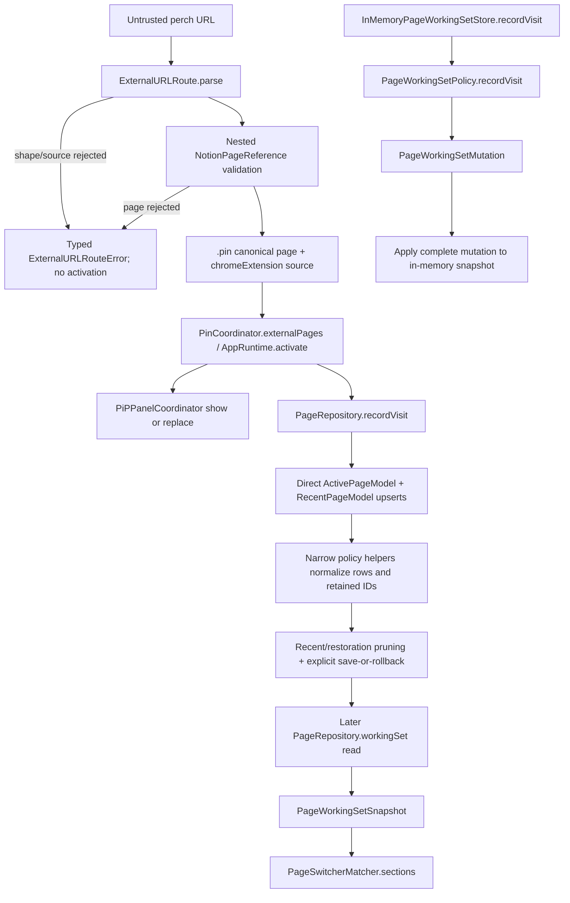

# Lecture 7 — Domain Modeling, Validation, and Policies

> **Estimated duration:** 75 minutes (10 minutes foundation, 20 minutes
> repository tour, 15 minutes runtime trace, 15 minutes deep dive, 5 minutes
> knowledge check, and 10 minutes exercise)

Perch's Domain directory is where many dangerous or ambiguous inputs
become explicit values: a URL becomes a validated Notion page, a cross-app
handoff becomes one known route, a pile of pages becomes a bounded working set,
and a failed delivery becomes a state with safe retry metadata. Most of these
rules are deterministic and value-semantic, which makes them unusually easy to
read and test in isolation.

This lecture documents committed source at baseline
`0b76a2c27d1715631896c3d03ab48ef0bd7e5823`. The working tree contained
uncommitted changes to `PageWorkingSetPolicy.swift` and its tests during course
production; those edits are not treated as evidence here. When a linked working
file differs, inspect the taught baseline with `git show 0b76a2c:<path>`.

## Learning objectives

By the end of this lecture, you will be able to:

1. distinguish value semantics, validation, representation, and policy from
   persistence and side-effecting orchestration;
2. state the exact accepted URL and canonicalization rules for
   `NotionPageReference` and the stricter outer grammar for `ExternalURLRoute`;
3. trace an untrusted handoff through validation into a bounded page working
   set without confusing parsing with activation or storage;
4. explain the ordering, deduplication, limits, and matching rules used by page
   history and switching;
5. describe panel-size values and mutations separately from AppKit frame
   application;
6. read capture snapshots, destinations, delivery states, retry policy,
   retention policy, and deterministic export as one recovery-oriented model;
7. explain what `JSONValue` and canonical JSON do—and do not—guarantee;
8. identify the credential and export security boundaries without overstating
   heuristic redaction; and
9. select focused value-policy tests while locating persistence, service, and
   manual verification in later layers.

The material is intentionally layered. New Swift programmers should begin with
**Foundation**. Experienced Swift programmers can start at **Repository tour**,
then use **Deep dive** for the exact invariants and security consequences.

## Before you begin

Recommended context:

- [Lecture 2](02-repository-and-technology-stack.md) for the SwiftPM target and
  source layout;
- [Lecture 4](04-composition-and-runtime.md) for dependency direction and
  isolation boundaries;
- [Lecture 5](05-panel-stashing-and-controls.md) for the consumer side of panel
  size preferences;
- [Lecture 6](06-webkit-notion-session.md) for the WebKit navigation and durable
  restoration consumers; and
- the [glossary](GLOSSARY.md) for `Sendable`, repository, and value semantics.

Three reading rules prevent category errors:

1. A struct can represent persisted data without being the persistence layer.
   Domain snapshots are transportable values; SwiftData models and model actors
   are taught in Lecture 8.
2. `Sendable` says a value may cross concurrency boundaries safely. It does not
   start a task, create an actor, or make a function asynchronous.
3. A parser returning a valid value authorizes only that representation. The
   runtime still decides whether to activate, persist, display, deliver, or
   export it.

The Domain directory is not perfectly “pure” in a theoretical layering sense.
Most files import Foundation or CoreGraphics and perform deterministic work,
but `DesignTokens.swift` imports AppKit and SwiftUI, and page policy consumes
`StoredPageSnapshot`, whose declaration lives with `PageRepository`. Treat the
directory as a pragmatic ownership boundary, not proof that every declaration
is platform-independent.

**Verification boundary:** unit tests can prove exact value transformations,
validation failures, ordering, and deterministic encodings. They do not prove
that Launch Services delivered a URL, Notion accepted a network request,
SwiftData committed a transaction, Keychain protected a token, or a recovered
export contains every future editor feature.

## Foundation

### Values, invariants, and policy

A **value** describes data by its contents. Two equal
`NotionPageReference` values mean the same page identity, URL, and title,
regardless of where each value was created. Swift structs and enums naturally
support this model; many repository values also conform to `Equatable`,
`Hashable`, `Codable`, and `Sendable` where those capabilities are useful.

An **invariant** is a condition that must remain true for every valid instance.
For example, `PanelContentSize` is finite and bounded, and
`DurablePageRestoration.scrollProgress` is finite and between zero and one.
Failable or throwing initializers concentrate those checks at construction.

A **policy** answers a deterministic question from explicit inputs:

```text
input values + policy parameters → output value or typed error
```

`PageWorkingSetPolicy.recordVisit`, `HistoryAssembler.sections`,
`PageSwitcherMatcher.sections`, and `RetryPolicy.delay` are examples. None
needs a database, window, network, or global singleton. A repository or
controller supplies current values, invokes policy, and applies the result.

### Why value semantics help concurrency

Mutable reference graphs require questions such as “who else can change this?”
Value-semantic inputs and outputs make mutation local and explicit. A
`PageWorkingSetMutation` is a complete proposed result, not a handle to live
repository state. A `CaptureRecordSnapshot` can cross from a model actor to a
delivery actor without sharing a SwiftData model object.

`Sendable` declarations document this intent. They complement actor isolation:
the actor protects mutable storage, while immutable snapshots cross the actor
boundary. The compiler can check much of the transfer shape, and focused tests
can construct values without booting the production graph.

### Validation is not sanitization, and canonicalization is not authorization

These terms have different jobs:

- **Validation** rejects inputs outside an accepted grammar or range.
- **Canonicalization** maps accepted variants to a stable representation.
- **Sanitization** removes or transforms content considered unsafe for a
  particular output.
- **Authorization** decides whether an actor may perform an operation.

`NotionPageReference` validates a Notion URL and canonicalizes its host/path.
`ExternalURLRoute` validates the outer handoff grammar. `CaptureExport`
sanitizes credential-shaped fields for recovery output. None of them decides
whether a Notion account may access a page or database; that remains an
authenticated service concern.

### Algebraic data types make invalid combinations harder to express

Enums with associated values model alternatives directly:

```swift
enum CaptureDestination {
    case managed(databaseID: String)
    case manual(pageID: String)
    case pageParent(pageID: String)
    case dataSource(dataSourceID: String)
}
```

Callers switch over all cases instead of coordinating loosely related strings
and booleans. Stable `rawKind` strings exist only at representation boundaries.
The enum remains the in-memory source of truth.

## Repository tour

### Complete Domain file map

Every committed Domain source is named here so this lecture can serve as a
coverage index:

| File | Principal values or policy | Representation and consumers | Focused evidence |
|---|---|---|---|
| [`CaptureExport.swift`](../../Sources/Perch/Domain/CaptureExport.swift) | Deterministic JSON/Markdown recovery export and credential-shaped key removal | Consumed by runtime recovery export | [`CaptureExportTests.swift`](../../Tests/PerchTests/CaptureExportTests.swift) |
| [`CaptureSnapshot.swift`](../../Sources/Perch/Domain/CaptureSnapshot.swift) | `DraftMutation`, draft/record snapshots, `CanonicalJSON` | Values passed among editor, repositories, runtime, and delivery services | capture export, editor-flow, repository, and delivery tests |
| [`DeliveryState.swift`](../../Sources/Perch/Domain/DeliveryState.swift) | Delivery/draft states, delivery destination, safe error | Persistence and delivery state-machine representation | [`DeliveryEngineTests.swift`](../../Tests/PerchTests/DeliveryEngineTests.swift) |
| [`DesignTokens.swift`](../../Sources/Perch/Domain/DesignTokens.swift) | Shared spacing, radii, and semantic SwiftUI colors | AppKit/SwiftUI presentation constants; deliberate platform-aware exception | view-level usage; no direct Domain unit test |
| [`ExternalURLRoute.swift`](../../Sources/Perch/Domain/ExternalURLRoute.swift) | Strict `perch://pin` handoff parser | Cross-app input becomes a typed route | [`ExternalURLRouteTests.swift`](../../Tests/PerchTests/ExternalURLRouteTests.swift) |
| [`HistoryAssembler.swift`](../../Sources/Perch/Domain/HistoryAssembler.swift) | Source-grouped, globally limited history sections | Public pure assembly API; no current production source consumer | [`HistoryAssemblerTests.swift`](../../Tests/PerchTests/HistoryAssemblerTests.swift) |
| [`JSONValue.swift`](../../Sources/Perch/Domain/JSONValue.swift) | Recursive Codable JSON sum type | Notion API request bodies and block conversion | [`NotionBlockConverterTests.swift`](../../Tests/PerchTests/NotionBlockConverterTests.swift) |
| [`NotionPageReference.swift`](../../Sources/Perch/Domain/NotionPageReference.swift) | Validated page identity, canonical URL, optional display title | Shared trust boundary for typed, restored, WebKit, and external page input | [`NotionPageReferenceTests.swift`](../../Tests/PerchTests/NotionPageReferenceTests.swift) |
| [`PageSwitcherMatcher.swift`](../../Sources/Perch/Domain/PageSwitcherMatcher.swift) | Pinned/recent sections and deterministic fuzzy scoring | Used by `PageSwitcherController` | [`PageSwitcherMatcherTests.swift`](../../Tests/PerchTests/PageSwitcherMatcherTests.swift) |
| [`PageWorkingSetPolicy.swift`](../../Sources/Perch/Domain/PageWorkingSetPolicy.swift) | Bounded, deduplicated pins/recents and retained restoration IDs | Used by page repository/store adapters | [`PageWorkingSetPolicyTests.swift`](../../Tests/PerchTests/PageWorkingSetPolicyTests.swift) |
| [`PageWorkingSetSnapshot.swift`](../../Sources/Perch/Domain/PageWorkingSetSnapshot.swift) | Working-set/restoration transport values and typed errors | Crosses repository, runtime, switcher, and WebKit boundaries | [`PageRepositoryTests.swift`](../../Tests/PerchTests/PageRepositoryTests.swift) and WebKit tests |
| [`PanelSizePreferences.swift`](../../Sources/Perch/Domain/PanelSizePreferences.swift) | Validated content sizes, built-in/custom presets, mutations | Used by size controller, defaults store, Settings | [`PanelSizePreferencesTests.swift`](../../Tests/PerchTests/PanelSizePreferencesTests.swift) |
| [`PersonalIntegrationToken.swift`](../../Sources/Perch/Domain/PersonalIntegrationToken.swift) | Trimmed `ntn_` token and redacted description | Passed to credential vault and API clients; not itself secure storage | [`PersonalIntegrationTokenTests.swift`](../../Tests/PerchTests/PersonalIntegrationTokenTests.swift) |
| [`QuickCaptureDestination.swift`](../../Sources/Perch/Domain/QuickCaptureDestination.swift) | Saved page-parent/data-source selection and display title | Settings/controller/repository value; converts to delivery destination | [`QuickCaptureDestinationRepositoryTests.swift`](../../Tests/PerchTests/QuickCaptureDestinationRepositoryTests.swift) |
| [`RetryPolicy.swift`](../../Sources/Perch/Domain/RetryPolicy.swift) | Clock seam, exponential retry, attention threshold, retention interval/result | Used by capture repository, delivery engine, scheduler | delivery and [`RetentionPolicyTests.swift`](../../Tests/PerchTests/RetentionPolicyTests.swift) |

The table also exposes two intentional cross-layer facts. `DesignTokens` is UI
policy living in Domain for shared ownership. `PageWorkingSetPolicy` operates
on `StoredPageSnapshot`, declared in
[`PageRepository.swift`](../../Sources/Perch/Persistence/PageRepository.swift),
so the current source layout is not a dependency-pure standalone Domain module.

### Exact Notion page URL invariants

`NotionPageReference.init(validating:)` accepts an input only when:

1. the UTF-8 length of `absoluteString` is at most 4,096 bytes;
2. the scheme, case-insensitively, is exactly `https`;
3. URL user and password are absent;
4. the lowercased host is exactly `app.notion.com`, `notion.com`,
   `www.notion.com`, or one of the legacy hosts `notion.so` and
   `www.notion.so`; and
5. scanning backward through the final path component can collect 32 ASCII
   hexadecimal characters, skipping hyphens encountered before all 32 are
   collected. Once 32 are collected, earlier characters remain the title
   prefix rather than being validated as more ID characters.

The page ID is lowercased. Canonicalization always uses `https`, preserves
`app.notion.com`, maps every other accepted host to `www.notion.com`, preserves
the complete percent-encoded path, and drops query and fragment because neither
is copied into the canonical components. The optional display title comes from
the final component's prefix before the ID: surrounding hyphens/spaces are
trimmed, hyphens become spaces, and whitespace collapses.

This is exact-host validation, not suffix matching. `notion.com.example.com` is
rejected. Workspace routes and percent-encoded path segments survive. Bare and
hyphenated UUID page IDs are accepted. Home/search paths without the required
ID are rejected. Unlike the outer handoff parser, the page initializer does not
explicitly reject a URL port; canonical components do not copy one, so an
accepted input port is absent from the resulting canonical URL.

### The stricter external route grammar

`ExternalURLRoute.parse` accepts only one current route shape:

```text
perch://pin?url=<percent-encoded HTTPS Notion page>&source=chrome-extension
```

The outer URL is independently bounded to 4,096 UTF-8 bytes. Its scheme must be
`perch`; user, password, port, fragment, and any nonempty path are
forbidden. The host/action must be `pin`. Query keys must be a subset of
`url` and `source`, with no duplicate occurrence—even a duplicate with a nil
value. Both single nonnil values are required. The only source is the exact
string `chrome-extension`. Finally, the nested URL must construct a valid
`NotionPageReference`; its typed error is wrapped as `.invalidPage`.

That two-stage parse prevents an outer custom-scheme URL from bypassing the
inner HTTPS/host/page-ID boundary. The parser returns a `Result`; it does not
activate the page or trust arbitrary source labels.

### Working set, history, and matching

`PageWorkingSetPolicy.standard` allows seven pins and seven unpinned recents.
Page identity comparisons lowercase IDs. `orderedUnique` sorts newest timestamp
first, breaks equal timestamps by canonical ID ascending, then keeps the first
case-insensitive ID occurrence. Pins are truncated to `pinLimit`; recents omit
all pinned IDs and truncate to `recentLimit`.

The policy's `recordVisit` makes the visited page active, preserves normalized
pins, inserts the visit into recent candidates, and excludes it from recents if
already pinned. `setPinned` first removes the page from both lists. Pinning
appends it unless a new pin would exceed the limit; unpinning adds it to
recents. These full mutation methods return the lowercased union of retained
pin/recent IDs, and `InMemoryPageWorkingSetStore` applies those
`PageWorkingSetMutation` values to its snapshot.

The durable `PageRepository` takes a narrower path. Its `recordVisit` directly
upserts `ActivePageModel` and `RecentPageModel`, then uses helpers such as
`canonicalID`, `pinnedPages`, `recentPages`, and `retainedRestorationIDs` while
normalizing rows and pruning restorations. It does **not** call
`PageWorkingSetPolicy.recordVisit` or apply a `PageWorkingSetMutation`.

`DurablePageRestoration` adds another validated value boundary. Its last URL
must parse as the same page ID, x/y/progress must be finite, and progress must
be in `0...1`. `PageWorkingSetSnapshot.restoration(for:)` compares IDs
case-insensitively.

`HistoryAssembler` is a separate general history policy. It searches item
title, page display title, or page ID with localized case-insensitive contains;
groups in fixed precedence `pinned → draft → captured → notion`; sorts each
source by descending time while retaining input order for ties; deduplicates
page ID across all sections; and applies one positive row limit globally.
There is currently no production source consumer, so it is a tested public
capability rather than evidence of the current page-switcher UI path.

`PageSwitcherMatcher` owns that current switcher path. With an empty query it
deduplicates and preserves stored Pinned/Recent order, removes pinned IDs from
recents, and marks active identity case-insensitively. Search folds case and
diacritics, collapses whitespace, and scores ordered character subsequences by
token boundaries, adjacency, gaps, prefix, and candidate length. Title matches
receive a 100,000-point class advantage over page-ID matches. Equal scores sort
by pinned first, newer timestamp, then page ID ascending. Results appear in one
`Results` section.

### Panel sizes are values before they are windows

`PanelSizePreferences.swift` does not move an AppKit window. It defines:

- finite content dimensions from 360×420 through 4,096×4,096;
- Compact at 420×520, Wide at 680×720, and Comfortable as screen width × 0.34
  clamped to 480...560 plus height × 0.70 clamped to 560...720;
- stable `builtin:<name>` and `custom:<uuid>` IDs;
- custom whole-point dimensions and trimmed names of 1...40 characters;
- case-insensitive name uniqueness, with built-in names reserved;
- at most 12 custom presets; and
- a default ID plus optional last explicit working content size.

Mutating methods validate a proposed new value. Deleting the default custom
preset falls back to Comfortable but preserves the last explicit working size.
The controller/store/AppKit path was traced in [Lecture 5](05-panel-stashing-and-controls.md#size-presets-from-value-model-to-surfaces).

### Capture, delivery, destination, and JSON values

`DraftMutation` is a requested draft write. `CaptureDraftSnapshot` is the
versioned result, including editor/source JSON, disposition, timestamps, and
record/return links. `CaptureRecordSnapshot` is the delivery envelope: it
freezes the enqueued draft revision and carries destination, state, attempt
times, fingerprint, operation journal, remote identity, safe error, and whether
a managed ambiguity check is required.

`DeliveryState` has six durable cases: `queued`, `inFlight`, `delivered`,
`retrying`, `blockedConflict`, and `uncertain`. `DraftDisposition` is `active`,
`stashed`, or `abandoned`. `SafeDeliveryError` holds an application code plus
optional message, HTTP status, and retry-after interval; “safe” means designed
for persistence/presentation, not proof that arbitrary upstream text has been
formally classified.

`CaptureDestination` represents four delivery mechanisms:

| Case | Stable kind | Managed lookup? | Journaled page creation? |
|---|---|---:|---:|
| `.managed(databaseID:)` | `managed` | yes | no |
| `.manual(pageID:)` | `manual` | no | no |
| `.pageParent(pageID:)` | `page_parent` | no | yes |
| `.dataSource(dataSourceID:)` | `data_source` | no | yes |

`QuickCaptureDestination` is the smaller saved-selection value used in
Settings: page parent or data source, stable identifier, and display title. It
rejects empty identifiers when reconstructed from raw fields and converts to
the corresponding `CaptureDestination` when a draft is enqueued.

`JSONValue` is a recursive Codable enum for object, array, string, number,
boolean, and null. It gives Notion request construction a typed tree without
using unbounded `[String: Any]` at API boundaries. Decode order intentionally
tries null, Bool, Double, String, array, then object.

`CanonicalJSON` accepts JSON fragments, parses bytes into a Foundation JSON
object, and re-encodes with sorted object keys. It stabilizes equivalent key
ordering for storage/comparison; it is not schema validation, credential
redaction, or a cryptographic signature.

### Retry, attention, retention, and export

`RetryPolicy` defaults to a 5-second base, 6-hour maximum, and 7-day attention
interval. Without server guidance, attempt `n` waits
`min(5 × 2^(n-1), 6 hours)`, with the exponent clamped to `0...20`. A supplied
`retryAfter` wins and is clamped only to zero or greater; it is **not** capped by
`maximumDelay`. Work at or beyond the attention interval requires attention.

`CaptureClock` makes time injectable; `SystemCaptureClock` returns `Date()`.
`RetentionPolicy` carries a default 30-day interval, while `RetentionResult`
reports deleted records and drafts. The policy value alone does not decide
which states are safe to delete. `CaptureRepository.applyRetention` owns that
persistence transition; tests establish that ordinary delivered work may be
removed while unresolved states, active/stashed drafts, and operation journals
needed for recovery remain.

`CaptureExport` emits deterministic recovery artifacts. JSON export sorts
drafts and records by ID, uses sorted object keys, and includes schema version
1. Markdown sorts identically, renders supported ProseMirror nodes and marks,
and includes canonical recovery JSON for unknown nodes, source documents, and
operation journals.

Before either output, editor/source/journal trees are recursively sanitized by
**key shape**. Exact `key`, `token`, or `secret`; authorization/password words;
credential-like token/secret suffixes; and qualified key suffixes such as API,
private, signing, client, encryption, access, auth, device, or public key are
removed. Benign keys such as `monkey`, `keyboardShortcut`, `tokenCount`, and
`secretary` remain.

This is an important but bounded recovery defense. It is heuristic key-based
redaction, not a general secret scanner: a credential under an innocent key can
remain, and future node shapes require review. Exports should still be treated
as potentially sensitive user documents.

`PersonalIntegrationToken` is similarly narrow. It trims surrounding
whitespace, requires a nonempty `ntn_` prefix, and offers a redacted description
ending in the last four characters for longer values. It retains the full token
in memory. Secure persistence belongs to `PersonalTokenCredentialVault`, not to
this value type, and tokens should never be pasted into chat, logs, URLs, or
exports.

## Runtime trace

### Untrusted handoff → canonical page → bounded working set

This trace shows where pure Domain decisions end and side-effecting owners
begin. Assume the Chrome extension sends a route containing a slugged Notion
URL with a query and fragment.



Step by step:

1. The outer parser checks the byte bound, custom scheme, empty path, absent
   credentials/port/fragment, exact `pin` action, exact query cardinality, and
   known source.
2. It percent-decodes the nested `url` query value through `URLComponents` and
   constructs a `NotionPageReference`.
3. The page initializer checks its independent byte bound, HTTPS scheme, exact
   host, absent credentials, and 32-hex suffix. It lowercases identity,
   normalizes the host, retains the encoded path, and drops query/fragment.
4. Only `.success(.pin(page, .chromeExtension))` becomes a candidate for
   runtime activation. Parser success itself performs no UI or persistence.
5. Runtime/pin coordination presents the page. In parallel, durable persistence
   calls `PageRepository.recordVisit`.
6. That repository canonicalizes the ID and directly upserts the singleton
   active row and matching recent row. It does not call
   `PageWorkingSetPolicy.recordVisit` and does not consume a
   `PageWorkingSetMutation`.
7. The repository uses the narrower `pinnedPages`, `recentPages`, and
   `retainedRestorationIDs` helpers while limiting recents and pruning
   restoration rows, then explicitly saves or rolls back its model context.
8. The full-mutation path belongs to the separate in-memory adapter:
   `InMemoryPageWorkingSetStore.recordVisit` calls the policy's `recordVisit`
   and applies the returned `PageWorkingSetMutation` to its process-local
   snapshot.
9. Later, `PageRepository.workingSet` returns a `PageWorkingSetSnapshot` to the
   switcher. Empty query preserves its Pinned/Recent order; a nonempty query
   creates deterministic scored Results.

### Failure branches worth retaining

| Input or condition | Domain result | Side effects permitted |
|---|---|---|
| Unknown handoff query key or duplicate `url` | `.invalidRouteShape` | None |
| `http://www.notion.com/...` nested page | `.invalidPage(.unsupportedScheme)` | None |
| Host `notion.com.example.com` | `.invalidPage(.unsupportedHost)` | None |
| Eighth new pin | `.pinLimitReached(maximum: 7)` | Existing working set must remain unchanged |
| Restoration URL belongs to another page | `.invalidRestoration` | Invalid restoration must not become resume input |
| No fuzzy page match | empty sections | UI may show no results; no activation |

The URL and policy tests establish these typed branches. Actual custom-scheme
delivery through Launch Services and atomic repository application are separate
integration concerns.

## Deep dive

### Value-policy pipeline versus effectful shell

| Concern | Value/policy core | Effectful owner |
|---|---|---|
| Page input | `NotionPageReference`, `ExternalURLRoute` | app delegate, runtime, WebKit delegates |
| Page collection | snapshots, `PageWorkingSetPolicy`, matcher | `PageRepository`, store, switcher controller |
| Panel sizing | `PanelContentSize`, presets/preferences | defaults store, size controller, AppKit coordinator |
| Capture state | mutations, snapshots, states, destinations | capture repository, lifecycle coordinator, delivery engine |
| Retry/retention | delay/threshold/interval values | engine, scheduler, repository transitions |
| Notion JSON | `JSONValue`, canonical bytes | block converter, API client, HTTP transport |
| Recovery output | deterministic `CaptureExport` transformation | runtime chooses destination/opening; user controls resulting file |
| Token grammar | `PersonalIntegrationToken` | Keychain vault, connection controller, API client |

When changing behavior, first decide whether the request is a transformation of
values or an effect. A new sort tie-breaker belongs in policy. Fetching current
rows, persisting normalized rows, opening a URL, or sending HTTP does not.

### Security boundaries and non-guarantees

| Boundary | Exact protection | Does not guarantee |
|---|---|---|
| Page URL | length bound, HTTPS, absent user/password, exact host allowlist, 32-hex ID, stable path-only canonical form | page authorization, content safety, network reachability |
| External route | independently bounded and exact custom-scheme grammar, one known action/source, no extra/duplicate fields | caller identity or cryptographic authenticity of the Chrome extension |
| Restoration | same validated page ID, finite coordinates, progress in 0...1 | DOM/back-forward reproduction or successful scroll application |
| Panel sizes | finite bounded dimensions, validated names/count/version | fit on every display; AppKit still clamps effective geometry |
| JSON values | typed recursive cases and Codable representation | a Notion API schema, finite-number validation at every producer, or canonical semantics |
| Canonical JSON | parsed JSON and sorted object keys | redaction, schema validation, hashing, signature, or array reordering |
| Export | recursive credential-shaped **key** removal and deterministic recovery | detection of secrets stored under benign keys; nonsensitive document content |
| Token value | trim, `ntn_` prefix, safe display string | secure storage, token validity, permissions, or network authentication |
| Safe delivery error | selected fields suitable for durable state/UI by convention | automatic proof that every supplied message contains no sensitive text |

The external route's `source=chrome-extension` is provenance metadata, not
authentication. Another local process can construct the scheme URL. Security
comes from treating every field as untrusted and revalidating the nested page,
not from believing the source label.

### Delivery states describe ambiguity instead of hiding it

The delivery model refuses to collapse every outcome into success/failure:

- `queued` is durable work not yet claimed;
- `inFlight` records ownership before transport begins;
- `delivered` has a successful terminal receipt;
- `retrying` is known retryable work, possibly paused for reconnect;
- `blockedConflict` requires user or policy resolution; and
- `uncertain` means the remote result cannot safely be inferred.

Destination capabilities explain different ambiguity handling. Managed create
can search by capture ID before another create. A manual append has no equivalent
managed lookup, so an ambiguous outcome becomes uncertain rather than blindly
duplicating content. Page-parent and data-source creation carry an operation
journal because multi-step replacement/archive work must be recoverable.

The enum does not enforce legal transitions by itself. Repositories and
`DeliveryEngine` own atomic claims and transitions, covered in Lectures 8 and
10. The Domain layer supplies names and immutable evidence so those transitions
are explicit and testable.

### Determinism is a recovery feature

Stable ordering appears throughout the layer:

- canonical page IDs are lowercase;
- page ordering has timestamp and ID tie-breakers;
- switcher scoring has explicit pinned/time/ID tie-breakers;
- history retains input order on equal timestamps;
- preset IDs serialize to stable strings;
- JSON object keys are sorted;
- export drafts/records are sorted by ID; and
- replacement journals sort block identifiers before canonical encoding.

Determinism improves reproducible tests, conflict comparison, inspection, and
support exports. It does not imply that all business events commute: arrays,
timestamps, revisions, and operation order remain meaningful.

### Model validation must survive decoding

`PanelContentSize`, `CustomPanelSizePreset`, and `PanelSizePreferences` implement
custom `Decodable` paths that call their validating initializers. Stored JSON
therefore cannot bypass bounds, whole-point rules, name limits, version checks,
duplicate IDs/names, or default-preset existence.

By contrast, simple synthesized snapshot decoding preserves its encoded shape
and relies on the repository/schema boundary for transition integrity. Choose
custom decoding when every instance must satisfy a local invariant; avoid
duplicating repository transition logic inside passive transport values.

## Common misconceptions and failure modes

| Misconception | Correction | Diagnostic starting point |
|---|---|---|
| “Everything in Domain is platform-free pure business logic.” | Most is value/policy code, but `DesignTokens` imports AppKit/SwiftUI and page policy consumes a persistence-declared snapshot. | Complete Domain file map |
| “A canonical Notion URL proves access.” | It proves accepted syntax, host, ID, and representation only. Notion authentication/authorization remains remote. | `NotionPageReference.init` |
| “Checking `hasSuffix("notion.com")` is equivalent.” | Exact allowlist membership prevents hosts such as `notion.com.example.com`. | `supportedHosts` and URL tests |
| “The external source string authenticates the extension.” | It is one allowed metadata value in an untrusted custom-scheme URL, not a signature. | `ExternalURLRoute.parse` |
| “Query and fragment are part of page identity.” | They are deliberately omitted from the canonical page URL; the encoded path and 32-hex ID are retained. | canonical URL construction |
| “Pins and recents are two independent lists.” | Policy removes pinned IDs from recents, bounds both, and returns their union for restoration retention. | `PageWorkingSetPolicy` |
| “Both page-store implementations apply `PageWorkingSetMutation`.” | Only `InMemoryPageWorkingSetStore` applies the full mutation. Durable `PageRepository.recordVisit` directly upserts models and calls narrower policy helpers. | `PageRepository.recordVisit` and `InMemoryPageWorkingSetStore.recordVisit` |
| “HistoryAssembler drives the current page switcher.” | It is a tested public history policy with no current production source consumer; `PageSwitcherMatcher` drives switcher matching. | source consumer search |
| “Fuzzy results depend on Set iteration.” | Scoring and all tie-breakers are explicit and deterministic. | `PageSwitcherMatcher.score` and sort |
| “Changing a size value resizes a window.” | Domain produces validated preferences. A main-actor controller and AppKit coordinator apply it. | `PanelSizeController` from Lecture 5 |
| “`Sendable` makes a repository thread-safe.” | It describes transfer safety of the value. Actors/model actors protect mutable repository state. | snapshots versus repositories |
| “Canonical JSON removes secrets.” | It parses and sorts keys. Export sanitization is a separate heuristic transformation. | `CanonicalJSON` versus `CaptureExport.sanitize` |
| “Export redaction makes the file safe to publish.” | It removes credential-shaped keys, not every possible secret or sensitive note. Treat exports as private recovery data. | `isCredentialShaped` and export tests |
| “`retryAfter` is capped at six hours.” | Server guidance wins and is only clamped at zero; the maximum applies to computed exponential backoff. | `RetryPolicy.delay` |
| “Thirty days means every old capture is deleted.” | Repository retention preserves unresolved/recovery-critical states and journals. Domain only supplies the interval/result values. | `RetentionPolicyTests` |
| “A token with `ntn_` is valid and secure.” | The value checks a local prefix and redacts display. Remote validity and secure storage belong elsewhere. | `PersonalIntegrationToken` and vault |

A common implementation failure is adding a network or database lookup to a
value initializer because “validation belongs in Domain.” Local invariants
belong there; volatile authority does not. Keep initializers deterministic and
let an injected service perform authenticated or persistent checks.

## Presenter notes

### Suggested 75-minute pacing

- **0–10 minutes:** values, invariants, policy, and effectful shell.
- **10–22 minutes:** exact page URL and external route trust boundary.
- **22–34 minutes:** working-set, history, matcher, and restoration values.
- **34–42 minutes:** panel-size and complete file-map exceptions.
- **42–53 minutes:** capture/delivery/destination/JSON model.
- **53–62 minutes:** retry, retention, deterministic export, and token boundary.
- **62–68 minutes:** handoff runtime trace and security table.
- **68–75 minutes:** misconceptions, knowledge check, and exercise setup.

### Board plan and demonstration cues

Draw a large inner box labeled **value/policy core** and an outer ring labeled
**effectful owners**. Put the URL parsers, working-set policy, matcher, size
preferences, snapshots, states, retry, and export inside. Put Launch Services,
runtime, AppKit, SwiftData, Keychain, scheduler, and HTTP outside. Arrows may
carry values across the boundary; do not draw a database or network arrow
originating from a Domain initializer.

For the source tour:

1. Open `NotionPageReference` and number its five acceptance gates. Then point
   to canonical component construction and say what is copied versus omitted.
2. Open `ExternalURLRoute` beside its tests. Ask why both outer and nested URLs
   need independent 4,096-byte bounds.
3. Feed one page through `recordVisit` on the board; compute normalized pins,
   recents, and retained restoration IDs.
4. Compare `HistoryAssembler` with `PageSwitcherMatcher`; emphasize that only
   the latter has a production switcher consumer today.
5. Show `PanelContentSize` custom decoding as an invariant-preserving path.
6. Lay out `CaptureRecordSnapshot` and color fields as identity, revision,
   destination, state/timing, ambiguity/recovery, and safe diagnostics.
7. Compute retry delays for attempts 1–5: 5, 10, 20, 40, 80 seconds; then ask
   what a 50,000-second `retryAfter` does.
8. In `CaptureExport.isCredentialShaped`, contrast `apiKey` with `monkey` and
   explicitly state the heuristic's non-guarantee.
9. Finish at the file map and confirm every Domain basename has a role.

### Demonstration safety

Use synthetic URLs and placeholder token text. Never paste a real integration
token, Notion cookie, password, user export, or page content into slides,
terminal history, tests, or chat. Do not register or invoke a real custom URL
handler just to demonstrate the parser; source and unit tests are sufficient.

If showing export behavior, use generated JSON containing obviously fake
credential-shaped fields. Do not claim the sanitizer is exhaustive. If showing
persistence consumers, use in-memory stores; Lecture 8 owns durable schema and
transaction details.

## Knowledge check

1. What does value semantics buy this layer beyond convenient equality tests?
2. List the five acceptance gates for `NotionPageReference`.
3. Which URL pieces survive canonicalization, and how are the three accepted
   hosts represented?
4. Why does `ExternalURLRoute` validate both its outer URL and nested page URL?
5. How do pins, recents, and retained restoration IDs relate?
6. How does `HistoryAssembler` differ from `PageSwitcherMatcher` in both rules
   and current consumption?
7. Why is a temporarily clamped panel frame not a `PanelContentSize` mutation?
8. What is the difference between `QuickCaptureDestination` and
   `CaptureDestination`?
9. What does `CanonicalJSON` guarantee, and what security operation does it not
   perform?
10. What happens to computed retry delay at very high attempt counts, and what
    happens when `retryAfter` is supplied?
11. Why can a deterministic, redacted capture export still be sensitive?
12. Name the two important exceptions to describing Domain as a completely
    platform-free, dependency-pure module.

### Answers

1. Immutable snapshots cross actors without sharing mutable model objects;
   mutations become complete proposals; ownership and concurrency reasoning
   are clearer; and callers cannot observe half-applied local mutation.
2. At most 4,096 UTF-8 bytes; HTTPS; no URL user/password; exact accepted host;
   and a backward scan of the final path component that collects 32 ASCII hex
   characters while skipping hyphens until the count is reached.
3. HTTPS and the full percent-encoded path survive; query/fragment are omitted.
   `app.notion.com` remains itself, while all other accepted current and legacy
   hosts canonicalize to `www.notion.com`.
4. The outer custom-scheme grammar constrains action, source, and field shape;
   nested validation independently constrains the page to an accepted HTTPS
   Notion identity. Neither boundary substitutes for the other.
5. Pins and recents are bounded, deduplicated, disjoint lists. Retained
   restoration IDs are their lowercased union, allowing persistence to prune
   state for pages no longer in the working set.
6. History uses fixed source precedence, contains search, a global row limit,
   and cross-source deduplication; it has no production source consumer now.
   The switcher preserves Pinned/Recent sections for empty query and uses
   deterministic fuzzy scoring for search; `PageSwitcherController` consumes it.
7. Content size is the user's validated request. AppKit frame policy may clamp
   the effective window to a display without changing that preferred value.
8. `QuickCaptureDestination` stores a user selection plus title for page-parent
   or data-source creation. `CaptureDestination` is the delivery envelope's
   four-way mechanism, including managed and manual modes without display title.
9. It validates that bytes parse as JSON fragments and re-encodes objects with
   sorted keys. It does not redact, validate an application schema, authorize,
   hash, or sign.
10. Computed exponential delay caps at `maximumDelay` after a bounded exponent.
    Supplied `retryAfter` wins and is clamped only to nonnegative, not to the
    maximum.
11. Redaction is heuristic and key-shaped; user content is inherently private,
    and secrets under innocent keys can remain. Determinism does not imply safe
    publication.
12. `DesignTokens.swift` imports AppKit/SwiftUI, and page policy uses
    `StoredPageSnapshot` declared in the persistence file `PageRepository.swift`.

## Hands-on exercise

### Exercise: design a trusted “open recent page” handoff

Product proposes a new cross-app route:

```text
perch://open-recent?page_id=<id>&source=chrome-extension
```

The request says: “Accept any page ID, look it up in recents, and show it.”
Without editing source, write a design review that answers:

1. Which existing type should own outer route parsing?
2. What exact grammar and bounds should the new action enforce?
3. Is a bare `page_id` enough to construct `NotionPageReference`?
4. Which layer should look up the current working set?
5. How should missing, duplicate, stale, or nonrecent IDs behave?
6. Which tests belong to pure policy, repository/controller integration, and
   manual Launch Services verification?
7. What information must not be logged or returned to the caller?

Use committed-source searches:

```sh
git grep -n "maximumURLLength\|itemsByName\|unknownAction" HEAD -- \
  Sources/Perch/Domain Tests/PerchTests/ExternalURLRouteTests.swift
git grep -n "canonicalID\|recentPages\|restoration(for" HEAD -- \
  Sources/Perch/Domain Tests/PerchTests
git grep -n "externalPages\|handleOpenURLs" HEAD -- Sources/Perch
```

Do not register the scheme, change the handoff protocol, or launch external
applications for this source exercise.

### Expected answer and observations

`ExternalURLRoute` should own the new outer grammar because it already converts
untrusted custom-scheme input into a typed route. A defensible shape would keep
the independent 4,096-byte bound; exact scheme/action/source; absent
credentials, port, path, and fragment; an allowlist of exactly `page_id` and
`source`; and exactly one nonnil value for each. The page ID should use an exact
32-ASCII-hex parser and canonical lowercase representation rather than an
unbounded arbitrary string.

A bare ID is not enough to reconstruct the canonical URL safely. The current
`NotionPageReference` requires a validated URL and preserves meaningful
workspace/app-host path. Route parsing should therefore produce a typed lookup
request such as `.openRecent(pageID:source:)`, not invent
`https://www.notion.com/<id>` and pretend it is the stored page reference.

The effectful runtime/controller should ask the page repository or in-memory
working-set port for the current snapshot, then use a small deterministic policy
to find a case-insensitive ID **only in recents**. Parsing must not query
SwiftData. A missing/stale ID should produce no activation and a bounded,
nonrevealing user-facing result. Duplicate query fields are invalid even if one
has no value. If storage contains duplicate/corrupt rows, repository
normalization should prevent them from escaping; lookup policy should still
define deterministic first/none behavior rather than relying on collection
accident.

Suggested verification split:

- `ExternalURLRouteTests`: exact new shape, bounds, unknown/duplicate/missing
  fields, source, ID grammar, and typed result;
- a pure lookup-policy test: case-insensitive match, recents-only behavior,
  missing ID, deterministic duplicates;
- runtime/repository tests: lookup before activation, no mutation on failure,
  saved canonical page and restoration forwarded on success; and
- manual protocol test: Launch Services actually delivers the registered
  custom URL from the intended client on supported macOS versions.

Logs and errors should not reveal page titles, URLs, workspace paths, tokens,
cookies, or arbitrary query values. The `source` label still is not caller
authentication. If stronger provenance is required, that is a new security
design—not a reason to trust a string already present in the URL.

## Recap

- Domain modeling turns ambiguous inputs and state into explicit values,
  invariants, enums, and deterministic policies.
- Value semantics and `Sendable` snapshots complement actors: values cross
  isolation boundaries while repositories/services own mutable effects.
- `NotionPageReference` accepts bounded HTTPS URLs on the current exact hosts
  plus two legacy `.so` hosts with a 32-hex page suffix; it canonicalizes
  non-app hosts to `www.notion.com` and removes query/fragment.
- `ExternalURLRoute` independently constrains the outer custom-scheme grammar,
  one action, one source, field cardinality, and nested page validation.
- Page-working-set policy bounds pins and unpinned recents at seven each,
  canonicalizes identity, and returns restoration-retention IDs as a complete
  mutation. The in-memory store applies that full mutation; the durable
  repository directly upserts models and reuses narrower policy helpers.
- History assembly and page-switcher matching are different policies; only the
  matcher drives the current switcher path.
- Panel-size values validate user preferences independently of AppKit's
  effective frame and display clamping.
- Capture snapshots preserve revisions, destination, durable state, timing,
  ambiguity, and recovery evidence across actors and persistence.
- Delivery state makes retry, conflict, and uncertainty explicit. Destination
  capability determines whether ambiguous work can be looked up or must stop.
- Retry uses bounded exponential backoff unless server `retryAfter` is present;
  retention defaults to 30 days but effectful repository rules preserve
  unresolved recovery work.
- `JSONValue` is a typed recursive representation; canonical JSON sorts object
  keys but does not sanitize or validate a Notion schema.
- Capture export is deterministic and recursively removes credential-shaped
  keys, but remains private recovery data rather than a guaranteed-safe public
  artifact.
- `PersonalIntegrationToken` validates local shape and redacts display; secure
  storage and remote permission checks belong to other layers.
- The Domain directory is pragmatic rather than perfectly pure:
  `DesignTokens.swift` is platform-aware, and page policy consumes a
  persistence-declared snapshot.

Next, Lecture 8 in the [course navigation](README.md#course-navigation) follows
these values into SwiftData schemas, model actors, repository transactions,
restoration, capture transitions, and degraded persistence behavior.
