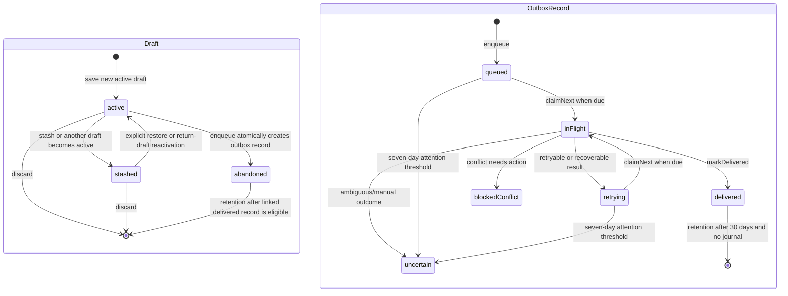

# Lecture 8 — SwiftData Persistence and Restoration

> **Estimated duration:** 75 minutes (10 minutes foundation, 20 minutes
> repository tour, 15 minutes runtime trace, 15 minutes deep dive, 5 minutes
> knowledge check, and 10 minutes exercise)

Notion PiP persists two kinds of continuity: the page working set that brings
the user's context back, and the Quick Capture records that prevent an edit or
delivery attempt from disappearing. Both use one versioned SwiftData
container, but their repositories enforce different invariants. A small set of
preferences deliberately uses `UserDefaults`, and degraded startup deliberately
keeps nonpersistent app surfaces available when the SwiftData store cannot open.

This lecture documents committed source at baseline
`363c422da3df1c7e3b27632aacf4d55c82680cee`. The working tree contained
uncommitted changes to `PageRepository.swift` and its tests during course
production; those changes are excluded from every claim below. If a linked
working file differs, inspect the taught baseline with
`git show 363c422:<path>`.

## Learning objectives

By the end of this lecture, you will be able to:

1. explain how `NotionPiPPersistence` opens the current V3 schema and applies
   the V1→V2→V3 migration plan;
2. map every SwiftData model to its repository-owned snapshot and lifecycle;
3. explain why `@ModelActor`, a private `ModelContext`, explicit save, and
   rollback form the persistence isolation boundary;
4. trace page visits, pins, recents, active-page restoration, and validated
   scroll restoration through `PageRepository`;
5. trace draft revision checks, enqueue, atomic claim, delivery transitions,
   recovery journals, and retention through `CaptureRepository`;
6. distinguish SwiftData settings, `UserDefaults` panel-size preferences, and
   the in-memory page-working-set adapter; and
7. describe exactly which features degrade when the shared persistent
   container cannot open.

The lecture is layered for a mixed audience. New Swift programmers should read
**Foundation** first. SwiftData users can begin with **Repository tour**.
Experienced maintainers should still read **Deep dive**, where migration,
atomicity, idempotency, and degraded startup are separated precisely.

## Before you begin

Recommended context:

- [Lecture 4](04-composition-and-runtime.md) for the composition root,
  repository protocols, and actor boundaries;
- [Lecture 6](06-webkit-notion-session.md) for the producer and consumer of
  durable page restoration;
- [Lecture 7](07-domain-modeling-and-policies.md) for page-working-set,
  delivery-state, retry, retention, and snapshot values; and
- the [architecture map](ARCHITECTURE_MAP.md#flow-4--capture-delivery-from-editor-to-notion)
  for the cross-layer capture flow.

Keep four rules in mind:

1. A SwiftData `@Model` object is mutable persistence state tied to a model
   context. It does not cross repository isolation.
2. A domain snapshot is a value copy designed to cross actors. It is not a live
   row and changing it does not change the store.
3. An actor serializes calls to its own state. It does not make a multi-step
   operation durable until `ModelContext.save()` succeeds.
4. “Local save” and “delivered to Notion” are separate milestones. The outbox
   exists specifically to keep them separate.

**Verification boundary:** the focused tests use in-memory containers or
temporary store files to prove model, migration, rollback, ordering, and
transition behavior. They do not prove recovery from arbitrary on-disk
corruption, disk exhaustion, power loss during SQLite I/O, or every database
created by a future shipped build.

## Foundation

### SwiftData in plain language

SwiftData maps annotated Swift reference types to durable records:

- `@Model` marks a stored record type.
- `ModelContainer` owns the schema and backing store.
- `ModelContext` tracks fetched, inserted, changed, and deleted model objects.
- `FetchDescriptor` describes a query, sort, predicate, and optional limit.
- `@ModelActor` gives a repository a serial executor associated with its model
  context.

Notion PiP opens a `Schema` for `NotionPiPSchemaV3` through
[`NotionPiPPersistence.swift`](../../Sources/NotionPiP/Persistence/NotionPiPPersistence.swift).
Production uses SwiftData's normal local store location unless a test supplies
an explicit URL. Tests may request an in-memory-only configuration. CloudKit
is explicitly `.none` in every path.

### Models stay inside; values cross actors

The repositories fetch mutable model objects, validate their raw strings and
URLs, and return `Sendable` values such as `StoredPageSnapshot`,
`PageWorkingSetSnapshot`, `CaptureDraftSnapshot`, and
`CaptureRecordSnapshot`. This is the important boundary:

```text
MainActor / service actor
        │  async request + Sendable values
        ▼
@ModelActor repository
        │  private ModelContext and @Model objects
        ▼
shared ModelContainer → local SwiftData store
```

No view or delivery service receives a `PinnedPageModel`,
`CaptureRecordModel`, or another context-bound object.

### Explicit transactions in this repository

Every SwiftData repository creates its own `ModelContext` from the shared
container and sets `autosaveEnabled = false`. A write follows this shape:

```text
fetch → validate → mutate one or more models → save
                                      failure → rollback → throw
```

`PageRepository` and `QuickCaptureDestinationRepository` call a
`saveOrRollback` helper. `CaptureRepository.commit` also labels the save
operation so tests can inject a failure at claim, enqueue, delivery, journal,
or retention boundaries. Rollback matters because a failed tracked mutation
must not leak into a later successful save.

### Three storage choices

| Storage | Used for | Reason |
|---|---|---|
| SwiftData | Pages, restorations, capture drafts, outbox records, and selected Quick Capture destination | Versioned structured data, queries, multi-record mutations, and reopen behavior |
| `UserDefaults` JSON | Panel-size preferences | Small device-local preference value with legacy AppKit frame compatibility |
| In-memory actor | Page switcher when no repository is supplied and deterministic tests | Same protocol behavior without claiming durability |

The optional personal integration token is not in this layer; it belongs in
Keychain. WebKit cookies likewise remain in WebKit's website data store.

## Repository tour

### Complete Persistence file map

Every committed Persistence basename appears below.

| File | Owns | Key invariants and consumers | Focused evidence |
|---|---|---|---|
| [`ActivePageModel.swift`](../../Sources/NotionPiP/Persistence/ActivePageModel.swift) | Singleton-like current page row | Unique `stableID` defaults to `active`; page ID, canonical URL, title, update time | [`PageRepositoryTests.swift`](../../Tests/NotionPiPTests/PageRepositoryTests.swift), [`SchemaMigrationTests.swift`](../../Tests/NotionPiPTests/SchemaMigrationTests.swift) |
| [`CaptureDraftModel.swift`](../../Sources/NotionPiP/Persistence/CaptureDraftModel.swift) | Mutable editor draft row | Unique ID, optimistic revision, canonical editor/source JSON, raw disposition, record/return-draft links | [`CaptureRepositoryTests.swift`](../../Tests/NotionPiPTests/CaptureRepositoryTests.swift) |
| [`CaptureRecordModel.swift`](../../Sources/NotionPiP/Persistence/CaptureRecordModel.swift) | Durable delivery outbox row | Enqueued revision, destination/state raw values, scheduling timestamps, safe error, journal, remote identity | capture, delivery, scheduler, and retention tests |
| [`CaptureRepository.swift`](../../Sources/NotionPiP/Persistence/CaptureRepository.swift) | Draft and outbox model actor | Revision checks, explicit draft transitions, enqueue reconciliation, atomic claim, recovery, delivery writes, journals, retention, rollback | [`CaptureRepositoryTests.swift`](../../Tests/NotionPiPTests/CaptureRepositoryTests.swift), [`DeliverySchedulerTests.swift`](../../Tests/NotionPiPTests/DeliverySchedulerTests.swift), [`RetentionPolicyTests.swift`](../../Tests/NotionPiPTests/RetentionPolicyTests.swift) |
| [`NotionPiPPersistence.swift`](../../Sources/NotionPiP/Persistence/NotionPiPPersistence.swift) | Container factory | Current V3 schema, migration plan, disk/explicit-URL/in-memory configurations, no CloudKit | migration and shared-container tests |
| [`NotionPiPSchema.swift`](../../Sources/NotionPiP/Persistence/NotionPiPSchema.swift) | V1/V2/V3 schemas and migration stages | Ordered lightweight migration path | [`SchemaMigrationTests.swift`](../../Tests/NotionPiPTests/SchemaMigrationTests.swift) |
| [`PageRepository.swift`](../../Sources/NotionPiP/Persistence/PageRepository.swift) | Page working-set model actor and `StoredPageSnapshot` | Validated URL/page-ID match, seven pins, seven unpinned recents, active page, restoration pruning, rollback | [`PageRepositoryTests.swift`](../../Tests/NotionPiPTests/PageRepositoryTests.swift) |
| [`PageRestorationModel.swift`](../../Sources/NotionPiP/Persistence/PageRestorationModel.swift) | Per-page durable URL/scroll row | Repository deduplicates by canonical page ID and deletes invalid/out-of-working-set rows | page repository and WebKit restoration tests |
| [`PageWorkingSetStore.swift`](../../Sources/NotionPiP/Persistence/PageWorkingSetStore.swift) | `PageWorkingSetPersisting` port and in-memory actor | Shared async API; in-memory adapter applies the same pure policy but does not survive launch | page-switcher and runtime tests |
| [`PanelSizePreferencesStore.swift`](../../Sources/NotionPiP/Persistence/PanelSizePreferencesStore.swift) | Versioned panel preferences in `UserDefaults` | Missing value returns `nil` for legacy frame authority; corrupt/unsupported value returns safe defaults | [`PanelSizePreferencesStoreTests.swift`](../../Tests/NotionPiPTests/PanelSizePreferencesStoreTests.swift) |
| [`PinnedPageModel.swift`](../../Sources/NotionPiP/Persistence/PinnedPageModel.swift) | Favorite-page row | Unique canonical page ID plus URL, title, pin time | page repository and migration tests |
| [`QuickCaptureDestinationRepository.swift`](../../Sources/NotionPiP/Persistence/QuickCaptureDestinationRepository.swift) | Selected destination model actor and protocol | Saves/replaces/clears one stable destination; removes extras; save-or-rollback | [`QuickCaptureDestinationRepositoryTests.swift`](../../Tests/NotionPiPTests/QuickCaptureDestinationRepositoryTests.swift) |
| [`QuickCaptureSettingsModel.swift`](../../Sources/NotionPiP/Persistence/QuickCaptureSettingsModel.swift) | Default Quick Capture destination row | Unique `default` ID, destination kind/ID, display title, update time; no token or content | destination repository and migration tests |
| [`RecentPageModel.swift`](../../Sources/NotionPiP/Persistence/RecentPageModel.swift) | Visited-page row | Unique canonical page ID plus URL, title, visit time; pinned pages are excluded in returned recents | page repository tests |

[`RepositoryModelActorTests.swift`](../../Tests/NotionPiPTests/RepositoryModelActorTests.swift)
provides a compile-time generic check that the page and capture repositories
conform to `ModelActor`; the destination repository is also declared
`@ModelActor` in committed source.

### Schema and migration table

| Version | Models in schema | Meaning of the change | Migration behavior |
|---|---|---|---|
| V1 `1.0.0` | `CaptureDraftModel`, `CaptureRecordModel`, `PinnedPageModel`, `RecentPageModel` | Initial draft/outbox and page collections | Base persisted shape |
| V2 `2.0.0` | V1 + `QuickCaptureSettingsModel` | Adds a saved default page-parent or data-source destination | Lightweight V1→V2; existing drafts remain and destination is initially absent |
| V3 `3.0.0` | V2 + `ActivePageModel`, `PageRestorationModel` | Separates current page identity from favorites and adds durable URL/scroll restoration | Lightweight V2→V3; first `workingSet()` lazily bootstraps active page from the leading valid legacy pin when needed |

The bootstrap is repository behavior, not a custom migration closure. The
migration test opens a V2 store through the V3 container, then calls
`PageRepository.workingSet()`; that read inserts the missing active row while
preserving the pin.

### Stored model relationships

The schema uses explicit stable IDs rather than SwiftData relationships:

| Model | Identity/link fields | Repository interpretation |
|---|---|---|
| `ActivePageModel` | `stableID = "active"`, `pageID` | One logical current page; duplicate rows are deleted on visit |
| `PinnedPageModel` / `RecentPageModel` | `stableID = canonical page ID` | Same page may have stored pin and recent metadata, but returned recents exclude pins |
| `PageRestorationModel` | `stableID = canonical page ID` | Restoration must validate to that same page ID and remain in the pin/recent union |
| `CaptureDraftModel` | `stableID`, `captureRecordID`, `returnDraftID` | Draft can point to its outbox record and to the stashed draft to reactivate |
| `CaptureRecordModel` | `stableID`, `draftID` | Enqueue uses the draft ID as record ID and stores the exact enqueued draft revision |
| `QuickCaptureSettingsModel` | `stableID = "default"` | One selected destination; repository removes extra rows |

Because there are no cascade relationships, cleanup is explicit. That makes
retention rules visible: an abandoned draft is deleted only when it is old and
its corresponding deletable delivered record can also be removed.

### Capture lifecycle



This diagram shows intended service-driven paths. The repository validates the
draft transition matrix directly. Delivery methods centralize state writes,
timestamps, safe errors, and rollback, but they do not independently encode a
complete “allowed previous state” matrix; `DeliveryEngine` owns that call
sequence.

## Runtime trace

### Trace 1: open the shared container or degrade

1. `AppComposition` calls `NotionPiPPersistence.makeContainer()` once.
2. The factory selects V3, the ordered migration plan, local storage, and no
   CloudKit.
3. On success, composition creates `PageRepository`, `CaptureRepository`, and
   `QuickCaptureDestinationRepository` from the same container, then builds
   delivery actors above the capture repository.
4. Each repository creates its own non-autosaving context and serial model
   executor. Interleaved page and capture writes remain visible after reopening
   the shared store, as `PageRepositoryTests` demonstrates.
5. If opening or migration throws, composition logs only a safe category,
   supplies `nil` for all three repositories and the delivery scheduler, and
   publishes `.persistentStoreUnavailable` instead of terminating the app.

### Trace 2: visit, pin, and restore a page

1. Runtime activation eventually calls `PageRepository.recordVisit` through
   `PageWorkingSetPersisting`.
2. The repository upserts the singleton active row and matching recent row,
   prunes unpinned recents beyond seven, and prunes restorations outside the
   seven-pin/seven-recent union. It saves explicitly and rolls back on failure;
   restoration pruning may perform a save when it deletes invalid or stale
   rows, followed by the method's final save call.
3. Pinning upserts a `PinnedPageModel`, refuses an eighth valid pin before
   mutation, preserves recent metadata, and returns value snapshots sorted by
   policy. Unpinning deletes the pin and allows the page back into recents.
4. `NotionWebSession.onRestorationCaptured` sends a validated
   `DurablePageRestoration` to `saveRestoration`. The repository upserts by
   canonical page ID and saves URL, absolute scroll, progress, and update time.
5. On launch, `workingSet()` bootstraps a legacy active row if necessary,
   validates every URL/page-ID pair, skips corrupt page rows, deletes invalid or
   unretained restorations, and returns snapshots. Runtime restores the active
   page and passes its matching restoration back to WebKit.

### Trace 3: autosave a revisioned draft and enqueue it

1. `saveDraft` rejects blank IDs and invalid JSON, canonicalizes editor/source
   JSON, and compares the caller's expected revision.
2. A new draft requires revision 0 and cannot start abandoned. Updating an
   existing draft must match its current disposition and cannot modify an
   abandoned draft.
3. One active draft is enforced: making a draft active stashes other active
   rows and records the most recent prior active draft as `returnDraftID`.
4. An identical replay one revision behind returns the already-saved snapshot,
   reconciling a lost acknowledgement without adding another revision.
5. `enqueue` either reconciles an existing same-revision/same-destination
   record or, in one commit, inserts a queued `CaptureRecordModel`, marks the
   draft abandoned, links it to the record, clears its return link, and
   reactivates the return draft.
6. Any validation, helper fetch, injected save, or real store error rolls the
   context back. Tests verify that a later successful save cannot accidentally
   persist the failed mutation.

### Trace 4: claim, recover, transition, and retain delivery work

1. `claimNext` first moves queued/retrying records older than the seven-day
   attention threshold to `uncertain` with a safe error.
2. It queries the oldest due queued/retrying record, breaking equal timestamps
   by stable ID, and atomically changes it to `inFlight`, clears
   `nextAttemptAt`, increments attempt count and revision, and saves.
3. Delivery completion calls `markDelivered`; retry, conflict, and ambiguous
   outcomes call their named transition methods. Each clears `inFlightAt`,
   updates scheduling/managed-check/error fields, increments revision, and
   commits or rolls back.
4. Journals are canonical JSON saved before the next remote step. They let
   journaled page creation resume without creating another page and preserve
   unresolved replacement/archive work.
5. Startup recovery converts interrupted managed delivery to retrying with a
   managed duplicate check, journaled page creation to retrying without that
   check, and unjournaled manual append to uncertain because its remote outcome
   cannot be proven.
6. Reconnection schedules only unauthorized paused retries. The scheduler can
   retry local persistence failures without repeating a journaled remote create.
7. Retention removes only delivered records older than 30 days with no journal,
   plus their eligible old abandoned drafts. Queued, in-flight, retrying,
   conflict, uncertain, active/stashed, and journaled work remains.

### Trace 5: save destination and panel-size settings

`QuickCaptureDestinationRepository.replaceDefault` stores only a destination
kind, stable Notion identifier, display title, and update time. It does not
store a token, page content, or API response. Replace and clear operations save
or roll back and remove duplicate settings rows.

`PanelSizePreferencesStore` is independent of SwiftData. Missing data returns
`nil` so legacy AppKit frame restoration remains authoritative; present but
invalid JSON or an unsupported preference version returns
`PanelSizePreferences.default`. A validated value is encoded back to one
`UserDefaults` key.

## Deep dive

### Migration correctness includes post-migration bootstrap

A lightweight schema migration can add optional/new model tables without
inventing product meaning. Choosing the active page from legacy pins is product
policy, so `PageRepository.bootstrapActivePageIfNeeded` performs it when the
V3 working set is first read. This split keeps schema mechanics in
`NotionPiPMigrationPlan` and page semantics in the page repository. It also
means a migration test must read through the repository, not merely assert that
the container opened.

Never edit an old schema's meaning casually. Stable delivery raw values and
destination raw kinds are persisted representation contracts. A change that
cannot be expressed as the existing lightweight stages needs a new schema
version, an explicit migration design, and store-reopen tests.

### Model-actor isolation is necessary but not magical

The page, capture, and destination repositories are different model actors
with different contexts over one container. Calls within one actor serialize,
and snapshots safely cross isolation. The actor does not validate raw stored
strings automatically, choose transaction boundaries, or guarantee that two
separate repository actors coordinate a cross-repository transaction.

This design avoids cross-repository transactions in normal flows. Page writes,
capture/outbox writes, and destination writes are separate responsibilities.
Within `CaptureRepository`, claim query plus mutation and draft plus outbox
enqueue are serialized and saved as one repository operation.

### Idempotency and rollback serve different failures

- **Revision checks** prevent a stale editor snapshot from overwriting a newer
  draft.
- **Identical-save reconciliation** handles a save that committed but whose
  acknowledgement was lost.
- **Enqueue reconciliation** returns the existing record only when original
  revision and destination agree.
- **Operation journals** record accepted remote progress before a later remote
  step can run.
- **Rollback** handles local mutation or save failure before another operation
  uses the same context.

None alone provides end-to-end exactly-once delivery. Together with the
delivery engine's destination-specific recovery, they make duplicates and
ambiguity explicit rather than silently discarding local work.

### Degraded persistence is a capability graph

If the shared container fails, composition does not construct page, capture,
destination, or delivery persistence. The page switcher receives its
`InMemoryPageWorkingSetStore` fallback, so temporary switching policy can still
operate, but runtime page visits cannot become durable. Quick Capture lifecycle
and delivery cannot be constructed without their repositories. Settings,
panel/WebKit presentation, shortcuts, Keychain access, and the independent
`PanelSizePreferencesStore` remain available. `PageSwitcherController` can
still be constructed against its empty in-memory adapter, but a missing page
repository means runtime activations are not recorded into a durable or
populated working set.

The health state is visible as `.persistentStoreUnavailable`. Its retry branch
does not reopen the store in the running process; correcting the environment
and relaunching is the recovery path. A later isolated page read/write failure
uses `.pinnedPagePersistenceUnavailable`, which runtime can retry separately.

## Common misconceptions and failure modes

| Misconception or failure | Correct model | Evidence or response |
|---|---|---|
| “Every file in Persistence uses SwiftData.” | `PanelSizePreferencesStore` uses `UserDefaults`; `InMemoryPageWorkingSetStore` is an actor over values. | Complete file map |
| “`@ModelActor` makes autosave safe.” | All three repositories explicitly disable autosave and choose save/rollback boundaries. | Repository initializers |
| “V3 migration automatically picks the active page.” | The lightweight migration adds models; first `workingSet()` lazily bootstraps from a valid pin. | `SchemaMigrationTests.testV2PinnedPageBecomesV3ActivePageAndFirstFavorite` |
| “Pinned and recent are mutually exclusive in storage.” | A recent row may remain; policy excludes pinned IDs from returned recents. | Page repository trace |
| “A restoration row can preserve any URL.” | Rehydration requires a valid Notion page URL whose ID matches the row ID; invalid rows are deleted. | `DurablePageRestoration` and `pruneAndReadRestorations` |
| “Saving a new active draft deletes the old one.” | The prior active draft becomes stashed and may be reactivated through `returnDraftID`. | Capture repository tests |
| “Queued means Notion received the capture.” | Queued means local enqueue committed. Remote delivery begins only after claim. | Capture lifecycle diagram |
| “Any delivered row is safe to delete after 30 days.” | An unresolved operation journal protects both record and linked draft. | Retention tests |
| “A store-open failure should crash the app.” | Composition publishes degraded health and omits persistence-dependent capabilities. | `AppComposition` |

**Manual-verification boundary.** Automated tests cover temporary-file
migrations, in-memory repository behavior, rollback injection, and reopen
round trips. A release still needs a real upgraded app store, relaunch after
normal and forced termination, disk-full/read-only/corrupt-store observation,
draft and page restoration through the UI, and confirmation that degraded
service guidance remains understandable. Do not delete or replace a user's
store to make a manual test pass; preserve it and test destructive recovery on
a copy.

## Presenter notes

### Suggested 75-minute pacing

- **0–10 min:** Explain model objects versus snapshots and the three storage
  choices.
- **10–20 min:** Walk through the complete Persistence file map.
- **20–30 min:** Present the schema table; emphasize lightweight migration
  versus lazy active-page bootstrap.
- **30–40 min:** Trace page working-set save and restoration.
- **40–52 min:** Use the lifecycle diagram for draft enqueue, claim, recovery,
  and retention.
- **52–60 min:** Discuss actor isolation, rollback, and idempotency.
- **60–65 min:** Explain degraded startup and manual limits.
- **65–70 min:** Run the knowledge check.
- **70–75 min:** Start the exercise; extend it offline if discussion runs long.

### Code-tour cues

1. Start with `NotionPiPPersistence.makeContainer`, then compare the three
   versioned model lists in `NotionPiPSchema.swift`.
2. Open each repository initializer side by side: point out the shared
   container, separate context, disabled autosave, and serial executor.
3. In `PageRepository.recordVisit`, highlight explicit save/rollback and the
   fact that restoration pruning can save when it deletes rows before the final
   save call.
4. In `CaptureRepository.enqueue`, identify the record insert, abandoned draft,
   return-draft reactivation, and one `commit` boundary.
5. In `claimNext`, separate the attention sweep from the deterministic due-row
   claim.
6. End in `AppComposition` with the success and catch branches so degraded
   persistence is understood as construction-time capability loss.

### Demonstration

Use the focused tests as deterministic demonstrations:

- V1 draft preservation and V2→V3 page bootstrap in
  `SchemaMigrationTests`;
- shared-container reopen and failed-save rollback in `PageRepositoryTests`;
- lost-acknowledgement reconciliation, atomic enqueue, and deterministic claim
  order in `CaptureRepositoryTests`; and
- protected retention states in `RetentionPolicyTests`.

**Live persistence demo — manual verification required.** A real app demo may
visit and pin a page, record scroll, create a draft, quit, relaunch, and observe
restoration. Do not claim that one successful demo proves crash consistency,
migration from every historical build, or behavior under disk failure. Do not
use a participant's real capture content or token in presentation fixtures.

## Knowledge check

1. What is the current schema version, and which models were added in V2 and
   V3?
2. Does the V2→V3 migration stage itself choose a legacy active page?
3. Why do repository APIs return snapshots instead of `@Model` objects?
4. Which multi-row changes occur in the same capture commit during enqueue?
5. What makes `claimNext` deterministic, and when does old queued work become
   uncertain instead?
6. Which delivered records are ineligible for 30-day retention cleanup?
7. What remains available when the shared SwiftData container cannot open?

### Expected answers

1. V3. V2 adds `QuickCaptureSettingsModel`; V3 adds `ActivePageModel` and
   `PageRestorationModel`.
2. No. The stage is lightweight. `PageRepository.workingSet()` performs a lazy
   bootstrap from the leading valid legacy pin when no active row exists.
3. Models belong to a context and actor. Immutable `Sendable` snapshots can
   cross isolation without sharing mutable persistence objects.
4. It inserts the queued record, marks the draft abandoned, links record and
   draft, clears the return link, and may reactivate the return draft before one
   explicit save.
5. It orders due work by `firstQueuedAt`, then stable ID. Queued or retrying work
   beyond the seven-day attention interval moves to uncertain and is not
   claimed.
6. Any delivered record with an operation journal, plus anything newer than
   the cutoff. Unresolved non-delivered states are never ordinary cleanup
   candidates.
7. The app process, settings, panel/WebKit surfaces, shortcuts, Keychain, panel
   size preferences, service-health UI, and an in-memory page-switcher store;
   durable pages, captures, destination selection, and delivery are unavailable.

## Hands-on exercise

### Part A: place a proposed field

For each proposal, choose the owning model/store and explain whether it needs a
new schema version:

1. Persist the last successful remote Notion page ID for a capture.
2. Save a user-named panel-size preset.
3. Persist a new per-page zoom value across launches.
4. Remember the selected Quick Capture destination's display title.
5. Store a personal integration token.

### Part B: audit one atomic operation

Choose either `PageRepository.recordVisit` or `CaptureRepository.enqueue`.
Write down:

- every model fetched, inserted, updated, or deleted;
- every validation that occurs before mutation;
- the exact save boundary;
- what rollback must undo; and
- the focused test that would expose a failed mutation leaking into a later
  save.

### Expected observations

1. Remote capture identity already belongs on `CaptureRecordModel`; changing
   its persisted shape requires schema/migration analysis rather than silently
   editing V3.
2. Panel-size presets belong in `PanelSizePreferencesStore` as part of the
   versioned `PanelSizePreferences` JSON value, not SwiftData.
3. Per-page zoom aligns with page restoration or a new page-settings model; it
   requires an explicit product invariant and a new schema version if stored in
   SwiftData.
4. `QuickCaptureSettingsModel` already stores destination display title; the
   destination repository replaces it with the stable kind and ID.
5. The token belongs in Keychain, never in any Persistence model or
   `UserDefaults`.
6. `recordVisit` mutates active, recent, and pruning state and ends with
   `saveOrRollback`; restoration pruning can save earlier when it deletes rows.
   `PageRepositoryTests` injects save failure on focused paths and checks that
   later writes do not persist failed changes.
7. `enqueue` validates revision and destination reconciliation, then one
   `CaptureRepository.commit` inserts the record, retires the draft, and
   restores a return draft; capture repository helper-fetch and stale-revision
   tests verify all-or-nothing observable state.

## Recap

Notion PiP's durable state is one versioned SwiftData graph with explicit
ownership. `NotionPiPPersistence` opens V3 and its lightweight migration path;
model actors keep context-bound rows inside; page, capture, and destination
repositories return validated snapshots; explicit save/rollback boundaries
make compound local mutations reliable; journals and idempotent reconciliation
preserve remote-work evidence; and retention deletes only resolved old work.

The outliers are intentional: panel sizes use `UserDefaults`, the page switcher
has an in-memory adapter, and credentials use Keychain. When the shared store
cannot open, the application degrades by removing persistence-dependent
capabilities rather than pretending data is durable. The planned capture and
delivery lectures in the [course navigation](README.md#course-navigation)
continue from these stored states into editor bridging and remote reliability.
