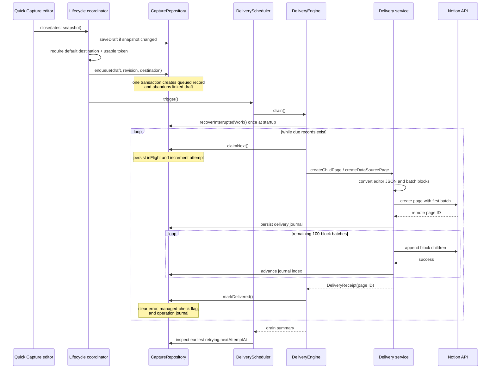

# Lecture 10 — Notion API and Delivery Reliability

**Duration:** 90 minutes
**Audience:** programmers new to API delivery, Swift developers following the implementation, and experienced engineers reviewing reliability boundaries

This lecture follows a Quick Capture after the editor closes: its latest local
snapshot becomes durable work, the scheduler claims that work, the personal-token
API creates a Notion page, and the repository records either success or a safe
recovery state. The central design lesson is that a remote timeout is not the
same as a remote failure. Once a request may have reached Notion, retrying it
blindly can duplicate a page or append the same blocks twice.

The source links describe the committed implementation. Personal integration
tokens belong only in the app's settings UI; never paste one into a terminal,
test fixture, screenshot, or course notes.

## Learning objectives

By the end of this lecture, you can:

1. Explain how token validation, Keychain persistence, bootstrap, search, and
   reconnect-driven delivery fit together.
2. Trace a request through `NotionAPIClient`, including finite transport limits,
   structured API errors, and malformed-response handling.
3. Distinguish the four domain destinations—`managed`, `manual`, `pageParent`,
   and `dataSource`—from the two page-creation destinations supported by the
   current personal-token transport.
4. Describe how editor JSON becomes Notion blocks, including 2,000-character
   rich-text chunks, 100-block batches, and visible unsupported-content markers.
5. Trace close, enqueue, claim, delivery, journaling, and completion across
   actors and durable state.
6. Predict the resulting state for 401, 409, 429, 5xx, network, malformed, and
   ambiguous outcomes.
7. Explain why startup recovery, single-flight drains, operation journals, and
   conservative `uncertain` states reduce duplicate remote writes.
8. Choose an appropriate automated or manual verification strategy without
   exposing credentials or claiming that a local test proves Notion's behavior.

## Before you begin

Open the [course glossary](GLOSSARY.md) for unfamiliar Swift, actor, HTTP, or
SwiftData terms. This lecture builds on the durable draft and record model from
[Lecture 8](08-persistence-and-restoration.md) and the close-time editor snapshot
from [Lecture 9](09-quick-capture-editor-bridge.md).

Use three reading layers:

- **Foundation:** follow the story and the state table. No Swift or Notion API
  experience is assumed.
- **Implementation:** open the linked source beside the lecture and follow the
  actors, protocols, and repository calls.
- **Reliability:** challenge every external write with two questions: “Could it
  have happened remotely?” and “What durable evidence makes the next action
  safe?”

For a read-only orientation, run:

```sh
git status --short
rg -n "PersonalTokenCredentialVault|NotionAPIClient|NotionCaptureDeliveryService|DeliveryEngine|DeliveryScheduler" Sources Tests
```

Expected observation: composition lives in the application layer, while token
storage, HTTP, conversion, delivery policy, scheduling, and persistence are
separate types with focused tests. If `git status` lists existing changes, keep
them; none of this lecture's exercises requires modifying product code.

Safety boundaries:

- Do not print, export, or inspect a real personal integration token. The
  Keychain behavior can be understood from source and tested with in-memory
  stores.
- A personal token is optional for building and launching the app. It is needed
  only for the optional API-backed capture flow.
- Do not send test pages to a workspace you do not control. A live Notion call
  is a remote mutation and unit tests cannot clean it up reliably.
- The unit tests use fakes and in-memory persistence. They prove local policy,
  request formation, and state transitions—not live permissions, rate limits,
  network timing, or Notion service behavior.

## Foundation

### A delivery is a local state machine around a remote side effect

Creating a Notion page crosses a process and network boundary. Three broad
outcomes are possible:

1. **Known success:** Notion responds and the app persists the remote page ID.
2. **Known rejection:** Notion returns a response such as 401, 409, or 429, so
   policy can choose reconnect, review, or retry.
3. **Unknown outcome:** the connection fails after the request might have been
   applied. The app must not infer “nothing happened.”

The third case drives the design. Notion PiP retains the local capture, records
safe error metadata, and either uses durable progress to resume or moves the
record to `uncertain` for human recovery.

### Credentials, connection, and destination are different concerns

A credential grants API access; a connection state says whether the app has
validated it; a destination says where a new capture should go. The app keeps
these responsibilities separate:

- [`PersonalTokenCredentialVault`](../../Sources/NotionPiP/Platform/PersonalTokenCredentialVault.swift)
  validates token shape and stores token bytes as a non-synchronizable generic
  password in Keychain, accessible only when this device is unlocked.
- [`NotionConnectionController`](../../Sources/NotionPiP/App/NotionConnectionController.swift)
  validates with Notion before saving, publishes connection/search state, and
  rejects late async results with generation checks.
- [`QuickCaptureDestinationController`](../../Sources/NotionPiP/App/QuickCaptureDestinationController.swift)
  searches pages and data sources, debounces automatic queries, paginates with
  cursor-loop protection, and persists only a stable selection.
- [`QuickCaptureDestinationRepository`](../../Sources/NotionPiP/Persistence/QuickCaptureDestinationRepository.swift)
  owns that single default selection in SwiftData.

At launch, a saved token is loaded and revalidated before the controller reports
`connected`. A successful bootstrap or explicit reconnect triggers the delivery
scheduler. Disconnect removes the Keychain item and invalidates in-flight search
leases; it does not erase durable captures.

### Domain destinations versus the active transport

[`CaptureDestination`](../../Sources/NotionPiP/Domain/DeliveryState.swift) can
represent four modes:

| Destination | Intended operation | Duplicate-safety model |
|---|---|---|
| `managed(databaseID:)` | Create a managed database entry | Recover by searching for the stable Capture ID before creating again |
| `manual(pageID:)` | Append blocks to an existing page | No remote idempotency proof; ambiguous outcomes become `uncertain` |
| `pageParent(pageID:)` | Create a child page below a page | Persist the created page ID and next block-batch index in a journal |
| `dataSource(dataSourceID:)` | Create a page in a data source | Resolve its title-property name, then use the same page-creation journal |

The current [`NotionCaptureDeliveryService`](../../Sources/NotionPiP/Services/NotionCaptureDeliveryService.swift)
implements `pageParent` and `dataSource`. Its legacy `managed` and `manual`
methods intentionally throw “unavailable.” The `DeliveryEngine` still models all
four because its protocol and reliability tests preserve the policies. Do not
describe protocol coverage as current end-user transport support.

## Repository tour

Follow this order to keep policy separate from mechanism:

1. **Composition and triggers**
   - [`NotionPiPApp.swift`](../../Sources/NotionPiP/App/NotionPiPApp.swift) creates
     the shared vault, repositories, personal-token API, delivery service,
     engine, scheduler, and close lifecycle.
   - [`AppRuntime.swift`](../../Sources/NotionPiP/App/AppRuntime.swift) starts
     token bootstrap, destination restoration, delivery, and capture-history
     refresh. A successful connection calls `trigger(reconnected: true)`.
2. **Credential and workspace discovery**
   - [`PersonalTokenCredentialVault.swift`](../../Sources/NotionPiP/Platform/PersonalTokenCredentialVault.swift)
     is the Keychain boundary.
   - [`NotionConnectionController.swift`](../../Sources/NotionPiP/App/NotionConnectionController.swift)
     owns validation, bootstrap, disconnection, and page search state.
   - [`QuickCaptureDestinationController.swift`](../../Sources/NotionPiP/App/QuickCaptureDestinationController.swift)
     owns page/data-source discovery and selection.
3. **HTTP boundary**
   - [`NotionAPIClient.swift`](../../Sources/NotionPiP/Services/NotionAPIClient.swift)
     builds versioned requests, bounds response size and time, and decodes
     results or structured Notion errors.
   - [`PersonalTokenNotionCaptureAPI.swift`](../../Sources/NotionPiP/Services/PersonalTokenNotionCaptureAPI.swift)
     loads the current token for each delivery API operation.
4. **Content conversion and remote progress**
   - [`NotionBlockConverter.swift`](../../Sources/NotionPiP/Services/NotionBlockConverter.swift)
     converts editor JSON to Notion block JSON without mutating the local source.
   - [`NotionCaptureDeliveryService.swift`](../../Sources/NotionPiP/Services/NotionCaptureDeliveryService.swift)
     creates a page, persists progress, and resumes later batches.
5. **Lifecycle and policy**
   - [`QuickCaptureLifecycleCoordinator.swift`](../../Sources/NotionPiP/Services/QuickCaptureLifecycleCoordinator.swift)
     saves the latest close snapshot, checks configuration, atomically enqueues,
     and triggers delivery.
   - [`DeliveryEngine.swift`](../../Sources/NotionPiP/Services/DeliveryEngine.swift)
     claims records, routes destinations, and maps delivery errors to states.
   - [`DeliveryScheduler.swift`](../../Sources/NotionPiP/Services/DeliveryScheduler.swift)
     coalesces triggers, resumes unauthorized work, schedules retries, and runs
     retention after successful startup delivery recovery.
   - [`CaptureRepository.swift`](../../Sources/NotionPiP/Persistence/CaptureRepository.swift)
     makes claims, journals, state transitions, and recovery durable.
   - [`RetryPolicy.swift`](../../Sources/NotionPiP/Domain/RetryPolicy.swift) defines
     exponential backoff, its six-hour default cap, server-directed delay, and
     the seven-day attention threshold.

High-value tests mirror those boundaries:

- [`PersonalTokenConnectionTests.swift`](../../Tests/NotionPiPTests/PersonalTokenConnectionTests.swift)
  and [`NotionConnectionControllerTests.swift`](../../Tests/NotionPiPTests/NotionConnectionControllerTests.swift)
  cover validation-before-save, bootstrap, reconnect, and stale searches.
- [`NotionAPIClientTests.swift`](../../Tests/NotionPiPTests/NotionAPIClientTests.swift)
  covers headers, parent-specific bodies, bounded responses, cancellation, and
  error decoding.
- [`NotionBlockConverterTests.swift`](../../Tests/NotionPiPTests/NotionBlockConverterTests.swift)
  covers supported nodes, chunks, batches, and recovery markers.
- [`QuickCaptureLifecycleTests.swift`](../../Tests/NotionPiPTests/QuickCaptureLifecycleTests.swift),
  [`NotionCaptureDeliveryServiceTests.swift`](../../Tests/NotionPiPTests/NotionCaptureDeliveryServiceTests.swift),
  [`DeliveryEngineTests.swift`](../../Tests/NotionPiPTests/DeliveryEngineTests.swift),
  and [`DeliverySchedulerTests.swift`](../../Tests/NotionPiPTests/DeliverySchedulerTests.swift)
  cover the end-to-end local reliability contract.

## Runtime trace

### Trace: close a capture and create a Notion page



Step-by-step:

1. `QuickCaptureLifecycleCoordinator.close` first reconciles the latest editor
   snapshot with the persisted draft revision. An empty title plus empty
   document is discarded.
2. Missing destination or missing usable token keeps the draft local and returns
   configuration guidance. It does not enqueue doomed work.
3. `enqueue` atomically creates a `queued` capture record and retires the draft.
   Its replay rules reconcile a lost acknowledgement only when revision and
   destination still match.
4. The scheduler coalesces overlapping triggers. The engine also has an
   `isDraining` guard, so concurrent calls cannot run two claim loops.
5. Before its first successful drain, the engine recovers interrupted `inFlight`
   work. A failed recovery is attempted again on the next drain.
6. `claimNext` persists `inFlight` before transport begins, increments the
   attempt count, and orders due work by first-queued time with a stable-ID tie
   break.
7. For a data source, the service fetches its actual title-property name before
   creating. For a child page, the title property is `title`. A whitespace-only
   local title becomes `Untitled`.
8. The create request includes at most the first 100 blocks. Once Notion returns
   a page ID, the service writes a journal before any remaining batch.
9. After each successful append, the service advances and persists
   `nextBatchIndex`. A retry reads that journal and resumes the same page rather
   than creating another one.
10. `markDelivered` stores the remote page identity and clears temporary
    delivery metadata. The scheduler then sleeps until the earliest scheduled
    retry, if any.

### State and error decision table

| Input or event | Durable result | Scheduler behavior | Why |
|---|---|---|---|
| Enqueue | `queued` | Trigger a drain | Local work exists before network work starts |
| Successful claim | `inFlight` | Deliver exactly that claim | A crash is now distinguishable from never-started work |
| Receipt persisted | `delivered` | Continue draining | Remote identity is durable and journal is cleared |
| 401 | `retrying`, no `nextAttemptAt`, code `unauthorized` | Pause the drain; reconnect resumes these records | Repeating with the same invalid credential cannot help |
| 409 | `blockedConflict`, code `conflict` | Continue with other records | Human review is safer than overwriting remote change |
| 429 | `retrying` at `now + delay`, code `rateLimited` | Schedule the earliest due retry | Honor numeric `Retry-After`; otherwise use backoff |
| Retryable network-unavailable error | `retrying` with backoff | Schedule retry | The service says the request did not get a usable transport path |
| 408 or 5xx for `managed` | `retrying`, `requiresManagedCheck = true` | On retry, search Capture ID before create | The write may already exist remotely |
| 5xx during journaled page creation/append | Usually `uncertain`, code `ambiguousPageCreation` | Do not automatically repeat ambiguous write | The response cannot prove whether that particular write applied |
| 5xx during data-source title lookup | `retrying` with backoff | Retry preflight | No create request has been sent yet |
| Ambiguous `manual` append | `uncertain`, code `ambiguousManualAppend` | No automatic repeat | An append has no safe duplicate check |
| Stale `queued`/`retrying` beyond attention interval | `uncertain`, code `requiresAttention` | Skip automatic delivery | Old work requires human attention |
| Startup finds interrupted `managed` | `retrying`, managed check required | Search before create | Stable Capture ID can prove prior creation |
| Startup finds journaled `pageParent`/`dataSource` | `retrying`, journal retained | Resume recorded page/batch | The journal identifies progress |
| Startup finds unjournaled `manual` | `uncertain` | Await review | Whether an append occurred is unknowable locally |

“Usually” in the journaled 5xx row is deliberate. A data-source schema lookup
happens before page creation and remains safely retryable. Once a create or
append may have applied, `NotionCaptureDeliveryService` maps the response to an
ambiguous transport outcome so `DeliveryEngine` stops automatic duplication.

## Deep dive

### 1. Token storage, validation, bootstrap, and search

`PersonalTokenCredentialVault` sits on the main actor and delegates bytes to a
small `SecretStoring` boundary. Its production store uses the Security framework:

- service: `com.fantomsuj.NotionPiP.personalIntegration`
- account: `notion-token`
- class: generic password
- synchronization: disabled
- accessibility: `kSecAttrAccessibleWhenUnlockedThisDeviceOnly`

Saving replaces the credential; disconnect deletes it. Loading turns bytes back
into a validated `PersonalIntegrationToken`. Tests inject an in-memory secret
store, so no developer credential enters the test process or system Keychain.

`NotionConnectionController.connect` follows a security-relevant order:

1. validate the raw token's local format;
2. construct a client and call `/v1/users/me`;
3. check that this async attempt is still the current generation;
4. save the validated token;
5. publish `connected` and notify the reconnect hook.

A rejected credential is never persisted. Bootstrap uses the same remote
validation before publishing a saved token as connected. Generation checks and
task cancellation stop disconnect/reconnect races from publishing a late search
result or stale connection result.

Destination search is separate from page search. It accepts pages and data
sources, requires at least two non-whitespace query characters, debounces normal
typing by 300 ms, follows at most four response pages, shows at most 100 unique
items, and stops on a repeated cursor. The saved selection contains stable
identity metadata, not a token or an API client.

### 2. Request construction and error decoding

`NotionAPIClient` sends bearer-authenticated JSON with Notion API version
`2026-03-11`. Its default ephemeral session has finite request and resource
timeouts, and the streaming transport rejects a response body larger than
1,048,576 bytes. That is a response bound, not a claim about request-body size.

The client provides focused operations:

- validate the connection at `/v1/users/me`;
- search pages or page/data-source destinations;
- retrieve a data source schema and locate its property of type `title`;
- create a page with a page or data-source parent; and
- append child blocks to an existing page.

For a non-2xx response, a valid Notion error body becomes `apiError` carrying
status, code, safe message, request ID, and numeric `Retry-After` when present.
If the body is unstructured, 401 and 403 still map to `unauthorized` and
`accessDenied`; other statuses become `requestFailed(statusCode:)`. Invalid
HTTP, oversized, and successful-but-undecodable responses stay distinct. The
delivery service then translates client errors into the smaller policy-facing
`DeliveryTransportError` vocabulary.

That separation matters: HTTP decoding answers “what did the server or
transport report?”; the engine answers “what durable state is safe next?”

### 3. Editor JSON to Notion blocks

`NotionBlockConverter` accepts a ProseMirror-style root object whose type must
be `doc`. It converts:

| Editor node | Notion block or behavior |
|---|---|
| paragraph | `paragraph` |
| heading | `heading_1` through `heading_3`; levels are clamped |
| bullet/ordered list | nested `bulleted_list_item` / `numbered_list_item` |
| task list | `to_do` with checked state |
| blockquote | `quote` |
| code block | `code`, default language `plain text` |
| horizontal rule | `divider` |
| unsupported or malformed child | visible paragraph recovery marker and entry in `unsupportedNodes` |

Text marks become Notion annotations for bold, italic, strike, underline, and
code. Only `http` and `https` links with a host survive as links. Rich text is
split at 2,000 Swift `Character` values, and top-level blocks are grouped into
batches of at most 100.

Unsupported content is not silently dropped from the local record. The remote
page receives `[Unsupported content preserved in Notion PiP]`, while the
original editor document remains durable for export and recovery. A malformed
root stops delivery with a safe local-document error.

### 4. Journaling page creation

The page-creation journal stores:

```text
stage = captureDelivery
pageID
titlePropertyName
nextBatchIndex
totalBatchCount
```

For 201 blocks, the call sequence is create-with-100, append-100, append-1. The
journal advances from batch index 1 to 2 to 3. A retry uses the recorded page ID
and starts from the recorded index. It does not issue the create again.

There is still an unavoidable gap: Notion can apply the create and the response
can disappear before the app knows the page ID. Likewise, an append can apply
before its journal advancement is saved. The service treats these as ambiguous
and the engine marks journaled page creation `uncertain`; it does not pretend the
journal is a distributed transaction or an idempotency key.

This is the core reliability distinction:

- **Progress journaling** safely resumes only progress the app has durably
  observed.
- **Idempotency** lets a repeated request prove it represents the same logical
  operation. The current child/data-source API calls do not supply such a key.
- **Managed Capture ID lookup** is a modeled application-level duplicate check,
  but the current personal-token delivery service does not implement managed
  delivery.

### 5. Claims, backoff, recovery, and single flight

The repository is the authority for ownership. `claimNext` changes the oldest
due eligible record to `inFlight`, increments its attempt, and saves before the
engine calls transport. Two engine drains are also serialized by the actor and
its `isDraining` flag; overlapping scheduler triggers are coalesced with
`isTriggering` and `triggerRequested`.

These are complementary controls:

- the repository claim is durable ownership across crashes;
- engine single flight prevents two loops in one engine instance;
- scheduler coalescing prevents a lost trigger while another trigger is active.

The default retry policy starts at five seconds, doubles by attempt, and caps
the computed delay at six hours. A server-provided `Retry-After` overrides that
computed delay and is not clamped to six hours. After seven days since first
enqueue, due queued/retrying work moves to `uncertain` with
`requiresAttention` instead of being claimed.

On 401, the engine marks the record `retrying` with no due date and stops the
current drain before claiming later work. A successful connection calls the
scheduler with `reconnected: true`; the scheduler makes only unauthorized
retries due, then drains. Persistence failures in resumption, claiming, state
transition, or completion set bounded health flags and cause a local recovery
retry rather than requiring another user action.

Startup recovery precedes the first successful drain. It classifies interrupted
work by the evidence available for its destination, as shown in the state table.
Only after the delivery startup path succeeds does the scheduler arrange its
startup retention pass.

## Common misconceptions and failure modes

1. **“A timeout means Notion did nothing.”** It means the client lacks a usable
   answer. The request may have applied. Treating every timeout as retryable can
   duplicate remote content.
2. **“The actor alone gives exactly-once delivery.”** Actors serialize local
   access; they do not make a remote HTTP side effect atomic with a SwiftData
   save.
3. **“A journal makes every retry safe.”** It makes acknowledged page and batch
   progress resumable. It cannot identify a page whose creation response was
   lost before the page ID was persisted.
4. **“All four `CaptureDestination` cases work through the current API.”** The
   engine models four. The active `NotionCaptureDeliveryService` implements only
   child-page and data-source page creation; legacy managed/manual calls fail as
   unavailable.
5. **“Manual and `pageParent` both target a page, so they are equivalent.”**
   `manual` means append to that page; `pageParent` means create a new child page
   below it. Their duplicate risks and recovery evidence differ.
6. **“A data-source page always uses a property called Name.”** The service
   reads the schema and selects whichever property has type `title`; the name is
   saved in the operation journal.
7. **“Every 5xx should use exponential backoff.”** A preflight lookup can retry
   because no write occurred. A create or append 5xx may be ambiguous and is
   handled conservatively.
8. **“The six-hour cap also caps `Retry-After`.”** It caps computed exponential
   delay. A server-directed delay is honored as supplied.
9. **“401 is just another scheduled retry.”** It has no `nextAttemptAt`, pauses
   the drain, and waits for a validated reconnect to make unauthorized work due.
10. **“Unsupported editor nodes disappear.”** They remain in the local editor
    JSON and produce a visible recovery marker remotely.
11. **“Connection validation proves destination access forever.”** It validates
    the token at one moment. Page permissions, workspace access, network state,
    and schemas can change before delivery.
12. **“Unit tests verify live Notion delivery.”** They verify deterministic
    local behavior with transports and repositories under test. Live service
    integration remains a bounded manual check.

When diagnosing a failed capture, start from the durable record rather than the
last visible alert: inspect its destination, state, attempt count,
`nextAttemptAt`, `requiresManagedCheck`, operation journal, safe error, and
remote identity. Those fields explain what the system knows and what it refuses
to assume.

## Presenter notes

### Suggested 90-minute plan

| Time | Segment | Teaching move |
|---:|---|---|
| 0–10 min | Foundation | Ask why “retry on every error” can create duplicates |
| 10–22 min | Credentials and search | Trace validate-before-save and stale-result protection |
| 22–34 min | HTTP boundary | Contrast decoded facts with delivery policy |
| 34–45 min | Conversion | Show the node table, 2,000-character chunks, and 100-block batches |
| 45–58 min | Runtime trace | Walk the sequence diagram from close to receipt |
| 58–72 min | Reliability | Use the state/error table for 401, 409, 429, 5xx, and ambiguity |
| 72–80 min | Journaling and limits | Explain acknowledged progress versus true idempotency |
| 80–85 min | Knowledge check | Have learners answer before revealing explanations |
| 85–90 min | Exercise debrief | Compare expected observations; reserve commands for follow-up |

### Demonstration script

1. Open `NotionPiPApp.swift` and point out that one repository is shared by the
   lifecycle, engine, scheduler, and delivery journal.
2. Open `QuickCaptureLifecycleCoordinator.close` and ask where network work
   begins. Expected answer: it does not begin there directly; close saves and
   enqueues, then invokes the scheduler callback.
3. Open `DeliveryEngine.drain` and identify startup recovery, the single-flight
   guard, claim-before-send, and state mapping.
4. Open `NotionCaptureDeliveryService.deliver`; use a 201-block example to trace
   create, journal, append, journal, append, journal.
5. End at `CaptureRepository.markDelivered` and show that the remote identity is
   retained while the operation journal and transient error fields are cleared.

### Questions to ask aloud

- “If page creation succeeds but journal persistence fails, which fact is
  missing?” Expected answer: the app cannot durably prove the remote page ID and
  progress, so repeating create could duplicate it.
- “Why can a data-source schema 503 retry while a page-create 503 becomes
  uncertain?” Expected answer: schema lookup is read-only preflight; the create
  may have applied.
- “What does single flight prevent, and what does it not prevent?” Expected
  answer: it prevents concurrent local drain loops; it does not establish
  exactly-once semantics across HTTP and persistence.

If a live demo is used, prepare a disposable page or data source in a workspace
the presenter controls. Show token entry only through Settings, keep the token
obscured, and delete the remote demo page manually afterward. If connectivity
or permissions fail, switch immediately to the tests and sequence diagram; that
failure is not evidence of a code defect by itself.

## Knowledge check

Answer before expanding the supplied answer.

1. Why does `connect` validate before writing the Keychain item?

   **Answer:** so an unsupported or unauthorized credential is never persisted
   as the saved credential and never published as a connected workspace.

2. A record receives 429 with `Retry-After: 75`. What happens?

   **Answer:** it becomes `retrying`, its safe error records `rateLimited` and
   the 75-second value, and `nextAttemptAt` is set to now plus 75 seconds. The
   scheduler targets the earliest retry date.

3. Why does 401 stop the drain before later queued records are claimed?

   **Answer:** later calls would use the same invalid credential. The current
   record waits in `retrying` without a due date until reconnect; untouched later
   work remains `queued`.

4. For a 201-block child page, what calls and journal indices are expected?

   **Answer:** create with 100 blocks and persist index 1; append 100 and persist
   index 2; append 1 and persist index 3. A retry starts from the durable index.

5. Why can an ambiguous managed create be retried differently from an ambiguous
   manual append?

   **Answer:** managed policy can search a stable Capture ID before another
   create. Manual append has no such duplicate check, so it becomes `uncertain`.
   This describes engine policy; the active personal-token service currently
   implements neither legacy operation.

6. A 503 occurs while looking up a data source's title property. Is the capture
   uncertain?

   **Answer:** no. Since no create was sent, the service maps preflight failure
   as safely retryable and the engine schedules backoff.

7. What do the response-size limit and timeouts prove about Notion?

   **Answer:** nothing about Notion's service limits. They are client safety
   bounds that prevent an unbounded response or wait. The response-size bound
   must not be described as a request-size limit.

8. Why retain the original editor JSON when conversion finds an unsupported
   node?

   **Answer:** the local record remains the recovery source. The remote marker
   makes loss visible without destroying content that a later converter or
   export path may recover.

## Hands-on exercise

### Exercise: prove the local reliability contract without a real token

**Goal:** connect one behavior in each layer—conversion, HTTP decoding, delivery
progress, engine policy, and scheduling—to a focused test. Allow 15–20 minutes
outside the 90-minute lecture or use the final five minutes to begin.

1. Preserve existing work and confirm the target files:

   ```sh
   git status --short
   rg -n "testSplitsRichText|testDecodesStructured|testRetryResumes|testRateLimitHonors|testConcurrentTrigger" Tests/NotionPiPTests
   ```

   Expected observation: the matches land in converter, API client, delivery
   service, engine, and scheduler tests. Existing working-tree changes remain
   untouched.

2. Read these five tests and write one sentence for the invariant each proves:

   - `NotionBlockConverterTests.testSplitsRichTextAtTwoThousandCharactersAndBatchesAtOneHundredBlocks`
   - `NotionAPIClientTests.testDecodesStructuredNotionAPIError`
   - `NotionCaptureDeliveryServiceTests.testRetryResumesCreatedPageAfterCompletedAppendProgress`
   - `DeliveryEngineTests.testRateLimitHonorsRetryAfter`
   - `DeliverySchedulerTests.testConcurrentTriggerCannotScheduleRetentionBeforeBlockedRecoveryCompletes`

   Expected answers, in order: conversion respects Notion-oriented chunk/batch
   bounds; structured error metadata survives decoding; durable batch progress
   prevents a second create and already-finished append; 429 honors server delay;
   overlapping triggers cannot let retention pass blocked startup recovery.

3. Run only the directly relevant XCTest cases:

   ```sh
   DEVELOPER_DIR=/Applications/Xcode.app/Contents/Developer swift test --filter NotionBlockConverterTests
   DEVELOPER_DIR=/Applications/Xcode.app/Contents/Developer swift test --filter NotionAPIClientTests
   DEVELOPER_DIR=/Applications/Xcode.app/Contents/Developer swift test --filter NotionCaptureDeliveryServiceTests
   DEVELOPER_DIR=/Applications/Xcode.app/Contents/Developer swift test --filter DeliveryEngineTests
   DEVELOPER_DIR=/Applications/Xcode.app/Contents/Developer swift test --filter DeliverySchedulerTests
   ```

   Expected observation: all selected suites pass without a Notion token or live
   network call. A toolchain failure is an environment result, not permission to
   alter signing, entitlements, dependencies, or system configuration.

4. Manually trace `testAppliedCreateReturningServerErrorBecomesUncertainWithoutSecondCreate`.
   Record the external call count and final state.

   Expected answer: one create call is applied, no second create is attempted,
   and the record ends `uncertain`. This is the deliberate duplicate-avoidance
   boundary.

5. Optional controlled integration check: only in a disposable destination you
   own, use Settings to connect, select a page or data source, submit a uniquely
   titled capture, and observe one created child/data-source page plus a
   `delivered` history entry. Remove the page manually afterward.

   Manual limits: this observation does not prove race safety, retry policy,
   crash recovery, universal permissions, rate-limit handling, or exactly-once
   behavior. Do not induce failures by disabling the network mid-write in a
   valuable workspace; ambiguity is expected and cleanup cannot be automated
   safely without knowing the remote outcome.

No source edit is required. If a focused test fails, capture its exact command
and output, inspect the involved source and test, and avoid broad changes until
the local invariant is understood.

## Recap

- A Quick Capture becomes remote work only after its latest snapshot is saved
  and enqueue atomically creates a `queued` record.
- Tokens are validated before Keychain persistence, revalidated on bootstrap,
  and loaded afresh by the personal-token capture API.
- `NotionAPIClient` owns request formation and response/error decoding;
  `DeliveryEngine` owns durable retry and attention policy.
- The converter retains the local source, marks unsupported content visibly,
  splits rich text at 2,000 characters, and batches blocks by 100.
- The current transport creates child pages and data-source pages. Managed and
  manual behavior remains modeled and tested but unavailable in that transport.
- Claim-before-send, startup recovery, engine single flight, scheduler
  coalescing, and a persisted page/batch journal cooperate; none alone creates a
  distributed transaction.
- 401 waits for reconnect, 409 blocks for review, 429 schedules its delay,
  safely retryable failures back off, and ambiguous writes become `uncertain`
  unless a managed duplicate check can establish identity.
- Tests prove local conversion, request, persistence, and scheduling contracts.
  Live Notion permissions, timing, service behavior, and end-to-end ambiguity
  remain carefully bounded manual verification.

Lecture 11 connects these delivery and connection states to Settings, recovery
views, commands, and user-visible event propagation.
