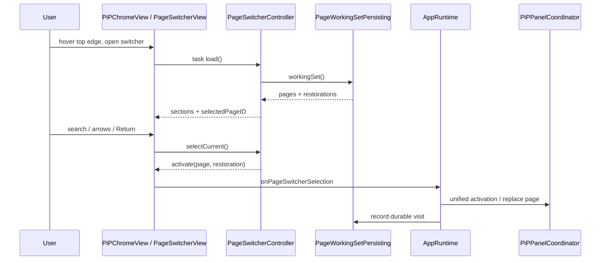
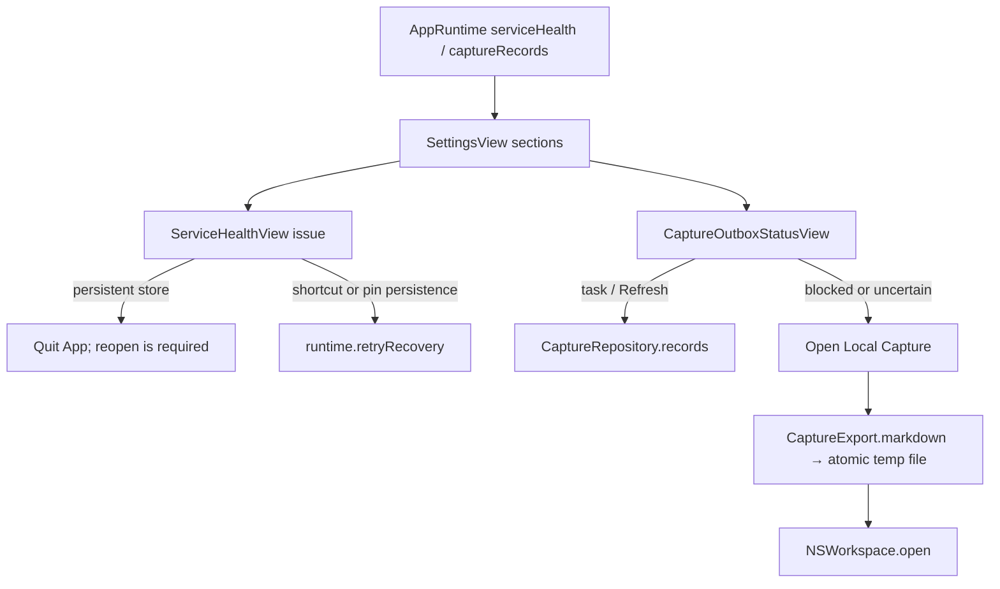

# Lecture 11 — Views, Settings, and UI State

> **Estimated duration:** 75 minutes (10 minutes foundation, 20 minutes
> repository tour, 15 minutes runtime traces, 15 minutes deep dive, 5 minutes
> knowledge check, and 10 minutes exercise)

Perch's SwiftUI layer is small enough to read, but it spans four very
different surfaces: persistent PiP chrome, an edge stash handle, ordinary
key-capable app windows, and local WebKit content. The views remain useful only
because observable controllers own asynchronous work and platform coordinators
own AppKit effects.

This lecture documents committed source at baseline
`bea07158ab444b3d63690e174394d719590287f7`. `SettingsView.swift` and other
product/test files had uncommitted changes while this lecture was produced;
those edits are excluded from every claim. If a linked working file differs,
inspect the taught version with `git show bea0715:<path>`.

## Learning objectives

By the end of this lecture, you will be able to:

1. group all 20 committed View files by surface and identify their state owner;
2. explain where `NSHostingView` and `NSViewRepresentable` bridge SwiftUI to
   AppKit/WebKit;
3. choose correctly among `@ObservedObject`, `@StateObject`, `@State`,
   `@Binding`, `@FocusState`, and accessibility `@Environment` values;
4. trace PiP chrome actions through page switching, command dispatch, WebKit,
   stashing, and restoration;
5. trace Settings bindings through runtime/controller validation and durable
   preference stores without placing persistence in the view;
6. explain Quick Capture conflict, outbox, service-health, and local recovery
   presentation; and
7. distinguish behavior protected by controller/unit tests from rendering,
   accessibility, focus, and window behavior that still needs manual checks.

The lecture is layered. **Foundation** covers state ownership. **Repository
tour** maps every view. **Runtime traces** follow PiP, Settings, and recovery
events. **Deep dive** covers command reuse, binding design, accessibility, and
test boundaries.

## Before you begin

Recommended context:

- [Lecture 4](04-composition-and-runtime.md) for `AppRuntime` and the
  composition root;
- [Lecture 5](05-panel-stashing-and-controls.md) for `NSPanel` geometry,
  stashing, and size application;
- [Lecture 8](08-persistence-and-restoration.md) for the state repositories
  surfaced in Settings; and
- [Lecture 9](09-quick-capture-editor-bridge.md) for the WebKit editor embedded
  by `QuickCaptureView`.

Use this ownership test whenever a view looks complicated:

```text
Is it transient presentation state?       → local SwiftUI state
Is it shared UI state or async work?       → @MainActor observable controller/runtime
Is it a domain rule?                       → value/policy type
Is it persistence, a window, or WebKit?   → repository/platform owner
```

**Verification boundary:** controller and platform tests can prove state
transitions, callbacks, command definitions, geometry, and AppKit interaction.
They do not automatically prove the final SwiftUI hierarchy, VoiceOver
phrasing/order, focus under every keyboard configuration, hover timing on real
hardware, menu placement, sheet layout, color appearance on every display, or
Carbon shortcut registration across all system conflicts. Those remain
manual/accessibility/system checks.

## Foundation

### Four rendered surfaces

```text
PiP NSPanel
└─ NSHostingView<PiPChromeView>
   ├─ Notion WKWebView through NotionWebView
   ├─ PageSwitcherView popover
   └─ PiPAppCommandMenu → PanelSizeMenu

Edge handle NSPanel
└─ NSHostingView<PiPStashHandleView>
   └─ NSViewRepresentable pointer/accessibility interaction surface

Key-capable NSWindow
├─ NSHostingView<SettingsView>
├─ NSHostingView<OnboardingView>
└─ NSHostingView<QuickCaptureView> → Capture WKWebView

Menu-bar status item
└─ AppKit NSMenu built from the same AppCommandModel
```

[`PiPPanelCoordinator.swift`](../../Sources/Perch/Platform/PiPPanelCoordinator.swift)
owns the persistent panel and installs `PiPChromeView` in an `NSHostingView`.
[`PiPStashHandleController.swift`](../../Sources/Perch/Platform/PiPStashHandleController.swift)
does the same for the edge handle. [`AppWindowFactory.swift`](../../Sources/Perch/Platform/AppWindowFactory.swift)
creates the key-capable Settings and onboarding windows. Page setup stays
inline in those two surfaces instead of opening another window.

The views do not choose panel collection behavior, reposition windows, open a
SwiftData context, or register Carbon hot keys. They issue actions to owners
that already have those responsibilities.

### Property-wrapper ownership

| Wrapper | Meaning in this code | Examples |
|---|---|---|
| `@ObservedObject` | Owner is injected; view observes but does not create lifecycle | `AppRuntime`, `PanelSizeController`, `PageSwitcherController`, `CaptureEditorSession`, `PageURLInputState` |
| `@StateObject` | View creates and owns reference state for its lifetime | `PiPChromeView` owns `TopControlsHoverController` |
| `@State` | Small local presentation/edit buffer | queries, sheet visibility, captured size fields, shortcut recording/feedback, row hover |
| `@Binding` | Child edits storage owned by parent/state object | `PageURLField.text`, custom-size dimension fields |
| `@FocusState` | Declarative focus synchronized with the view hierarchy | URL field and page-switcher search |
| `@Environment` | System accessibility preference, not app persistence | reduce motion, VoiceOver, Switch Control |

An important anti-pattern would be copying an injected controller's durable
state into `@State` and letting the two drift. Local state here is instead a
query, an uncommitted sheet buffer, recording mode, or hover presentation.

### Views render projections; owners perform effects

`AppRuntime` is a main-actor facade over pin, connection, destination, shortcut,
capture, and health owners. It publishes direct properties such as active page,
shortcuts, outbox rows, and health. For child `NotionConnectionController` and
`QuickCaptureDestinationController`, it forwards `objectWillChange` so views
that observe the runtime refresh when those children publish.

`PanelSizeController`, `PageSwitcherController`, `PageURLInputState`, and
`CaptureEditorSession` provide narrower observable state where one concern has
enough behavior to deserve its own owner. Views call methods or closures; they
do not reproduce domain validation.

## Repository tour

### Complete Views file map

Every committed basename under `Sources/Perch/Views` appears below.

| File | Inputs and local state | Actions / owner | Focused evidence |
|---|---|---|---|
| [`CaptureOutboxStatusView.swift`](../../Sources/Perch/Views/CaptureOutboxStatusView.swift) | Runtime outbox rows/recovery message | Refresh and open local export through `AppRuntime` | delivery/repository/runtime tests; no direct render test |
| [`CaptureStatusView.swift`](../../Sources/Perch/Views/CaptureStatusView.swift) | One `CaptureEditorStatus` | Pure label/symbol/error-color projection; no current production consumer | editor-flow tests protect status cases; no direct view test |
| [`ConflictRecoveryView.swift`](../../Sources/Perch/Views/ConflictRecoveryView.swift) | Conflict, resolving flag | Invoke one allowed recovery action through session closure | [`CaptureEditorFlowTests.swift`](../../Tests/PerchTests/CaptureEditorFlowTests.swift), WebKit conflict tests |
| [`DeveloperStatusView.swift`](../../Sources/Perch/Views/DeveloperStatusView.swift) | Process/system metrics snapshot | Read-only About content | no direct test; formatting/refresh are manual boundaries |
| [`GlobalShortcutRecorderView.swift`](../../Sources/Perch/Views/GlobalShortcutRecorderView.swift) | Runtime shortcuts plus local recording/feedback | Capture AppKit key event; apply/reset panel and Quick Capture shortcuts | [`GlobalShortcutTests.swift`](../../Tests/PerchTests/GlobalShortcutTests.swift) |
| [`NotionWorkspaceSearchView.swift`](../../Sources/Perch/Views/NotionWorkspaceSearchView.swift) | Runtime search result/error plus query | Async workspace search and `.notionSearch` activation | [`AppRuntimeFacadeTests.swift`](../../Tests/PerchTests/AppRuntimeFacadeTests.swift), activation tests |
| [`PagePickerView.swift`](../../Sources/Perch/Views/PagePickerView.swift) | Pages and pin closure | Pure 30-character display title and pin action; no current production consumer | `PagePickerDisplay` in [`PinCoordinatorTests.swift`](../../Tests/PerchTests/PinCoordinatorTests.swift) |
| [`PageSwitcherView.swift`](../../Sources/Perch/Views/PageSwitcherView.swift) | Switcher controller, focus, row hover | Load/search/traverse/select/dismiss/pin through controller and callbacks | [`PageSwitcherMatcherTests.swift`](../../Tests/PerchTests/PageSwitcherMatcherTests.swift) |
| [`PageURLField.swift`](../../Sources/Perch/Views/PageURLField.swift) | Text binding, focus request, submit closure | Edit, focus, open in Perch | [`PageURLInputPresenterTests.swift`](../../Tests/PerchTests/PageURLInputPresenterTests.swift) plus manual field checks |
| [`PageURLInputView.swift`](../../Sources/Perch/Views/PageURLInputView.swift) | URL state and submit closure | Compose field and typed validation feedback | setup/activation tests |
| [`PanelSizeMenu.swift`](../../Sources/Perch/Views/PanelSizeMenu.swift) | Size controller | Apply, reset default, manage | [`AppCommandTests.swift`](../../Tests/PerchTests/AppCommandTests.swift), controller tests |
| [`PanelSizeSettingsView.swift`](../../Sources/Perch/Views/PanelSizeSettingsView.swift) | Size controller plus local sheet/row buffers | Set/apply default; add/edit/apply/delete custom presets | [`PanelSizeControllerTests.swift`](../../Tests/PerchTests/PanelSizeControllerTests.swift), preferences tests |
| [`PiPAppCommandMenu.swift`](../../Sources/Perch/Views/PiPAppCommandMenu.swift) | Shared command model and optional size controller | Perform commands with keyboard equivalents | [`AppCommandTests.swift`](../../Tests/PerchTests/AppCommandTests.swift) |
| [`PiPChromeView.swift`](../../Sources/Perch/Views/PiPChromeView.swift) | Web session, switcher/command/size controllers, callbacks, accessibility environment, hover owner | Quick Capture, switch, re-pin, browser, stash, menu, retry, offline capture, clipboard insertion | [`PiPChromeViewTests.swift`](../../Tests/PerchTests/PiPChromeViewTests.swift), WebKit/command tests |
| [`PiPStashHandleView.swift`](../../Sources/Perch/Views/PiPStashHandleView.swift) | Side and restore/drag callbacks | Click/accessibility restore or AppKit drag/re-place | [`PiPStashHandleInteractionTests.swift`](../../Tests/PerchTests/PiPStashHandleInteractionTests.swift) |
| [`QuickCaptureDestinationSettingsView.swift`](../../Sources/Perch/Views/QuickCaptureDestinationSettingsView.swift) | Destination/search facade plus local query | Clear, search, schedule search, select, paginate | [`QuickCaptureDestinationControllerTests.swift`](../../Tests/PerchTests/QuickCaptureDestinationControllerTests.swift) |
| [`QuickCaptureView.swift`](../../Sources/Perch/Views/QuickCaptureView.swift) | Capture session web view/conflict state | Web editor plus async native conflict resolution | Lecture 9's editor-flow and real-WebKit tests |
| [`ServiceHealthView.swift`](../../Sources/Perch/Views/ServiceHealthView.swift) | Runtime health issues | Quit for unavailable store; retry pin/shortcut recovery | [`RuntimeActivationAndMenuBarTests.swift`](../../Tests/PerchTests/RuntimeActivationAndMenuBarTests.swift), pinned-page tests |
| [`SettingsView.swift`](../../Sources/Perch/Views/SettingsView.swift) | Runtime, size controller, local token field | Compose all settings, token/toggles/menu visibility; scrub local token | controller/runtime tests; no snapshot test |
| [`TopControlsHoverController.swift`](../../Sources/Perch/Views/TopControlsHoverController.swift) | Pointer intent and delay parameters | Delayed reveal/dismiss/cancel | [`PiPChromeViewTests.swift`](../../Tests/PerchTests/PiPChromeViewTests.swift) |

The two no-consumer rows are still legitimate tested/public capabilities, but
they are not evidence of today's rendered hierarchy.

### PiP chrome, hover, and page switching

`PiPChromeView` is the panel root. Its top controls include Quick Capture,
page switcher, re-pin, open in browser, shared app menu, and stash. The controls
reserve 32 points only while visible. Pointer intent uses a 250 ms reveal and
500 ms dismissal; an 8-point invisible top strip and 12-point hover outset make
the target forgiving. VoiceOver, Switch Control, or Full Keyboard Access keeps
controls visible without hover. Reduce Motion removes the 160 ms fade.

Loading shows a progress indicator. Offline state explains durable Quick
Capture and can automatically invoke the enabled primary command on appear or
state change. Failed state offers re-pin. A valid web session embeds
`NotionWebView`; otherwise the root shows “No Notion page selected.” The
clipboard button asks the session to remember its current editor cursor before
inserting the current pasteboard string.

The switcher popover loads a `PageWorkingSetSnapshot` through
`PageSwitcherController`, focuses search, and renders matcher-produced Pinned,
Recent, or Results sections. Arrow keys clamp selection, Return activates or
dismisses an already active page, and Escape closes. Pin/unpin runs through the
store and converts an eighth-pin failure to “Unpin a page first.”

### Stash handle is SwiftUI appearance over AppKit interaction

`PiPStashHandleView` draws the side-aware material tab, but its interaction
surface is an `NSViewRepresentable`. `PiPStashHandleInteractionView` accepts
first mouse, distinguishes a click from a drag at a 3-point threshold, moves
the window using global pointer deltas, reports the final frame for placement
normalization, and implements an accessibility button press. The platform
controller owns the handle panel and callbacks; SwiftUI owns only appearance.

### URL input and workspace search

`PageURLField` edits a binding and reacts to a monotonically increasing
`focusRequest`. This avoids trying to focus an off-screen field before its
window is key. `AppRuntime.presentCurrentPageSetup()` presents Settings first,
then increments the request. The same `PageURLInputView` appears inline in
Settings and onboarding.

Submission calls `AppRuntime.validatePageURL`. Success enters the unified
activation path and displays typed success. During onboarding, success also
completes and closes the guide; failure keeps it visible and publishes safe
validation copy.

### Quick Capture, outbox, and conflict surfaces

`QuickCaptureView` uses `NSViewRepresentable` to embed the session-owned local
capture `WKWebView`. When native state publishes a conflict, the SwiftUI
`ConflictRecoveryView` appears below it. Buttons are disabled while resolution
is in flight or when an action is absent from the conflict's allowlist.

`CaptureStatusView` maps all editor statuses to concise symbols/copy but has no
current composition consumer. Status inside today's web editor is rendered by
its HTML. This is a useful reminder that a source file is not necessarily on a
live screen.

`CaptureOutboxStatusView` lives in Settings. Runtime refresh sorts durable
records newest-first; the view displays at most ten. Queued, in-flight,
delivered, and retrying are ordinary status colors. Blocked-conflict and
uncertain states use recovery color and expose “Open Local Capture,” which
creates an atomic temporary Markdown recovery export and asks AppKit to open
it. Safe error messages and a view-level recovery message provide context.

### Settings groups and their owners

The committed `SettingsView` is one grouped scrolling form:

| Section | Child/state owner | Effects |
|---|---|---|
| Current Page | URL input and runtime active page | Validate and activate a typed page; receive focused no-page fallbacks |
| Panel Sizes | `PanelSizeSettingsView` / `PanelSizeController` | Persist default/custom values and apply valid sizes to bound panel |
| Quick Capture Destination | destination view/controller | Persist page-parent or data-source selection |
| Global Shortcut | panel shortcut recorder/runtime | Replace/reset Carbon registration and store |
| Trusted Quick Capture | separate shortcut plus two runtime bindings | Persist clipboard prefill and saved-cursor insertion preferences |
| Menu Bar | runtime binding | Persist desired visibility; explain forced visibility during shortcut failure |
| Personal Notion Access | local `SecureField` plus connection controller | Connect/reconnect/disconnect token; durable secret goes to Keychain owner |
| Service Health | runtime health | Conditional quit/retry actions |
| Service Status | outbox plus pinned-page health projection | Refresh/open recovery and readiness |
| About | static product facts plus developer metrics | Read-only diagnostics |

The token exists briefly in view-local state. Connect copies it into a local
constant, immediately clears the field, then starts async connection. The field
is also cleared on disappearance. The view never displays a saved token or
passes it into WebKit.

Destination search schedules debounce on query change, supports immediate
submit, requires at least two characters, paginates without duplicate rows,
and surfaces the 100-result cap. The controller—not the view—rejects stale
search completions and persists a selection before publishing it.

Panel size editing similarly keeps temporary sheet/row text local but sends all
mutations through `PanelSizeController`. The controller validates domain
preferences, saves them, and only then publishes; applying a size separately
requires a pinned panel target.

### Commands and menus share one model

`AppCommandModel` defines three command groups: Quick Capture (Command-N),
Settings (Command-comma), and Quit (Command-Q). `PiPAppCommandMenu` renders them
in SwiftUI. [`AppKitCommandMenuFactory.swift`](../../Sources/Perch/Platform/AppKitCommandMenuFactory.swift)
renders the same groups in the status-item `NSMenu`, preserving labels,
separators, key equivalents, enablement, and optional size submenu.
[`StatusItemController.swift`](../../Sources/Perch/Platform/StatusItemController.swift)
owns that AppKit menu's presentation and routes selected command tags back to
the shared model, runtime context action, or size controller.

The status menu prepends one contextual command derived from current PiP
presentation: stash when visible, show when stashed, or open Settings when
unavailable. Runtime checks the state again when performing stash/show, so a
menu item captured before the panel changes cannot reverse the new state by
accident.

## Runtime trace

### Trace 1: PiP page-switcher selection



If the selected row is already active, the controller returns `.dismiss` and
the popover closes without reactivation. Otherwise the restoration snapshot
travels with the selection, and the same runtime activation path used by typed,
searched, restored, and external pages owns presentation and persistence.

### Trace 2: Settings panel-size edit

```text
User edits custom row / taps Save Changes
    → PanelSizeSettingsView passes name, width, height
    → PanelSizeController copies current preferences
    → PanelSizePreferences validates mutation
    → PanelSizePreferencesStore saves JSON
    → controller publishes new preferences or validationMessage
    → SwiftUI rerenders the row/error

User separately taps Apply
    → controller resolves content size for current screen
    → PiPPanelCoordinator applies/clamps effective AppKit frame
    → controller records actual current size and requested working preference
```

Changing the default picker persists a preference but does not resize the panel.
Apply is disabled without a pinned page, while creating/editing preferences can
remain available. This distinction keeps “preferred value” separate from
“window effect.”

### Trace 3: service and outbox recovery



Persistent-store failure cannot be repaired by a view-level retry, so its
action is Quit App. Shortcut and pinned-page persistence have scoped retry
operations. Outbox recovery does not claim to redeliver or repair remote state;
it opens a local recovery artifact for the user.

## Deep dive

### Bindings as explicit adapter code

SwiftUI `Binding(get:set:)` is used when the runtime/controller API should stay
read-only from the view's perspective. Examples include default panel preset,
trusted-capture toggles, and menu-bar visibility. The getter reads published
state; the setter calls one validated method. This is preferable to exposing a
public mutable property that bypasses persistence or side effects.

The `PageURLField` is a more direct `@Binding` because `PageURLInputState.text`
is intentionally editable view state. Its validation flags remain
`private(set)`, forcing messages through `showPinned` or
`showValidationFailure`.

Async button actions use `Task` to cross from a synchronous SwiftUI closure to
main-actor async APIs. The repository/network work remains below the runtime or
controller. A view does not retain the task for cancellation unless the owner
has an explicit lifecycle need.

### Shortcut recording crosses AppKit deliberately

SwiftUI does not expose the exact Carbon-compatible key code/modifier capture
needed here. `ShortcutKeyCaptureView` wraps an `NSView` that becomes first
responder, ignores bare modifier keys, converts AppKit flags to Carbon masks,
and returns a validated `GlobalShortcut`. Runtime rejects a Quick Capture
shortcut equal to Show/Hide and preserves the known-good registration if
replacement fails.

The two recorders intentionally differ in error copy and storage keys. They
share capture mechanics, not identity. A global-shortcut registration failure
also forces a saved-hidden menu-bar icon temporarily visible; Settings displays
that distinction between saved and effective visibility.

### Accessibility changes actual behavior

Accessibility is not only labels:

- VoiceOver, Switch Control, and Full Keyboard Access force PiP controls visible.
- Reduce Motion removes the hover fade.
- Page-switcher rows collapse children into one meaningful label and expose
  default plus named pin actions.
- The stash handle uses a real AppKit accessibility button/press.
- Switcher/menu-like views use headers, selection traits, focus, hints, and live
  validation/status copy.
- Decorative marks and chevrons are hidden from accessibility.

Manual verification must include keyboard-only and assistive-technology paths,
because unit assertions on labels cannot prove traversal order or announcement
quality.

### State that deliberately stays local

Local `@State` is appropriate for data that is disposable or not yet accepted:

- Settings token text before connection;
- destination/workspace search queries;
- shortcut recording mode and feedback;
- panel-size save-sheet fields and editable custom-row buffers;
- popover/sheet visibility and row hover.

The accepted result moves through an owner method. If persistence fails, the
owner retains authoritative state and publishes validation/error copy. This
prevents an optimistic UI field from silently becoming the saved setting.

### Developer and service status are different

`DeveloperStatusView` reads process ID, combined user/system CPU time, peak
resident memory, processor count, and system uptime. Its private metrics value
is created with the view instance; it is not a timer-driven monitor.

`ServiceHealthView` displays actionable application degradation from runtime
state. Service health affects features and recovery; developer metrics are
diagnostic facts. Neither should be presented as proof that a remote Notion
operation succeeded.

### Test pyramid and manual limits

| Layer | Strong examples | What it proves |
|---|---|---|
| Pure/value | page matcher, title truncation, delivery presentation, size preferences | deterministic projection and validation |
| Observable controller | switcher, panel size, destination, runtime facade | async ordering, persistence-before-publish, feedback, actions |
| Platform adapter | URL presenter, command menu, stash interaction, window presenter | AppKit calls, focus ordering, pointer threshold, shared command rows |
| WebKit integration | Quick Capture and Notion session suites | real embedded document behavior |
| Manual | Settings/PiP walkthrough with keyboard, VoiceOver, displays, system shortcuts | final hierarchy, focus, visual/accessibility/system behavior |

Several views have no direct rendering or snapshot test. That is not license to
assume they work; it identifies the manual and future UI-test boundary. Lecture
12 develops the broader testing/change workflow.

## Common misconceptions and failure modes

| Misconception | Correction | Typical failure |
|---|---|---|
| “Every Swift file in Views is on screen.” | `CaptureStatusView` and `PagePickerView` have no current production consumer. | Teaching dead/standalone capability as runtime truth |
| “`@ObservedObject` means the view owns it.” | The parent/platform layer owns the injected lifetime. | Recreating repositories/sessions during rendering |
| “A toggle can mutate the published property directly.” | Setter bindings call runtime persistence/side-effect methods. | UI and saved/system state diverge |
| “Default panel size means resize now.” | Setting default persists preference; Apply performs geometry. | Surprising window movement |
| “Hidden hover controls are inaccessible.” | Assistive access modes force them visible. | Keyboard/AT users losing controls |
| “Retry means the same thing for every health issue.” | Store failure requires relaunch; shortcut/pin failures have scoped retry. | Offering a button that cannot repair the state |
| “Open Local Capture retries delivery.” | It creates a recovery Markdown file only. | Misrepresenting uncertain remote state |
| “The menu bar and PiP menu define separate commands.” | Both render one `AppCommandModel`; status adds contextual state. | Labels/shortcuts/actions drift |
| “A three-pixel movement restores the handle.” | Movement at or above the threshold is a drag; smaller movement is click. | Accidental restores while repositioning |
| “Developer metrics update continuously.” | They are a point-in-time view-instance snapshot. | Reading them as monitoring telemetry |

## Presenter notes

### Suggested pacing

- **0–10 minutes:** draw the four hosting surfaces and property-wrapper table.
- **10–25 minutes:** inventory all view groups and flag the two no-consumer files.
- **25–38 minutes:** walk PiP hover, commands, switcher, offline/failure, and stash handle.
- **38–50 minutes:** tour Settings from panel sizes through service status.
- **50–60 minutes:** run the three traces and ask where each effect occurs.
- **60–65 minutes:** discuss accessibility and manual limits.
- **65–70 minutes:** complete the knowledge check.
- **70–75 minutes:** work the new-setting exercise.

### Live teaching cues

1. Search for `NSHostingView` and classify each root by AppKit window owner.
2. Toggle the conceptual “default size” on the board, then ask why the panel did
   not resize.
3. Trace one switcher Return key from view to runtime and restoration.
4. Compare SwiftUI and AppKit menus side by side; highlight the shared model.
5. Turn on a conceptual VoiceOver flag and recompute `showsTopControls`.
6. Show dirty working-copy `SettingsView.swift` only after the committed
   baseline; use `git show bea0715:…` to avoid mixing them.

Do not demo a personal token, password, session cookie, or recovery document
contents. Use synthetic fixtures and keep secret entry inside the app UI.

## Knowledge check

1. Who owns the PiP `NSPanel`, and who owns the SwiftUI chrome state?
2. Why is `TopControlsHoverController` a `@StateObject` while
   `PageSwitcherController` is observed?
3. What happens when Return selects the already active page in the switcher?
4. Why does the standalone URL presenter increment a focus counter after making
   the window key?
5. Which values distinguish saved from effective menu-bar visibility?
6. Why can users manage custom sizes when no page is pinned but not apply one?
7. Which recovery states expose Open Local Capture, and what does it do?
8. How do SwiftUI and status-item menus avoid command drift?
9. Where is a personal token held before connection, and when is it cleared?
10. Name two behaviors that require manual accessibility/system verification.

### Answers

1. `PiPPanelCoordinator` owns the panel; injected observable owners plus
   `PiPChromeView`'s local hover/popover state drive the SwiftUI hierarchy.
2. Chrome creates hover intent for its own lifetime. Composition injects the
   switcher because it needs the configured working-set store and activation
   callback.
3. `selectCurrent()` returns `.dismiss`; the popover closes without activating
   or persisting another visit.
4. A field cannot reliably accept focus before its AppKit window is key; the
   counter creates a new observable focus request after presentation.
5. `savedMenuBarIconVisibility`, `effectiveMenuBarIconVisibility`, and
   `isMenuBarIconVisibilityForced`. Shortcut failure may force effective true
   without changing saved false.
6. Preference editing is valid without a live target. Applying geometry needs
   a pinned panel and sets `canApply` accordingly.
7. Blocked-conflict and uncertain records. The action writes a sanitized local
   recovery Markdown export to a temporary file and opens it; it does not retry.
8. Both render the same grouped `AppCommandModel`; AppKit adds only the current
   presentation context and optional shared size submenu.
9. In `SettingsView`'s local `@State` backing a `SecureField`. It clears
   immediately on Connect and again when Settings disappears.
10. Examples: VoiceOver traversal/announcements, Full Keyboard Access focus,
    hover timing, sheet/menu placement, real Carbon shortcut conflicts, visual
    contrast across system modes.

## Hands-on exercise

### Add a “Show developer metrics” preference safely

Design—but do not implement—a setting that hides the About section's developer
metrics by default and persists the user's choice. Produce:

1. the value/store/controller/view ownership;
2. the binding shape;
3. automated tests; and
4. a manual matrix.

### Worked answer

1. Add a small persisted boolean preference owner (or extend an existing
   settings preference store if its scope explicitly fits). `AppRuntime`
   publishes `showsDeveloperMetrics` and owns load/save. `SettingsView` renders
   the toggle; `DeveloperStatusView` remains a read-only projection and is
   conditionally inserted. Do not let `DeveloperStatusView` access
   `UserDefaults` itself.
2. Use an adapter binding:

   ```swift
   Binding(
       get: { runtime.showsDeveloperMetrics },
       set: runtime.setShowsDeveloperMetrics
   )
   ```

   The setter saves before publishing or reports a settings error if the store
   can throw. Local `@State` is not the authority because the choice must
   survive a new Settings window and app relaunch.
3. Store tests cover default, round-trip, and corrupt-value fallback. Runtime
   tests cover load and setter persistence/publication. A small view-facing
   composition assertion can confirm the About decision is derived from the
   runtime property; avoid brittle pixel snapshots as the only protection.
4. Manually verify default hidden; toggle on/off; close/reopen Settings;
   relaunch; keyboard/VoiceOver access to the toggle; metrics hierarchy only
   when enabled; light/dark/increased-contrast layout; and no periodic CPU work
   while hidden.

### Review rubric

A strong answer has one durable owner, no direct store access from the view,
an explicit setter binding, safe fallback, tests at store/runtime boundaries,
and manual accessibility/lifecycle checks. It does not turn process metrics
into a timer merely to support visibility.

## Recap

- Twenty committed View files span PiP, edge handle, pin input, Quick Capture,
  Settings, recovery, and status surfaces; two have no current consumer.
- AppKit owns panels/windows/menus and hosts SwiftUI; representables bridge
  WebKit, key capture, and precise pointer interaction.
- Injected observable owners hold shared/async state; local SwiftUI state holds
  disposable presentation buffers and focus/hover intent.
- PiP chrome adapts to web state and accessibility, reuses shared commands, and
  delegates page activation/stashing to configured owners.
- Settings bindings call runtime/controller methods so validation, persistence,
  Keychain, Carbon registration, and window geometry stay outside views.
- Page switcher and URL input use explicit controller/presenter flows for
  ordering, restoration, validation, focus, and feedback.
- Quick Capture conflict and outbox recovery preserve local work without
  claiming uncertain remote delivery succeeded.
- Service health is actionable degradation; developer status is point-in-time
  diagnostics.
- Controller/platform tests and manual UI/accessibility checks protect
  different parts of the state-to-view boundary.
