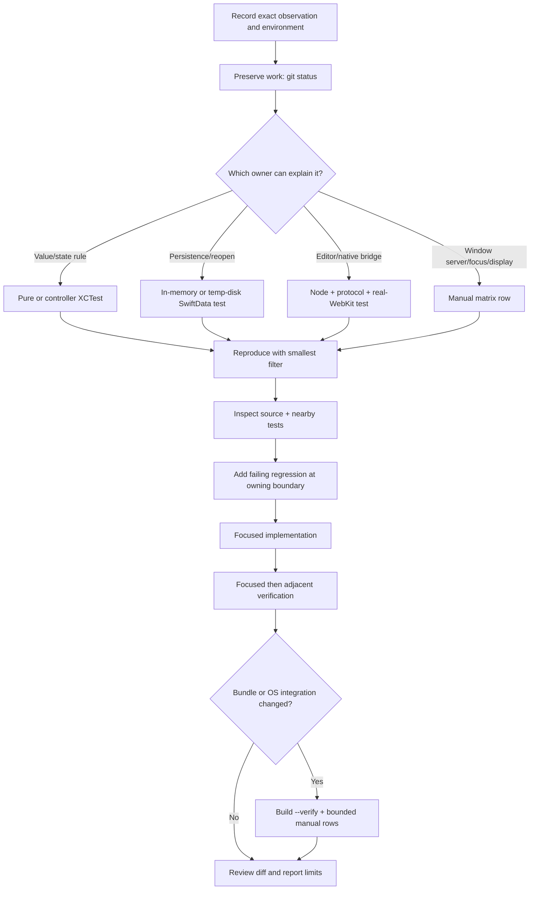

# Lecture 12 — Testing, Debugging, and the Change Workflow

**Duration:** 90 minutes

Notion PiP crosses pure domain logic, SwiftData actors, AppKit windows, SwiftUI
views, WebKit, a TypeScript editor, HTTP, Keychain, and macOS window-server
behavior. No single test style can cover all of that honestly. This capstone
lecture teaches how to choose the smallest trustworthy evidence, diagnose a
failure at its owning boundary, and expand verification only as far as the
change requires.

This repository's Swift tests use **XCTest** and run through SwiftPM's
`swift test`. They do not use Apple's newer `Testing` module or `@Test` macro.
The web editor uses Node's built-in test runner with TypeScript stripping; two
controller suites and the controller integration install a `happy-dom` window.
Naming the actual harness matters when interpreting what a passing test proves.

## Learning objectives

By the end of this lecture, you can:

1. Classify a behavior as pure domain, controller/service, SwiftData,
   AppKit/SwiftUI, WebKit, Node/DOM, build, or manual macOS verification.
2. Explain why fresh fixtures, protocol fakes, injected clocks, isolated
   `UserDefaults`, and independent stores keep parallel Swift tests reliable.
3. Distinguish an in-memory SwiftData repository test from a temporary on-disk
   migration/relaunch test.
4. Use the shared WebKit support to test the checked-in editor through the real
   Swift–JavaScript reply bridge without claiming it represents every keyboard,
   accessibility, or window-server environment.
5. Run the Node unit/DOM layers and explain the limits of `happy-dom`.
6. Choose a row in the manual windowing matrix when automation cannot own the
   relevant macOS behavior.
7. Use unified logs and first-only signposts without leaking credentials or
   mistaking telemetry for correctness.
8. Explain each build mode and trace SwiftPM output into an ad-hoc signed,
   launchable application bundle.
9. Perform three bounded investigations—domain, UI, and cross-language—with
   expected files, commands, observations, and escalation criteria.
10. Apply a disciplined change loop from reproduction through focused tests,
    integration verification, diff review, and honest handoff.

## Before you begin

Keep the [course README](README.md), [manual test matrix](../../docs/MANUAL_TEST_MATRIX.md),
and [Package.swift](../../Package.swift) open. Lectures
[8](08-persistence-and-restoration.md),
[9](09-quick-capture-editor-bridge.md), and
[10](10-notion-api-and-delivery.md) provide the persistence, bridge, and remote
delivery models used in the investigations.

Read at the layer that matches your experience:

- **Foundation:** concentrate on test boundaries, expected observations, and
  the change loop. No XCTest, WebKit, or signing experience is assumed.
- **Implementation:** follow the linked fakes, stores, WebViews, scripts, and
  command filters.
- **Maintenance:** ask which evidence can falsify the proposed behavior, which
  integration remains unproved, and how concurrency or generated artifacts
  could make a test misleading.

Before running commands:

```sh
git status --short
sw_vers -productVersion
test -x /Applications/Xcode.app/Contents/Developer/usr/bin/xcodebuild
DEVELOPER_DIR=/Applications/Xcode.app/Contents/Developer xcodebuild -version
DEVELOPER_DIR=/Applications/Xcode.app/Contents/Developer swift --version
```

Expected observation: existing working-tree changes are visible before any
build; the full Xcode toolchain is selected explicitly. Source builds require
macOS 15.6 or newer and Xcode 26.2 or newer at `/Applications/Xcode.app`, while
the produced app targets macOS 14 or newer.

Important safety boundaries:

- `script/build_and_run.sh` terminates every running process named
  `NotionPiP` before building. Save active work and quit the app first.
- Do not accept an Xcode license with `sudo`, install large dependencies, edit
  signing/entitlements, or change system configuration merely to make an
  exercise pass.
- Never put a Notion password, session cookie, personal integration token, or
  Keychain data in a test, log predicate, fixture, screenshot, or terminal.
- A pre-existing `node_modules` directory makes the build script regenerate
  the editor asset. Review that generated diff; a fresh clone uses the checked-in
  asset without needing Node just to build the app.

## Foundation

### Evidence is layered, not ranked by convenience

The best test is the smallest one that can fail for the behavior under
investigation. A pure value policy should not open a window. A window-server
Space behavior cannot be proved by comparing rectangles. Use layers deliberately:

| Layer | Good evidence | It does not prove |
|---|---|---|
| Pure domain | Values in, values/errors out | Persistence, framework callbacks, UI |
| Controller/service | Protocol fakes, injected closures/clocks, async state | Production framework or remote service behavior |
| SwiftData | Fresh in-memory container; temporary disk store for reopen/migration | Power-loss and arbitrary real-store corruption |
| AppKit/SwiftUI projection | Constructed menus/windows, closure spies, policy tests | Actual Spaces, Mission Control, focus, accessibility quality |
| Real local WebKit | Packaged editor, bridge replies, DOM queries, synthetic events | Every IME/layout/accessibility combination or live Notion DOM |
| Node unit/DOM | Fast state/protocol checks; `happy-dom` for owned DOM | WebKit engine quirks, visual layout, native bridge |
| Build verification | Bundle identity, resource, signature, process stability, startup diagnostics | Every user journey or distribution notarization |
| Manual matrix | Real displays, Spaces, Stage Manager, Dock, focus, assistive tech | Deterministic regression protection by itself |

### Test independence is a correctness requirement

Swift tests may run in parallel. Shared mutable defaults, one database URL,
global app state, real Keychain records, or ordering assumptions make failures
dependent on the runner rather than the product.

The suite's recurring isolation tools are:

- a new `ModelContainer` with `isStoredInMemoryOnly: true` for most repository
  tests;
- a UUID-named temporary directory and explicit cleanup when migration or
  reopen behavior requires disk;
- unique `UserDefaults` suites instead of `.standard`;
- protocol fakes and closure spies rather than live network, Keychain, global
  shortcut, pasteboard, or Launch Services calls;
- injected clocks, retry delays, and continuations for deterministic async
  boundaries; and
- polling a meaningful state with a deadline rather than assuming a fixed sleep
  proves completion.

The implementation source for the shared SwiftData factory is
[`NotionPiPPersistence.swift`](../../Sources/NotionPiP/Persistence/NotionPiPPersistence.swift).
Representative isolation lives in
[`CaptureRepositoryTests.swift`](../../Tests/NotionPiPTests/CaptureRepositoryTests.swift),
[`SchemaMigrationTests.swift`](../../Tests/NotionPiPTests/SchemaMigrationTests.swift),
and [`AppRuntimeTestSupport.swift`](../../Tests/NotionPiPTests/AppRuntimeTestSupport.swift).

## Repository tour

### Swift XCTest suite

[`Tests/NotionPiPTests`](../../Tests/NotionPiPTests) contains 70 committed Swift
test/support files at this course baseline: 64 `*Tests.swift` files and six
`*TestSupport.swift` files. Test classes inherit `XCTestCase`, import the
executable module with `@testable import NotionPiP`, and use async XCTest methods
for actor/MainActor work.

The suite groups naturally:

- **Domain and geometry:** page references, working sets, history, panel frames,
  stash placement, size preferences, routes, and tokens.
- **Repositories and migrations:** page/capture/destination repositories,
  retention, model-actor conformance, V1–V3 reopen/migration.
- **Services and controllers:** connection, API client, conversion, delivery,
  scheduling, shortcuts, switching, URL input, runtime activation, persistence,
  and termination.
- **AppKit/SwiftUI projections:** commands, main menu, windows, PiP chrome,
  stash-handle interaction, window roles, and external drops.
- **WebKit integration:** editor bootstrap/autosave/conflict/focus/lifecycle,
  navigation, rich text, slash menu, toolbar, recovery, resources, and the
  shared WebView helpers.

The most reused support boundaries are:

- [`AppRuntimeTestSupport.swift`](../../Tests/NotionPiPTests/AppRuntimeTestSupport.swift):
  runtime factory plus fake panel, settings presenter, pasteboard, shortcut
  registrar, URL presenter, token store, page repository, and Notion client.
- [`Task3TestSupport.swift`](../../Tests/NotionPiPTests/Task3TestSupport.swift):
  canonical JSON fixture helper and controllable delivery clock.
- [`CaptureWebViewTestSupport.swift`](../../Tests/NotionPiPTests/CaptureWebViewTestSupport.swift):
  real local `WKWebView` input/DOM/lock queries, bounded waits, persistence
  failures, bridge recording, and blocking gates.
- Formatting, slash-menu, and persistence helpers in
  [`CaptureWebViewFormattingTestSupport.swift`](../../Tests/NotionPiPTests/CaptureWebViewFormattingTestSupport.swift),
  [`CaptureWebViewSlashMenuTestSupport.swift`](../../Tests/NotionPiPTests/CaptureWebViewSlashMenuTestSupport.swift),
  and [`CaptureWebViewPersistenceTestSupport.swift`](../../Tests/NotionPiPTests/CaptureWebViewPersistenceTestSupport.swift).

### TypeScript and DOM suite

[`package.json`](../../package.json) defines:

```text
npm test          node --experimental-strip-types --test Web/**/*.test.ts ...
npm run typecheck tsc --noEmit
npm run build:editor
```

Eight `*.test.ts` files protect autosave, block commands, formatting, protocol,
controller bootstrap, transitions, and the formatting/slash controllers.
[`dom.ts`](../../Web/QuickCaptureEditor/test-support/dom.ts) installs a fresh
`happy-dom` `Window` and browser globals for DOM-facing Node tests. Other tests
use plain `node:test`, strict assertions, fake dispatch, and fake Tiptap chains.

The Node suite exercises author-owned state quickly. The real-WebKit Swift
suites then exercise the generated editor asset, local file loading, native
reply handler, synthetic key events, and page-world JavaScript. Neither replaces
the other.

### Operational evidence

- [`MANUAL_TEST_MATRIX.md`](../../docs/MANUAL_TEST_MATRIX.md) is the source of
  truth for Stage Manager, Spaces, Mission Control, multi-display/Dock geometry,
  focus, retained WebView state, panel sizes, and accessibility passes.
- [`PerformanceSignposter.swift`](../../Sources/NotionPiP/Platform/PerformanceSignposter.swift)
  defines first-only intervals for cold launch, first PiP presentation, and
  first Quick Capture presentation.
- [`build_and_run.sh`](../../script/build_and_run.sh) assembles, signs, launches,
  debugs, streams logs, or verifies the app.
- [`NotionPiP.entitlements`](../../Support/NotionPiP.entitlements) enables the app
  sandbox and outbound network client access—nothing more.
- [`Version.env`](../../Support/Version.env) supplies the bundle version/build;
  [`Package.swift`](../../Package.swift) supplies Swift 6.2, macOS 14, the
  executable/test targets, and copied Quick Capture resources.

## Runtime trace

### From a failing observation to trustworthy evidence



The owning layer is the earliest place where actual behavior diverges from the
contract—not simply the highest visible UI. If a menu is wrong because the
shared command definition is wrong, fix the command model. If the definition is
right but AppKit projection is missing a row, fix the renderer. If unit geometry
is right but a panel appears on the wrong Space, collect manual evidence at the
window boundary.

### Build, bundle, sign, launch, verify

[`build_and_run.sh`](../../script/build_and_run.sh) performs this sequence for
every mode:

1. validate mode, version strings, and full Xcode location;
2. terminate running `NotionPiP` processes;
3. if both `package.json` and `node_modules` exist, regenerate editor assets;
4. `swift build --product NotionPiP` and find SwiftPM's binary directory;
5. replace `dist/NotionPiP.app`, copy the executable and every top-level SwiftPM
   resource bundle;
6. write and lint `Info.plist` with bundle ID, version, macOS 14 minimum,
   `LSUIElement = true`, and `notion-pip` URL scheme;
7. ad-hoc sign with the sandbox/network entitlements and verify the signature;
8. launch the staged bundle according to the selected mode.

The mode determines what happens after staging:

| Mode | Behavior | Best use |
|---|---|---|
| `run` or no argument | `open -n` the app | Ordinary local trial |
| `--debug` | Launch, wait for PID, attach Xcode's LLDB | Native breakpoint/crash investigation |
| `--logs` | Stream unified logs for process `NotionPiP` | Lifecycle and framework-visible events |
| `--telemetry` | Stream `com.fantomsuj.NotionPiP` subsystem at info level | App-owned categories and signpost context |
| `--verify` | Capture logs before launch; check PID, plist, resource, signature, two-second stability, and absence of two SwiftData concurrency diagnostics | Repeatable local bundle/startup gate |

A successful verification prints `Verified .../dist/NotionPiP.app (pid ...)`.
The result is a development app signed with `-`; it is not Developer ID signed,
not notarized, and not evidence that every UI flow passed.

## Deep dive

### 1. Swift tests, fakes, and parallel independence

Use `DEVELOPER_DIR=/Applications/Xcode.app/Contents/Developer swift test` for
the full suite and `--filter TypeName` or `--filter TypeName/testName` while
iterating. A filter is a diagnostic tool, not permission to skip affected
neighbors before handoff.

Protocols and injected closures make tests precise:

- `NotionRequestTransport` records `URLRequest` values without a live API.
- `CaptureDeliveryTransport` scripts receipts and failures without remote writes.
- `GlobalShortcutRegistering`, pasteboard, window, panel, opener, and repository
  abstractions avoid mutating system-global resources.
- `CaptureClock`, retry delays, release schedulers, and continuations expose
  ordering without long sleeps.
- signposter spies verify begin/end ownership without Instruments.

Fakes should model only the relevant contract. A fake that duplicates production
logic can make the same mistake and produce a false pass. Prefer recording inputs,
controlling one boundary, and asserting durable outputs.

SwiftData selection follows the behavior:

- **In memory:** transaction/state policy, failure rollback, claim ordering,
  retention, and repository/controller integration.
- **Temporary disk:** migration, reopen, relaunch recovery, and shared-store
  interleaving. Use a unique directory, close references before reopen, and
  remove the exact directory in `defer`.

Never share one in-memory container across tests merely for speed. SwiftData
tests may execute concurrently, and records from one test can change another's
claim order or active-draft invariant.

### 2. WebKit support versus Node DOM support

The Swift WebKit helpers are `@MainActor` because `WKWebView` and AppKit event
delivery are UI-bound. They load the local packaged editor, call page-world
JavaScript, create `NSEvent` key pairs, inspect focus/DOM/lock state, and poll
repositories with five-second deadlines. Blocking gates and injected save
failures make acknowledgement races deterministic.

These tests are intentionally more integrated and slower than TypeScript unit
tests. Run the nearest file while iterating, then the related WebKit group when
bridge, resources, focus, lifecycle, or generated editor behavior changes.

`happy-dom` is appropriate for controller-owned DOM attributes, focus traversal,
event routing, and accessibility state. It is not a WebKit layout engine. It
cannot prove toolbar pixels, macOS key routing, IME behavior, VoiceOver quality,
or native reply handling. Conversely, only testing the generated editor through
WebKit makes state-machine failures slow to locate. Keep both layers.

If authoring source changes under `Web/QuickCaptureEditor`:

```sh
npm ci
npm test
npm run typecheck
npm run build:editor
git diff -- Sources/NotionPiP/Resources/QuickCapture/editor.js
```

The generated [`editor.js`](../../Sources/NotionPiP/Resources/QuickCapture/editor.js)
is checked in. Regenerate it intentionally and review the diff. `npm ci` uses
the lockfile; do not replace pinned dependencies casually.

### 3. Logs and signposts

Unified logging through OSLog `Logger` is diagnostic evidence, not a replacement
for state inspection. Production categories cover lifecycle, shortcuts,
persistence, panel actions, and delivery. Messages use bounded categories such
as `repository-read`, `persistence`, and `cancelled` rather than serializing
arbitrary errors or user content.

Useful commands after a staged build:

```sh
./script/build_and_run.sh --logs
./script/build_and_run.sh --telemetry
```

`--logs` filters by process; `--telemetry` filters by app subsystem. Stop the
stream after reproducing the event. Do not broaden a predicate to dump tokens,
cookies, page content, or unrelated process data.

`AppPerformanceSignposter` starts each named operation only once per process and
ends only a known live token. It records public outcome strings—success,
failure, or cancelled—for:

- `ColdLaunchToReady` in `performance.lifecycle`;
- `FirstPiPPresentation` in `performance.presentation`; and
- `FirstQuickCapturePresentation` in `performance.presentation`.

[`PerformanceSignposterTests.swift`](../../Tests/NotionPiPTests/PerformanceSignposterTests.swift)
proves first-only token and repeated-end safety. Signposts answer “how long did
this interval take?” They do not prove the resulting UI was correct.

### 4. What remains manual

The [manual matrix](../../docs/MANUAL_TEST_MATRIX.md) is not a generic “click
around” checklist. Each row records environment, action, expected result, actual
result, pass/fail, and notes. It covers combinations automation does not own:

- Stage Manager and separate-Spaces settings;
- one/two displays, negative origins, menu bars, and Dock edges;
- full-screen Spaces, Mission Control, and Command-` exclusion;
- status-item mouse buttons and icon override behavior;
- display unplug/reconnect and retained preferred size;
- real panel sizing, focus, selection, and retained Notion WebView state;
- Full Keyboard Access and VoiceOver; and
- warm eviction/restoration and live embedded navigation.

Run only rows affected by the change, record the actual environment, and avoid
claiming an unrun combination. Unit tests should still protect any extracted
geometry or state policy so manual verification is reserved for OS integration.

### 5. The maintenance loop

Use this sequence for a code change:

1. **Preserve:** inspect `git status --short`; identify unrelated work.
2. **State the contract:** write the expected behavior and the observed failure,
   including environment and exact command.
3. **Locate the owner:** trace call sites and nearby tests; do not begin at the
   symptom if a lower layer owns the state.
4. **Reproduce narrowly:** run the smallest existing filter or manual row.
5. **Add a regression:** make it independent and prove it fails for the intended
   reason before implementation when practical.
6. **Change minimally:** preserve Swift 6.2, macOS 14, public API, concurrency,
   signing, entitlement, and generated-resource contracts unless explicitly in
   scope.
7. **Verify outward:** focused test, adjacent suite, full relevant toolchain,
   bundle verification, and affected manual rows in that order.
8. **Review evidence:** inspect `git diff --check`, generated diffs, new secrets,
   error copy, actor isolation, file scope, and test independence.
9. **Handoff honestly:** report commands/results, manual observations, and every
   unverified integration. A near-complete task is not a passing test.

## Common misconceptions and failure modes

1. **“Swift Testing means this repo uses `import Testing`.”** It uses XCTest via
   SwiftPM. Search the imports before choosing syntax or filters.
2. **“One full-suite pass tells me which layer failed.”** A focused reproduction
   gives better diagnostic locality; broaden after the cause is controlled.
3. **“In-memory SwiftData proves migrations.”** It proves repository behavior
   without durable reopen. Migration/relaunch needs a temporary on-disk store.
4. **“Tests are independent because each method creates new model values.”** A
   shared container, defaults suite, singleton, or file path can still couple
   them under parallel execution.
5. **“A sleep makes async state deterministic.”** It only delays observation.
   Prefer injected clocks, gates, continuations, and bounded state polling.
6. **“A mock should implement the production algorithm.”** It should control or
   record a boundary. Duplicated algorithms can share the production bug.
7. **“`happy-dom` proves WebKit.”** It provides a convenient DOM for owned
   controller logic, not WebKit layout, native messaging, or macOS event routing.
8. **“A synthetic WebKit key event proves every real keyboard.”** It proves the
   tested event path. IMEs, layouts, accessibility, and focus across apps remain
   manual dimensions.
9. **“`--verify` runs the product test suite.”** It verifies the staged bundle,
   signature, resource, process stability, and selected startup diagnostics.
10. **“Ad-hoc signed means release-ready.”** Development signing is expected
    locally; distribution needs Developer ID signing and notarization outside
    this script's contract.
11. **“The sandbox entitlement blocks network access.”** The bundle also carries
    `com.apple.security.network.client`; do not add broader entitlements to fix
    an unrelated error.
12. **“Logs are safe if they are local.”** Secrets and user content should never
    be logged. Local diagnostic data can still escape through reports or screen
    sharing.
13. **“A manual pass replaces a regression test.”** Extract stable policy into
    automation and reserve manual rows for the irreducible OS behavior.
14. **“A generated file changed, so the build must have needed it.”** An existing
    `node_modules` directory can trigger editor regeneration. Understand why the
    file changed before staging it.

## Presenter notes

### Suggested 90-minute plan

| Time | Segment | Teaching move |
|---:|---|---|
| 0–10 min | Evidence layers | Ask what a rectangle test cannot prove about Spaces |
| 10–22 min | XCTest and independence | Compare fake, in-memory, and temporary-disk boundaries |
| 22–34 min | Web tests | Contrast Node state tests, `happy-dom`, and real local WebKit |
| 34–44 min | Manual matrix | Select rows for a hypothetical panel-display change |
| 44–55 min | Logs/signposts | Separate diagnostics, performance intervals, and correctness |
| 55–67 min | Build pipeline | Trace executable → bundle → entitlements → ad-hoc signature → launch |
| 67–82 min | Guided investigations | Work domain, UI, and cross-language cases |
| 82–87 min | Knowledge check | Require evidence and limits in every answer |
| 87–90 min | Change-loop recap | End with verification outward and honest handoff |

### Live demonstration cues

1. Run `swift test --filter PerformanceSignposterTests` and identify the spy
   boundary. Expected observation: no Instruments process is required to prove
   first-only interval ownership.
2. Open `CaptureWebViewTestSupport.swift` beside `dom.ts`. Ask which one can call
   `WKWebView.callAsyncJavaScript` and which one creates Node globals.
3. Read `build_and_run.sh` from `swift build` through `codesign`; do not run it
   unless active Notion PiP work is saved.
4. Open one multi-display row in the manual matrix and ask learners to name the
   unit policy tests that should accompany it.

If the environment lacks Xcode 26.2 or macOS 15.6, do not improvise around the
guard. Teach from source and captured commands, and record the build as not run.
If `node_modules` is absent, do not install it merely for a native-only demo.

## Knowledge check

1. Does this repository use the `Testing` module?

   **Answer:** no. Its Swift suite imports XCTest and uses `XCTestCase`; SwiftPM
   runs it with `swift test`.

2. When should a repository test use a temporary disk store rather than an
   in-memory container?

   **Answer:** when the contract requires persistence across container lifetime,
   reopen, relaunch, shared-store interleaving, or schema migration. Ordinary
   state/transaction policy should use a fresh in-memory container.

3. Why is a unique `UserDefaults` suite part of test correctness?

   **Answer:** `.standard` is shared process state. Parallel tests can observe or
   overwrite one another's values, making results order-dependent.

4. What can `happy-dom` prove here?

   **Answer:** controller-owned DOM attributes, events, focus traversal, and
   accessibility state in the tested model. It cannot prove WebKit layout,
   native reply handling, macOS event routing, or assistive-technology quality.

5. Why does the real-WebKit harness poll a state with a deadline?

   **Answer:** editor and bridge work is asynchronous. Polling the intended state
   expresses completion and fails with a bound; a fixed sleep guesses at timing.

6. What does `./script/build_and_run.sh --verify` establish?

   **Answer:** the staged bundle has expected plist values, copied editor
   resource, valid ad-hoc signature, a process surviving startup, and no selected
   SwiftData concurrency diagnostic in captured startup logs. It does not run
   all tests or prove UI journeys.

7. Why must the app be quit before the build script?

   **Answer:** the script uses `pkill -x NotionPiP` before building. Unsaved work
   in a running development instance can be lost.

8. Which evidence is appropriate for a Mission Control regression?

   **Answer:** a manual matrix row in the actual window-server environment,
   supported by unit tests for any extracted window-role or collection-behavior
   policy. A unit test alone cannot operate Mission Control truthfully.

9. What is the difference between `--logs` and `--telemetry`?

   **Answer:** `--logs` filters unified logging by the app process;
   `--telemetry` filters at info level by the app's subsystem, emphasizing
   app-owned categories/signpost context.

10. A focused test passes. What should the handoff say?

    **Answer:** name the exact passing command, run adjacent/full relevant checks
    proportional to the change, report any build/manual checks, and explicitly
    list integrations not verified. Never summarize a focused pass as universal.

## Hands-on exercise

Work these three investigations without changing source. Each begins with
`git status --short` so existing work remains visible.

### Investigation 1 — domain: a stashed handle chooses the wrong edge

**Report:** “A panel mostly on the right display edge produced a left-edge stash
handle.”

Expected files:

- [`PanelStashPolicy.swift`](../../Sources/NotionPiP/Platform/PanelStashPolicy.swift)
- [`PanelStashPolicyTests.swift`](../../Tests/NotionPiPTests/PanelStashPolicyTests.swift)
- [`PiPPanelCoordinator.swift`](../../Sources/NotionPiP/Platform/PiPPanelCoordinator.swift)
- [`MANUAL_TEST_MATRIX.md`](../../docs/MANUAL_TEST_MATRIX.md)

Commands:

```sh
rg -n "placement|greatestPanelIntersection|nearest" \
  Sources/NotionPiP/Platform/PanelStashPolicy.swift \
  Tests/NotionPiPTests/PanelStashPolicyTests.swift
DEVELOPER_DIR=/Applications/Xcode.app/Contents/Developer \
  swift test --filter PanelStashPolicyTests
```

Expected observation: the pure policy tests cover panel-half edge choice,
greatest screen intersection, visible-frame clamping, and dragged-handle edge
selection. If the report's rectangles reproduce there, the domain policy owns
the fix. If the policy returns the correct right placement, inspect coordinator
inputs and then manually reproduce on the reported display/Dock configuration;
do not change geometry formulas speculatively.

### Investigation 2 — UI: top controls reveal too early

**Report:** “Moving across the PiP top edge flashed the controls immediately.”

Expected files:

- [`TopControlsHoverController.swift`](../../Sources/NotionPiP/Views/TopControlsHoverController.swift)
- [`PiPChromeView.swift`](../../Sources/NotionPiP/Views/PiPChromeView.swift)
- [`PiPChromeViewTests.swift`](../../Tests/NotionPiPTests/PiPChromeViewTests.swift)

Commands:

```sh
rg -n "reveal|dismiss|pointer|duration|topControls" \
  Sources/NotionPiP/Views/TopControlsHoverController.swift \
  Sources/NotionPiP/Views/PiPChromeView.swift \
  Tests/NotionPiPTests/PiPChromeViewTests.swift
DEVELOPER_DIR=/Applications/Xcode.app/Contents/Developer \
  swift test --filter PiPChromeViewTests
```

Expected observation: tests inject short durations and prove delayed reveal,
cancelled reveal when the pointer leaves, delayed dismissal, and re-entry
cancellation. If those fail, the controller/view interaction is locally
reproducible. If they pass, manually evaluate real pointer tracking and visual
behavior; timing tests do not prove perceived animation quality or every event
sequence.

### Investigation 3 — cross-language: autosave advances the wrong revision

**Report:** “A second quick edit used the revision from before the first native
acknowledgement.”

Expected files:

- [`debounced-change-publisher.ts`](../../Web/QuickCaptureEditor/bridge/debounced-change-publisher.ts)
- [`bridge-client.ts`](../../Web/QuickCaptureEditor/bridge/bridge-client.ts)
- [`protocol.ts`](../../Web/QuickCaptureEditor/protocol.ts)
- [`CaptureBridgeProtocol.swift`](../../Sources/NotionPiP/Platform/CaptureBridgeProtocol.swift)
- [`CaptureEditorSession.swift`](../../Sources/NotionPiP/Platform/CaptureEditorSession.swift)
- [`autosave.test.ts`](../../Web/QuickCaptureEditor/autosave.test.ts)
- [`CaptureEditorFlowTests.swift`](../../Tests/NotionPiPTests/CaptureEditorFlowTests.swift)
- [`CaptureWebViewAutosaveTests.swift`](../../Tests/NotionPiPTests/CaptureWebViewAutosaveTests.swift)

Commands:

```sh
npm ci
npm test
npm run typecheck
DEVELOPER_DIR=/Applications/Xcode.app/Contents/Developer \
  swift test --filter CaptureBridgeProtocolTests
DEVELOPER_DIR=/Applications/Xcode.app/Contents/Developer \
  swift test --filter CaptureEditorFlowTests
DEVELOPER_DIR=/Applications/Xcode.app/Contents/Developer \
  swift test --filter CaptureWebViewAutosaveTests
```

Expected observation: Node tests prove overlapping changes serialize and read
the current revision after the prior acknowledgement; Swift protocol tests
prove exact typed envelopes; native flow tests prove authoritative revision and
lost-ack reconciliation; real-WebKit tests prove Saving/Saved and exact retry
through the packaged bridge. A failure at one layer narrows ownership. If
authoring TypeScript changes, regenerate `editor.js` only after Node/typecheck
passes, then rerun WebKit tests and inspect the generated diff.

Manual limits for all three investigations: domain/UI/WebKit automation does not
prove real multi-display placement, perceived hover quality, VoiceOver, IME
composition, live Notion content, or a production login session. Record those
separately with the relevant manual matrix row and environment.

## Recap

- The Swift suite is XCTest run by SwiftPM; the editor suite is `node:test`, with
  `happy-dom` only where an owned DOM is useful.
- Reliable tests isolate mutable state with protocol fakes, fresh stores,
  unique defaults, temporary directories, injected clocks/gates, and bounded
  state waits.
- In-memory SwiftData proves repository behavior; temporary disk proves
  reopen/migration behavior. Neither alone proves every storage failure.
- Node tests localize TypeScript state, real local WebKit tests the packaged
  bridge, and the manual matrix owns irreducible macOS/window-server behavior.
- Logs provide bounded diagnostic categories; first-only signposts measure
  three startup/presentation intervals without proving correctness.
- The build script creates `dist/NotionPiP.app`, copies resources, writes its
  plist, applies sandbox/network entitlements, ad-hoc signs, and launches or
  verifies according to mode.
- `--verify` is a bundle/startup gate, not the XCTest/Node/manual suite and not a
  notarized release check.
- A safe change starts from a precise contract and owning layer, adds independent
  regression evidence, changes narrowly, verifies outward, reviews the diff,
  and reports everything still unverified.
