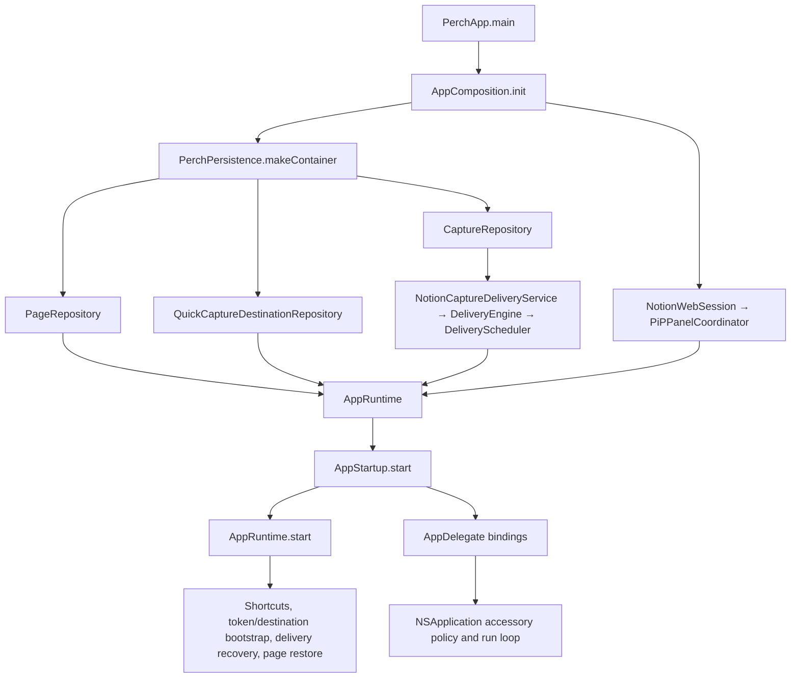
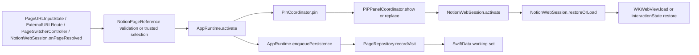
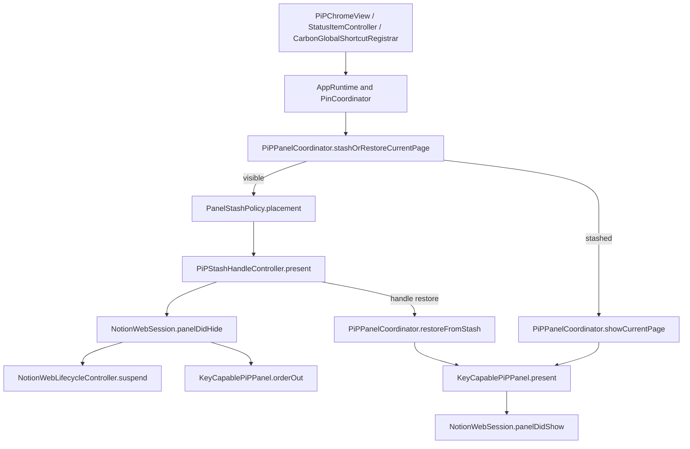
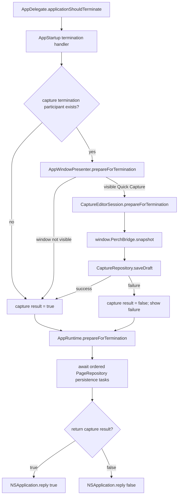
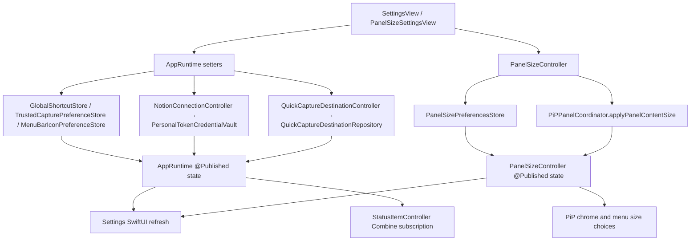

# Perch Architecture Map

Perch is one Swift Package Manager executable with deliberately separated
responsibilities inside the target and a separately authored TypeScript editor
that is bundled as a resource. The `AppRuntime` is the main-actor facade seen by
views, but it does not own every subsystem: AppKit controllers own windows,
WebKit sessions own browser lifecycles, actors own persistence and delivery,
and pure domain values and policies carry state between them.

Use this map to answer two questions before changing code: **which type owns the
decision?** and **which cross-layer flow will the change affect?** Terms are
defined in the [glossary](GLOSSARY.md); the planned teaching sequence is in the
[course navigation](README.md#course-navigation).

## Subsystem and ownership map

| Subsystem | Owns | Principal concrete types | Does not own |
|---|---|---|---|
| Entry and composition | Process entry, dependency construction, degraded startup wiring, termination binding | [`PerchApp`, `AppStartup`, `AppComposition`](../../Sources/Perch/App/PerchApp.swift), [`AppDelegate`](../../Sources/Perch/App/AppDelegate.swift) | Feature policy or durable transitions |
| Runtime/application | UI-facing state, activation routing, controller coordination, ordered page persistence | [`AppRuntime`](../../Sources/Perch/App/AppRuntime.swift), [`PinCoordinator`](../../Sources/Perch/App/PinCoordinator.swift), [`PageSwitcherController`](../../Sources/Perch/App/PageSwitcherController.swift) | AppKit window mechanics, database model mutation, HTTP transport |
| Domain | Validated values, snapshots, state machines, matching, geometry and retry rules | [`NotionPageReference`](../../Sources/Perch/Domain/NotionPageReference.swift), [`PageWorkingSetPolicy`](../../Sources/Perch/Domain/PageWorkingSetPolicy.swift), [`DeliveryState`](../../Sources/Perch/Domain/DeliveryState.swift), [`RetryPolicy`](../../Sources/Perch/Domain/RetryPolicy.swift) | Framework objects or I/O |
| AppKit platform | Window roles, panel geometry, stash handle, status item, global shortcuts, Keychain adapter | [`PiPPanelCoordinator`](../../Sources/Perch/Platform/PiPPanelCoordinator.swift), [`WindowRolePolicy`](../../Sources/Perch/Platform/WindowRolePolicy.swift), [`StatusItemController`](../../Sources/Perch/Platform/StatusItemController.swift), [`PersonalTokenCredentialVault`](../../Sources/Perch/Platform/PersonalTokenCredentialVault.swift) | SwiftUI view state or delivery policy |
| WebKit platform | One live Notion browser session, page interaction snapshots, lifecycle suspension, local-editor bridge | [`NotionWebSession`](../../Sources/Perch/Platform/NotionWebSession.swift), [`NotionWebLifecycleController`](../../Sources/Perch/Platform/NotionWebLifecycleController.swift), [`CaptureEditorSession`](../../Sources/Perch/Platform/CaptureEditorSession.swift), [`CaptureBridgeProtocol`](../../Sources/Perch/Platform/CaptureBridgeProtocol.swift) | Personal API credentials or remote delivery scheduling |
| SwiftUI views | Rendering, bindings, user intent, accessibility surfaces | [`PiPChromeView`](../../Sources/Perch/Views/PiPChromeView.swift), [`SettingsView`](../../Sources/Perch/Views/SettingsView.swift), [`QuickCaptureView`](../../Sources/Perch/Views/QuickCaptureView.swift) | Durable mutation rules or retained window ownership |
| Persistence | Shared SwiftData container, schemas, validated repository transactions, rollback | [`PerchPersistence`](../../Sources/Perch/Persistence/PerchPersistence.swift), [`PageRepository`](../../Sources/Perch/Persistence/PageRepository.swift), [`CaptureRepository`](../../Sources/Perch/Persistence/CaptureRepository.swift), [`QuickCaptureDestinationRepository`](../../Sources/Perch/Persistence/QuickCaptureDestinationRepository.swift) | UI presentation or network calls |
| Services | Capture finalization, scheduling, retries, document conversion, Notion HTTP operations | [`QuickCaptureLifecycleCoordinator`](../../Sources/Perch/Services/QuickCaptureLifecycleCoordinator.swift), [`DeliveryScheduler`](../../Sources/Perch/Services/DeliveryScheduler.swift), [`DeliveryEngine`](../../Sources/Perch/Services/DeliveryEngine.swift), [`NotionCaptureDeliveryService`](../../Sources/Perch/Services/NotionCaptureDeliveryService.swift), [`NotionAPIClient`](../../Sources/Perch/Services/NotionAPIClient.swift) | Views, windows, or browser session cookies |
| TypeScript editor | Tiptap document editing, debounced changes, reply validation, transition serialization, browser UI | [`QuickCaptureEditorController`](../../Web/QuickCaptureEditor/quick-capture-editor-controller.ts), [`DebouncedChangePublisher`](../../Web/QuickCaptureEditor/bridge/debounced-change-publisher.ts), [`EditorTransitionGate`](../../Web/QuickCaptureEditor/state/editor-transition-gate.ts) | Native persistence, Keychain access, or direct Notion API calls |
| Tests and manual checks | Deterministic policy, persistence, service, bridge, and WebKit regression evidence; real-system integration checklist | [`Tests/PerchTests`](../../Tests/PerchTests), [`MANUAL_TEST_MATRIX.md`](../MANUAL_TEST_MATRIX.md) | Proof of unexercised window-server, Spaces, focus, login-session, or Launch Services behavior |

The intended dependency direction is views and platform adapters toward the
runtime/application layer, then through narrow protocols and value snapshots to
actor-backed persistence and services. `AppComposition` is allowed to know the
concrete graph. Callback relays break construction cycles without turning
lower layers into service locators.

## Flow 1 — startup and dependency composition

Course destination: Lecture 3 and Lecture 4 in the
[course outline](README.md#course-navigation).

**Prose fallback.** [`PerchApp.main`](../../Sources/Perch/App/PerchApp.swift)
starts a cold-launch signpost, constructs `AppComposition`, installs the
`AppDelegate` and main menu, calls `AppStartup.start`, and then enters the
`NSApplication` run loop. The composition root opens one shared SwiftData
container and builds the page, capture, and destination repositories plus the
delivery service, engine, and scheduler. It separately wires the retained
`NotionWebSession`, `PiPPanelCoordinator`, runtime, status item, and lazy
windows. [`AppRuntime.start`](../../Sources/Perch/App/AppRuntime.swift)
registers both shortcuts, bootstraps saved credentials and destination state,
triggers delivery recovery, refreshes capture records, and begins pinned-page
restoration. If the persistent container cannot open, composition injects
`nil` repositories and publishes degraded service health; menu, settings, and
in-memory app controls remain available. `AppDelegate` intentionally selects
the accessory activation policy before launch finishes.

## Flow 2 — page activation and WebKit navigation

Course destination: Lecture 6 and Lecture 8 in the
[course outline](README.md#course-navigation).

**Prose fallback.** Typed URLs and external routes become a validated
[`NotionPageReference`](../../Sources/Perch/Domain/NotionPageReference.swift);
the page switcher already carries stored validated pages and optional durable
restoration. All routes converge on
[`AppRuntime.activate`](../../Sources/Perch/App/AppRuntime+Activation.swift),
which increments the page-selection generation and tells `PinCoordinator` to
show, reselect, or replace the panel's page. The
[`PiPPanelCoordinator`](../../Sources/Perch/Platform/PiPPanelCoordinator.swift)
presents the panel and delegates browser work to `NotionWebSession`. That
session preserves the outgoing page's in-process WebKit interaction state,
then either restores it or loads the trusted saved/canonical URL in the one
live `WKWebView`. In parallel, the runtime serializes
`PageRepository.recordVisit` after the previous persistence task so activation
order remains durable. Startup restoration travels the reverse storage edge:
`PageRepository.workingSet` returns the active page and its
`DurablePageRestoration`, then the same activation path presents it without
writing a duplicate visit.

## Flow 3 — stash/restore presentation

Course destination: Lecture 5 in the
[course outline](README.md#course-navigation).

**Prose fallback.** The chrome button, contextual menu-bar command, and global
shortcut all converge on
[`PiPPanelCoordinator.stashOrRestoreCurrentPage`](../../Sources/Perch/Platform/PiPPanelCoordinator.swift)
through the runtime or `PinCoordinator`. When visible,
[`PanelStashPolicy`](../../Sources/Perch/Platform/PanelStashPolicy.swift)
chooses the nearest screen edge, the coordinator saves the logical panel frame,
presents `PiPStashHandleController`, notifies `NotionWebSession` that the panel
hid, and calls `orderOut` on `KeyCapablePiPPanel`. The lifecycle controller
suspends the browser and schedules warm eviction; WebKit interaction and
durable scroll snapshots are captured at their owning boundaries. When
stashed, the toggle presents the saved page again; clicking the handle directly
calls `restoreFromStash`. Both restoration paths replace the saved frame,
dismiss the handle, present the panel, and call `panelDidShow` so the retained or
recreated browser resumes. The floating all-Spaces panel and all-Spaces handle
are intentional policies in
[`WindowRolePolicy`](../../Sources/Perch/Platform/WindowRolePolicy.swift),
not an `NSPanel` defect.

## Flow 4 — capture delivery from editor to Notion

Course destination: Lecture 9 and Lecture 10 in the
[course outline](README.md#course-navigation).

```mermaid
flowchart LR
    A["Tiptap Editor.onUpdate"] --> B["QuickCaptureEditorController.scheduleChange"]
    B --> C["DebouncedChangePublisher"]
    C --> D["BridgeClient"]
    D --> E["WeakScriptMessageHandler"]
    E --> F["CaptureEditorSession.handle"]
    F --> G["CaptureRepository.saveDraft"]
    G --> H["BridgeReply acknowledgement"]
    H --> C
    H -->|later window close| I["AppWindowFactory close handler"]
    I --> J["QuickCaptureLifecycleCoordinator.close"]
    J --> K["CaptureRepository.enqueue"]
    K --> L["DeliveryScheduler.trigger"]
    L --> M["DeliveryEngine.drain"]
    M --> N["CaptureRepository.claimNext"]
    N --> O["NotionCaptureDeliveryService"]
    O --> P["NotionBlockConverter"]
    O --> Q["PersonalTokenNotionCaptureAPI → NotionAPIClient"]
    Q --> R["Notion API"]
    R --> S["CaptureRepository delivery state or journal"]
```

**Prose fallback.** Tiptap changes in
[`QuickCaptureEditorController`](../../Web/QuickCaptureEditor/quick-capture-editor-controller.ts)
are debounced and serialized into a versioned `BridgeRequest` with a correlation
ID and expected revision. `BridgeClient` posts to WebKit; the trusted local
document is validated by `WeakScriptMessageHandler` and
[`CaptureEditorSession`](../../Sources/Perch/Platform/CaptureEditorSession.swift).
The session canonicalizes the ProseMirror document and awaits
`CaptureRepository.saveDraft` before returning an acknowledgement. A stale
revision becomes an explicit conflict, and a failed acknowledgement remains
retryable in the editor.

Closing a nonempty capture takes a fresh editor snapshot. The
[`QuickCaptureLifecycleCoordinator`](../../Sources/Perch/Services/QuickCaptureLifecycleCoordinator.swift)
ensures it is saved, requires a configured destination and usable token, and
atomically converts the draft into a queued capture record. Only then does it
trigger `DeliveryScheduler`. `DeliveryEngine` recovers interrupted work, claims
one due record at a time, and delegates conversion and transport to
`NotionCaptureDeliveryService`. Page creation and block batches are journaled
through `CaptureRepository`; success is marked delivered, while authorization,
rate-limit, conflict, ambiguous, and transport failures take explicit retry or
attention states. `PersonalTokenNotionCaptureAPI` loads the optional token from
the native Keychain vault for each API client. Neither the live Notion WebKit
session nor the local editor receives that credential.

## Flow 5 — termination/autosave coordination

Course destination: Lecture 3 and Lecture 9 in the
[course outline](README.md#course-navigation).

**Prose fallback.** [`AppDelegate`](../../Sources/Perch/App/AppDelegate.swift)
returns `.terminateLater` and runs the async handler bound by `AppStartup`. If a
Quick Capture presenter exists and its window is visible,
`AppWindowPresenter.prepareForTermination` calls
[`CaptureEditorSession.prepareForTermination`](../../Sources/Perch/Platform/CaptureEditorSession.swift).
The session reads the current JavaScript snapshot and persists it with the same
revision-aware rules used by autosave. Capture preservation returns a Boolean:
success permits termination, while failure publishes “Could not save the
latest draft before quitting” and records a veto. `AppStartup` stores that
Boolean, then **always** awaits `AppRuntime.prepareForTermination`, including
the capture-failure path, so the ordered pinned-page persistence chain drains
before any reply. Only after that wait does the handler return the stored
Boolean and `AppDelegate` reply true or false to AppKit. Ordinary editor
autosave still requires an explicit bridge acknowledgement; termination is a
final fresh snapshot, not an assumption that the debounce already fired. If
Quick Capture was never created, is no longer visible after a successful close,
or local capture persistence was unavailable, that window contributes `true`
rather than a veto, but runtime page persistence is still awaited.

## Flow 6 — settings propagation and observable state

Course destination: Lecture 11 in the
[course outline](README.md#course-navigation).

**Prose fallback.** [`SettingsView`](../../Sources/Perch/Views/SettingsView.swift)
turns user actions into methods on `AppRuntime` or `PanelSizeController`; views
do not write stores directly. Shortcut, trusted-capture, and menu-bar settings
are validated or registered, saved to dedicated UserDefaults adapters, then
published on the runtime. `StatusItemController` subscribes to effective
menu-bar visibility, including the safety override that temporarily restores
the icon if panel shortcut registration fails. Personal token actions pass
through `NotionConnectionController` to `PersonalTokenCredentialVault` and the
Keychain; the `SecureField` is cleared after submission or disappearance.
Destination selection passes through `QuickCaptureDestinationController` to a
SwiftData repository. Panel-size changes pass through
[`PanelSizeController`](../../Sources/Perch/App/PanelSizeController.swift),
which validates and saves preferences before publishing them and asks
`PiPPanelCoordinator` to change the live panel only for explicit apply actions.
SwiftUI observes these published values, while `AppRuntime` forwards change
signals from its focused child controllers.

## Cross-cutting invariants

- **UI isolation:** AppKit, SwiftUI coordination, WebKit objects, the runtime,
  and credential-vault facade are main-actor bound. Repository and delivery
  actors exchange `Sendable` value snapshots across that boundary.
- **One live Notion browser:** `NotionWebSession` owns at most one live Notion
  `WKWebView`. Page switching captures outgoing interaction state and reuses or
  recreates that view according to lifecycle policy.
- **Local-first capture:** editor acknowledgement means the draft reached local
  persistence, not that Notion accepted it. Closing converts a saved draft into
  a durable outbox record before remote work begins.
- **Explicit failure states:** persistence can degrade startup; capture
  revisions can conflict; delivery can retry, block, become uncertain, or
  require reconnection. Errors shown to users and logs do not include secrets
  or private document content.
- **Separate trust domains:** Notion cookies stay in the live WebKit data store;
  the personal API token stays in Keychain; the local capture editor uses a
  non-persistent WebKit store and a bounded bridge protocol.
- **Intentional macOS behavior:** accessory activation, floating level, the
  all-Spaces PiP panel, and the all-Spaces stash handle are product behavior.
  Window-server, Spaces, focus, login-session, and Launch Services integration
  still require manual validation in addition to unit tests.
